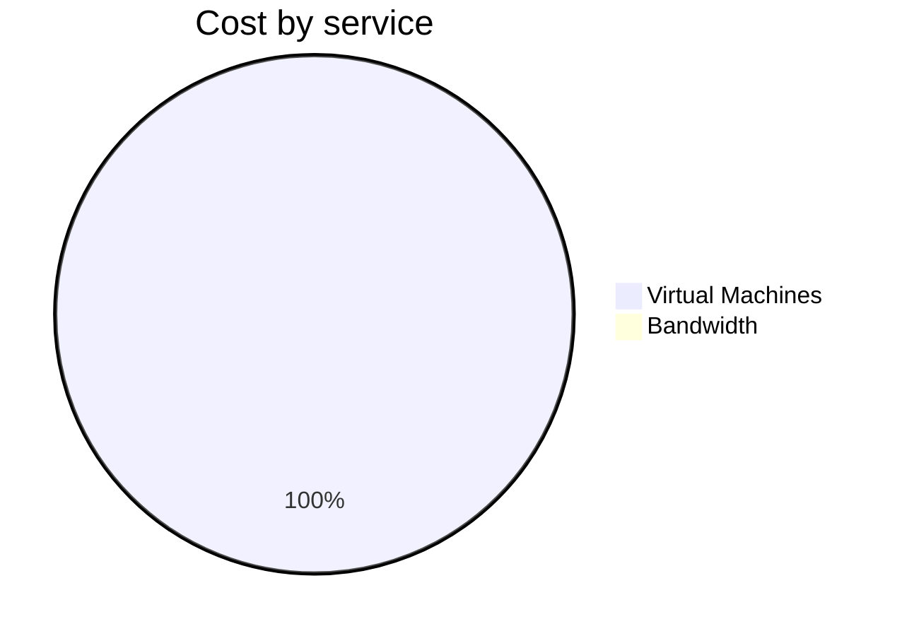
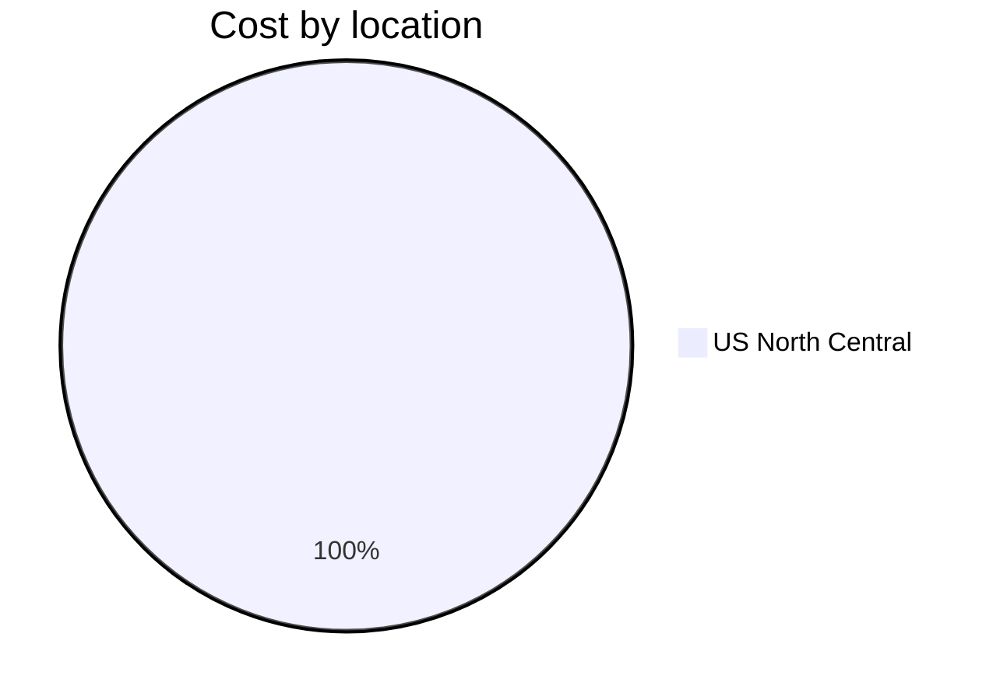
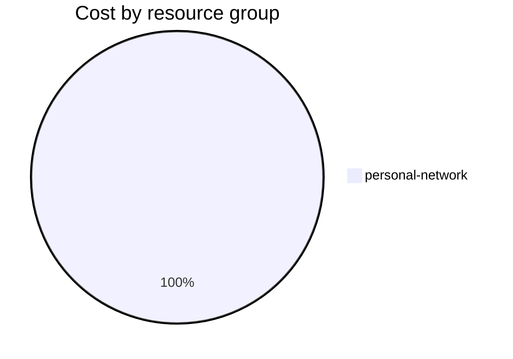

Fetching subscription details...
Fetching cost data...
Fetching forecasted cost data...
Fetching cost data by service name...
Fetching cost data by location...
Fetching cost data by resource group...
# Azure Cost Overview

> Accumulated cost for subscription id `JPF Pay-As-You-Go` from **01/01/2024** to **01/02/2024**

## Totals

|Period|Amount|
|---|---:|
|Today|0.05 USD|
|Yesterday|0.21 USD|
|Last 7 days|0.26 USD|
|Last 30 days|0.26 USD|

```mermaid
gantt
   title Accumulated cost
   dateFormat  X
   axisFormat %s
   section 01 Jan
   USD 0.21 :0, 21
   section 02 Jan
   USD 0.26 :0, 26
   section 03 Jan
   USD 0.45 : done, 0, 45
   section 04 Jan
   USD 0.65 : done, 0, 65
   section 05 Jan
   USD 0.85 : done, 0, 85
   section 06 Jan
   USD 1.05 : done, 0, 105
   section 07 Jan
   USD 1.24 : done, 0, 124
   section 08 Jan
   USD 1.44 : done, 0, 144
   section 09 Jan
   USD 1.64 : done, 0, 164
   section 10 Jan
   USD 1.84 : done, 0, 184
   section 11 Jan
   USD 2.03 : done, 0, 203
   section 12 Jan
   USD 2.23 : done, 0, 223
   section 13 Jan
   USD 2.43 : done, 0, 243
   section 14 Jan
   USD 2.63 : done, 0, 263
   section 15 Jan
   USD 2.82 : done, 0, 282
   section 16 Jan
   USD 3.02 : done, 0, 302
   section 17 Jan
   USD 3.22 : done, 0, 322
   section 18 Jan
   USD 3.42 : done, 0, 342
   section 19 Jan
   USD 3.62 : done, 0, 362
   section 20 Jan
   USD 3.81 : done, 0, 381
   section 21 Jan
   USD 4.01 : done, 0, 401
   section 22 Jan
   USD 4.21 : done, 0, 421
   section 23 Jan
   USD 4.41 : done, 0, 441
   section 24 Jan
   USD 4.61 : done, 0, 461
   section 25 Jan
   USD 4.80 : done, 0, 480
   section 26 Jan
   USD 5.00 : done, 0, 500
   section 27 Jan
   USD 5.20 : done, 0, 520
   section 28 Jan
   USD 5.40 : done, 0, 540
   section 29 Jan
   USD 5.60 : done, 0, 560
   section 30 Jan
   USD 5.80 : done, 0, 580
   section 31 Jan
   USD 5.99 : done, 0, 599
```

## By Service Name

|Service|Amount|
|---|---:|
|Virtual Machines|0.26 USD|
|Bandwidth|0.00 USD|

## By Location

|Location|Amount|
|---|---:|
|US North Central|0.26 USD|

## By Resource Group

|Resource Group|Amount|
|---|---:|
|personal-network|0.26 USD|

Generated at 2024-01-02 11:10:03 for subscription with id `4913be3f-a345-4652-9bba-767418dd25e3`
