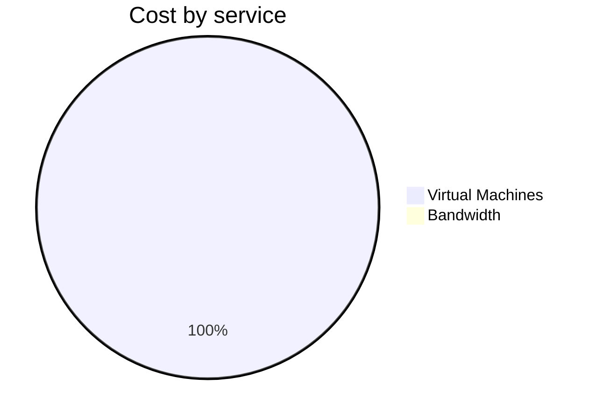
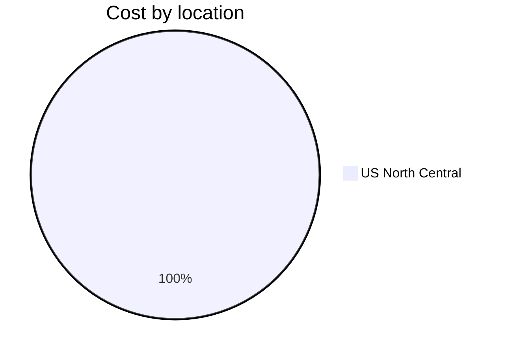
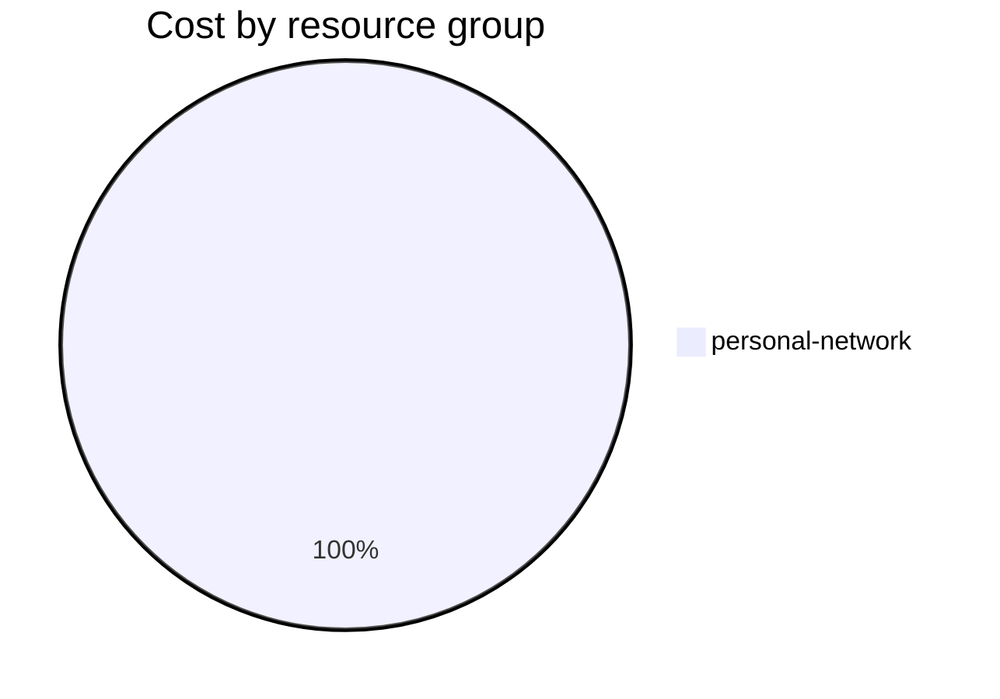

Fetching subscription details...
Fetching cost data...
Fetching forecasted cost data...
Fetching cost data by service name...
Fetching cost data by location...
Fetching cost data by resource group...
# Azure Cost Overview

> Accumulated cost for subscription id `JPF Pay-As-You-Go` from **09/14/2023** to **09/19/2023**

## Totals

|Period|Amount|
|---|---:|
|Today|0.06 USD|
|Yesterday|0.18 USD|
|Last 7 days|0.92 USD|
|Last 30 days|0.92 USD|

```mermaid
gantt
   title Accumulated cost
   dateFormat  X
   axisFormat %s
   section 14 Sep
   USD 0.16 :0, 16
   section 15 Sep
   USD 0.33 :0, 33
   section 16 Sep
   USD 0.51 :0, 51
   section 17 Sep
   USD 0.68 :0, 68
   section 18 Sep
   USD 0.86 :0, 86
   section 19 Sep
   USD 0.92 :0, 92
```

## By Service Name

|Service|Amount|
|---|---:|
|Virtual Machines|0.92 USD|
|Bandwidth|0.00 USD|

## By Location

|Location|Amount|
|---|---:|
|US North Central|0.92 USD|

## By Resource Group

|Resource Group|Amount|
|---|---:|
|personal-network|0.92 USD|

Generated at 2023-09-19 11:17:42 for subscription with id `4913be3f-a345-4652-9bba-767418dd25e3`
