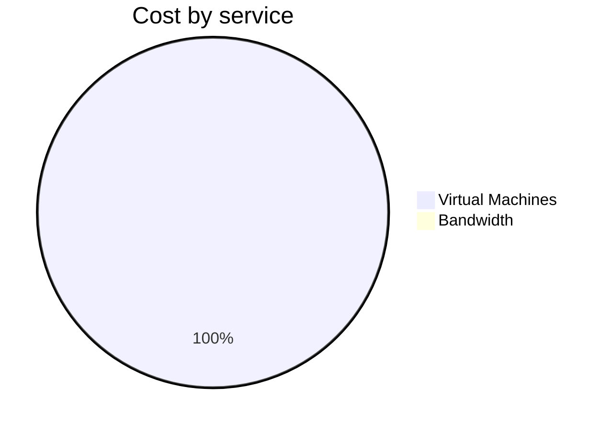
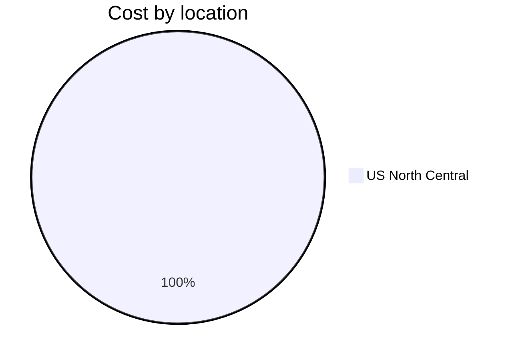
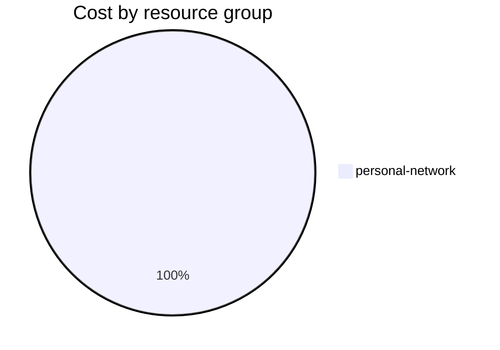

Fetching subscription details...
Fetching cost data...
Fetching forecasted cost data...
Fetching cost data by service name...
Fetching cost data by location...
Fetching cost data by resource group...
# Azure Cost Overview

> Accumulated cost for subscription id `JPF Pay-As-You-Go` from **12/01/2023** to **12/09/2023**

## Totals

|Period|Amount|
|---|---:|
|Today|0.04 USD|
|Yesterday|0.20 USD|
|Last 7 days|1.41 USD|
|Last 30 days|1.61 USD|

```mermaid
gantt
   title Accumulated cost
   dateFormat  X
   axisFormat %s
   section 01 Dec
   USD 0.20 :0, 20
   section 02 Dec
   USD 0.39 :0, 39
   section 03 Dec
   USD 0.59 :0, 59
   section 04 Dec
   USD 0.79 :0, 79
   section 05 Dec
   USD 0.98 :0, 98
   section 06 Dec
   USD 1.18 :0, 118
   section 07 Dec
   USD 1.37 :0, 137
   section 08 Dec
   USD 1.57 :0, 157
   section 09 Dec
   USD 1.61 :0, 161
```

## By Service Name

|Service|Amount|
|---|---:|
|Virtual Machines|1.61 USD|
|Bandwidth|0.00 USD|

## By Location

|Location|Amount|
|---|---:|
|US North Central|1.61 USD|

## By Resource Group

|Resource Group|Amount|
|---|---:|
|personal-network|1.61 USD|

Generated at 2023-12-09 11:13:48 for subscription with id `4913be3f-a345-4652-9bba-767418dd25e3`
