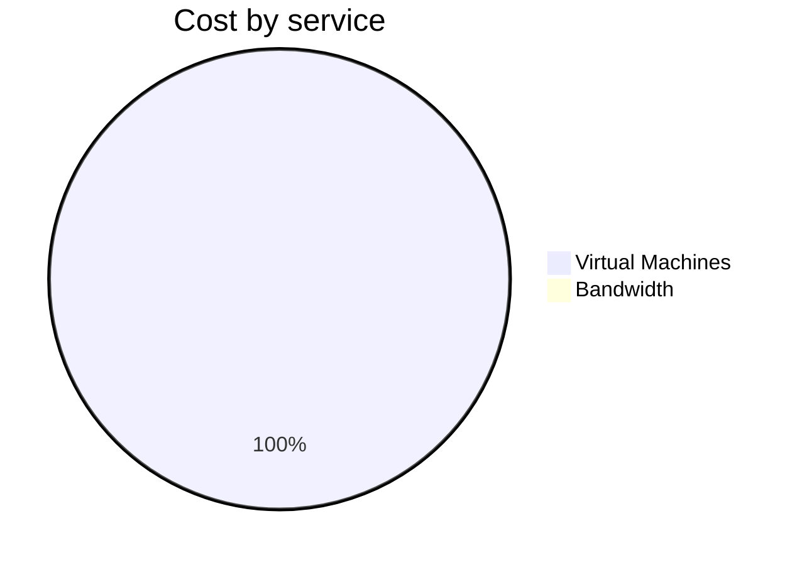
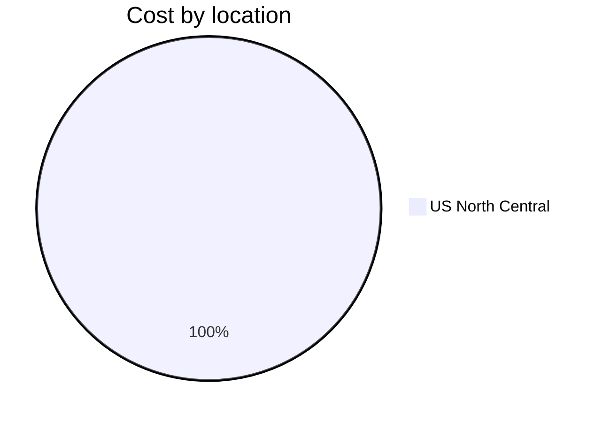
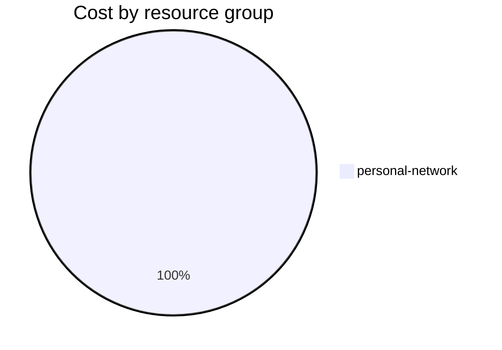

Fetching subscription details...
Fetching cost data...
Fetching forecasted cost data...
Fetching cost data by service name...
Fetching cost data by location...
Fetching cost data by resource group...
# Azure Cost Overview

> Accumulated cost for subscription id `JPF Pay-As-You-Go` from **01/01/2024** to **01/20/2024**

## Totals

|Period|Amount|
|---|---:|
|Today|0.02 USD|
|Yesterday|0.21 USD|
|Last 7 days|1.46 USD|
|Last 30 days|3.94 USD|

```mermaid
gantt
   title Accumulated cost
   dateFormat  X
   axisFormat %s
   section 01 Jan
   USD 0.21 :0, 21
   section 02 Jan
   USD 0.41 :0, 41
   section 03 Jan
   USD 0.62 :0, 62
   section 04 Jan
   USD 0.82 :0, 82
   section 05 Jan
   USD 1.03 :0, 103
   section 06 Jan
   USD 1.24 :0, 124
   section 07 Jan
   USD 1.44 :0, 144
   section 08 Jan
   USD 1.65 :0, 165
   section 09 Jan
   USD 1.86 :0, 186
   section 10 Jan
   USD 2.06 :0, 206
   section 11 Jan
   USD 2.27 :0, 227
   section 12 Jan
   USD 2.47 :0, 247
   section 13 Jan
   USD 2.68 :0, 268
   section 14 Jan
   USD 2.89 :0, 289
   section 15 Jan
   USD 3.09 :0, 309
   section 16 Jan
   USD 3.30 :0, 330
   section 17 Jan
   USD 3.51 :0, 351
   section 18 Jan
   USD 3.71 :0, 371
   section 19 Jan
   USD 3.92 :0, 392
   section 20 Jan
   USD 3.94 :0, 394
```

## By Service Name

|Service|Amount|
|---|---:|
|Virtual Machines|3.94 USD|
|Bandwidth|0.00 USD|

## By Location

|Location|Amount|
|---|---:|
|US North Central|3.94 USD|

## By Resource Group

|Resource Group|Amount|
|---|---:|
|personal-network|3.94 USD|

Generated at 2024-01-20 11:11:00 for subscription with id `4913be3f-a345-4652-9bba-767418dd25e3`
