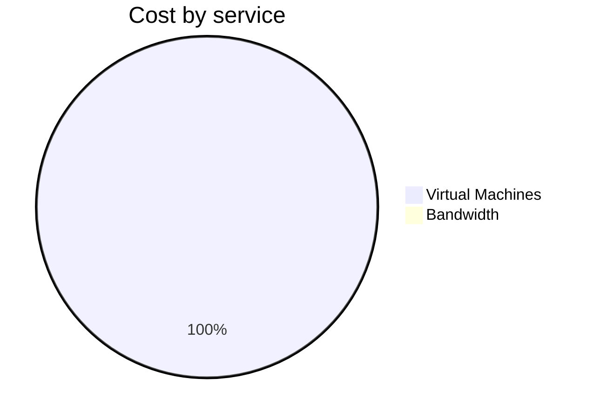
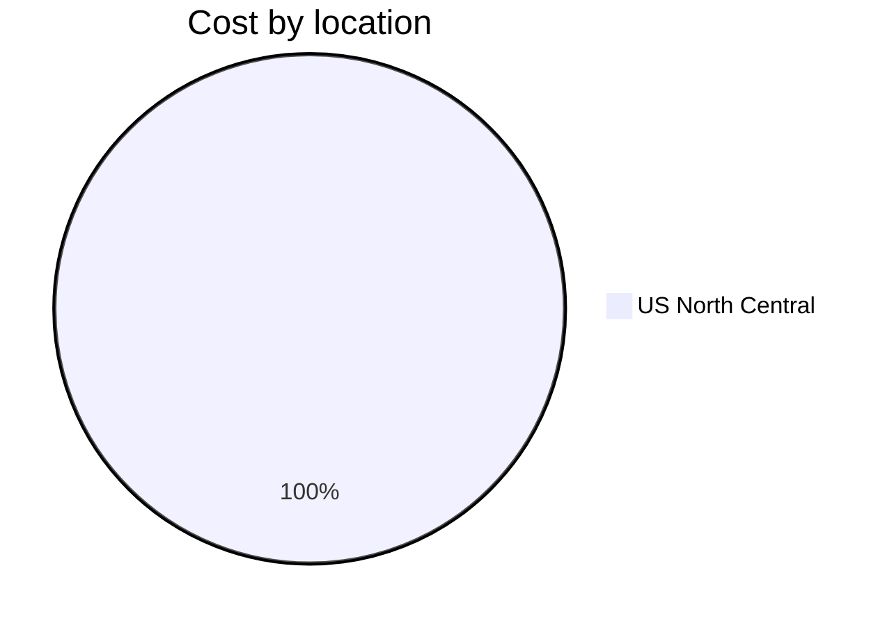
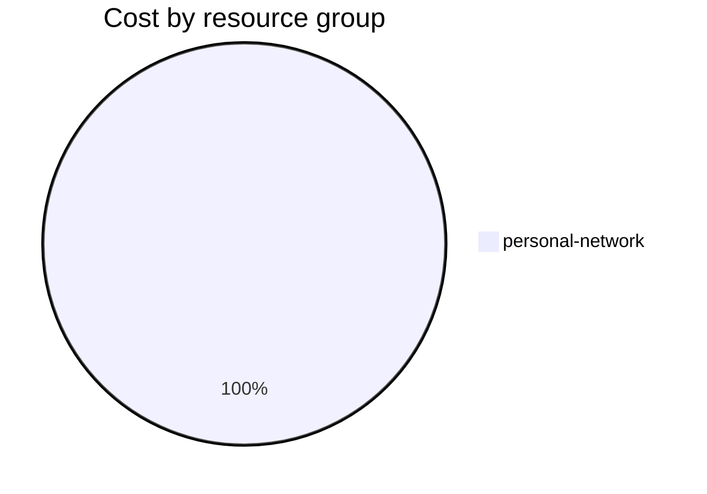

Fetching subscription details...
Fetching cost data...
Fetching forecasted cost data...
Fetching cost data by service name...
Fetching cost data by location...
Fetching cost data by resource group...
# Azure Cost Overview

> Accumulated cost for subscription id `JPF Pay-As-You-Go` from **01/01/2024** to **01/04/2024**

## Totals

|Period|Amount|
|---|---:|
|Today|0.05 USD|
|Yesterday|0.21 USD|
|Last 7 days|0.67 USD|
|Last 30 days|0.67 USD|

```mermaid
gantt
   title Accumulated cost
   dateFormat  X
   axisFormat %s
   section 01 Jan
   USD 0.21 :0, 21
   section 02 Jan
   USD 0.41 :0, 41
   section 03 Jan
   USD 0.62 :0, 62
   section 04 Jan
   USD 0.67 :0, 67
   section 05 Jan
   USD 0.87 : done, 0, 87
   section 06 Jan
   USD 1.07 : done, 0, 107
   section 07 Jan
   USD 1.27 : done, 0, 127
   section 08 Jan
   USD 1.47 : done, 0, 147
   section 09 Jan
   USD 1.67 : done, 0, 167
   section 10 Jan
   USD 1.87 : done, 0, 187
   section 11 Jan
   USD 2.07 : done, 0, 207
   section 12 Jan
   USD 2.27 : done, 0, 227
   section 13 Jan
   USD 2.47 : done, 0, 247
   section 14 Jan
   USD 2.67 : done, 0, 267
   section 15 Jan
   USD 2.87 : done, 0, 287
   section 16 Jan
   USD 3.07 : done, 0, 307
   section 17 Jan
   USD 3.27 : done, 0, 327
   section 18 Jan
   USD 3.47 : done, 0, 347
   section 19 Jan
   USD 3.67 : done, 0, 367
   section 20 Jan
   USD 3.87 : done, 0, 387
   section 21 Jan
   USD 4.07 : done, 0, 407
   section 22 Jan
   USD 4.27 : done, 0, 427
   section 23 Jan
   USD 4.48 : done, 0, 448
   section 24 Jan
   USD 4.68 : done, 0, 468
   section 25 Jan
   USD 4.88 : done, 0, 488
   section 26 Jan
   USD 5.08 : done, 0, 508
   section 27 Jan
   USD 5.28 : done, 0, 528
   section 28 Jan
   USD 5.49 : done, 0, 549
   section 29 Jan
   USD 5.69 : done, 0, 569
   section 30 Jan
   USD 5.89 : done, 0, 589
   section 31 Jan
   USD 6.09 : done, 0, 609
```

## By Service Name

|Service|Amount|
|---|---:|
|Virtual Machines|0.67 USD|
|Bandwidth|0.00 USD|

## By Location

|Location|Amount|
|---|---:|
|US North Central|0.67 USD|

## By Resource Group

|Resource Group|Amount|
|---|---:|
|personal-network|0.67 USD|

Generated at 2024-01-04 11:11:08 for subscription with id `4913be3f-a345-4652-9bba-767418dd25e3`
