Fetching subscription details...
Fetching cost data...
Fetching forecasted cost data...
Fetching cost data by service name...
Fetching cost data by location...
Fetching cost data by resource group...
# Azure Cost Overview

> Accumulated cost for subscription id `JPF Pay-As-You-Go` from **09/14/2023** to **09/20/2023**

## Totals

|Period|Amount|
|---|---:|
|Today|0.06 USD|
|Yesterday|0.17 USD|
|Last 7 days|1.09 USD|
|Last 30 days|1.09 USD|

```mermaid
gantt
   title Accumulated cost
   dateFormat  X
   axisFormat %s
   section 14 Sep
   USD 0.16 :0, 16
   section 15 Sep
   USD 0.33 :0, 33
   section 16 Sep
   USD 0.51 :0, 51
   section 17 Sep
   USD 0.68 :0, 68
   section 18 Sep
   USD 0.86 :0, 86
   section 19 Sep
   USD 1.03 :0, 103
   section 20 Sep
   USD 1.09 :0, 109
   section 21 Sep
   USD 1.25 : done, 0, 125
   section 22 Sep
   USD 1.43 : done, 0, 143
   section 23 Sep
   USD 1.60 : done, 0, 160
   section 24 Sep
   USD 1.78 : done, 0, 178
   section 25 Sep
   USD 1.95 : done, 0, 195
   section 26 Sep
   USD 1.95 : done, 0, 195
   section 27 Sep
   USD 1.95 : done, 0, 195
   section 28 Sep
   USD 2.11 : done, 0, 211
   section 29 Sep
   USD 2.29 : done, 0, 229
   section 30 Sep
   USD 2.46 : done, 0, 246
```

## By Service Name

|Service|Amount|
|---|---:|
|Virtual Machines|1.09 USD|
|Bandwidth|0.00 USD|

## By Location

|Location|Amount|
|---|---:|
|US North Central|1.09 USD|

## By Resource Group

|Resource Group|Amount|
|---|---:|
|personal-network|1.09 USD|

Generated at 2023-09-20 11:17:24 for subscription with id `4913be3f-a345-4652-9bba-767418dd25e3`
