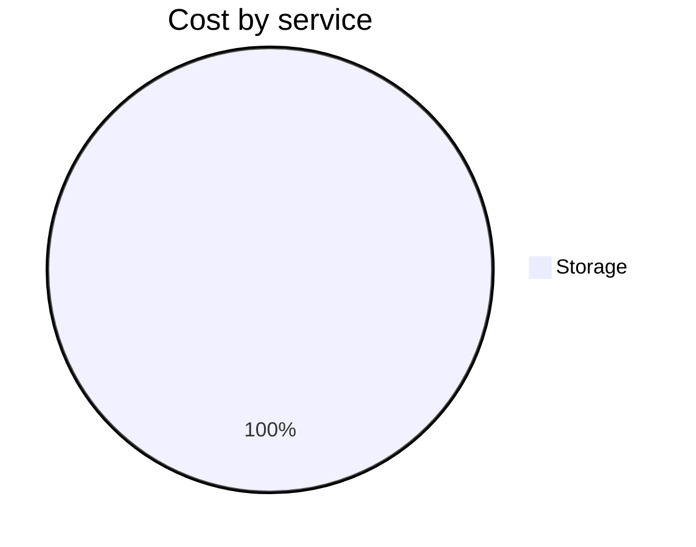
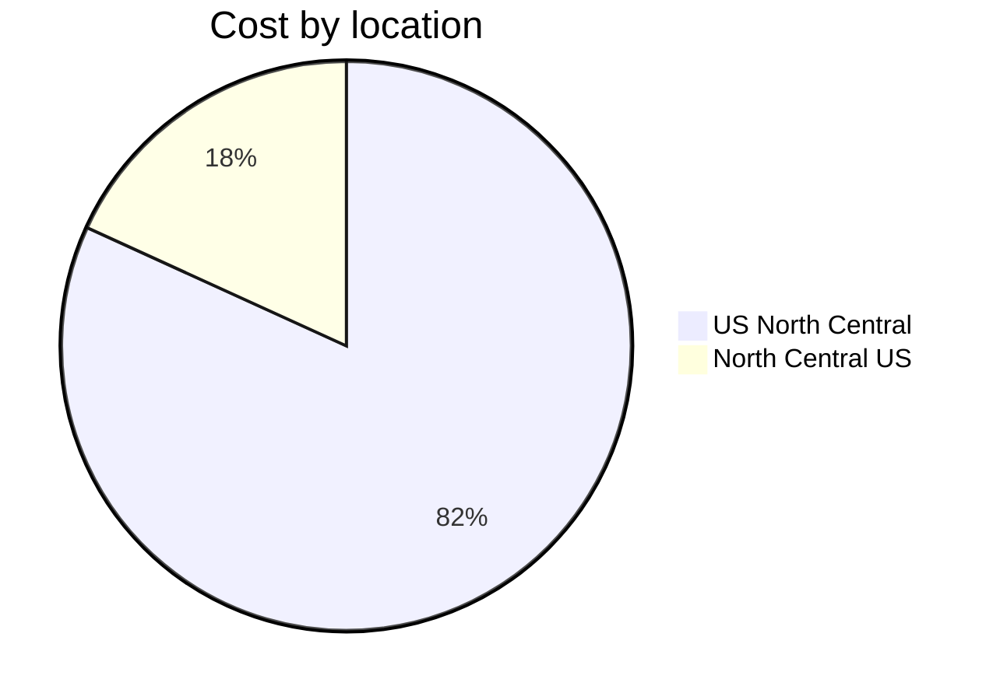
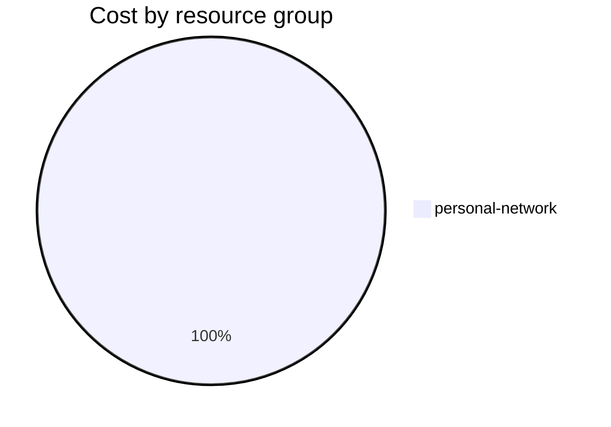

Fetching subscription details...
Fetching cost data...
Fetching forecasted cost data...
Fetching cost data by service name...
Fetching cost data by location...
Fetching cost data by resource group...
# Azure Cost Overview

> Accumulated cost for subscription id `JPF Pay-As-You-Go` from **11/01/2023** to **11/02/2023**

## Totals

|Period|Amount|
|---|---:|
|Today|0.00 USD|
|Yesterday|0.04 USD|
|Last 7 days|0.11 USD|
|Last 30 days|0.11 USD|

```mermaid
gantt
   title Accumulated cost
   dateFormat  X
   axisFormat %s
   section 01 Nov
   USD 0.06 :0, 6
   section 02 Nov
   USD 0.11 :0, 11
   section 03 Nov
   USD 0.17 : done, 0, 17
   section 04 Nov
   USD 0.23 : done, 0, 23
   section 05 Nov
   USD 0.29 : done, 0, 29
   section 06 Nov
   USD 0.35 : done, 0, 35
   section 07 Nov
   USD 0.42 : done, 0, 42
   section 08 Nov
   USD 0.48 : done, 0, 48
   section 09 Nov
   USD 0.54 : done, 0, 54
   section 10 Nov
   USD 0.60 : done, 0, 60
   section 11 Nov
   USD 0.66 : done, 0, 66
   section 12 Nov
   USD 0.73 : done, 0, 73
   section 13 Nov
   USD 0.79 : done, 0, 79
   section 14 Nov
   USD 0.85 : done, 0, 85
   section 15 Nov
   USD 0.91 : done, 0, 91
   section 16 Nov
   USD 0.97 : done, 0, 97
   section 17 Nov
   USD 1.03 : done, 0, 103
   section 18 Nov
   USD 1.10 : done, 0, 110
   section 19 Nov
   USD 1.16 : done, 0, 116
   section 20 Nov
   USD 1.22 : done, 0, 122
   section 21 Nov
   USD 1.28 : done, 0, 128
   section 22 Nov
   USD 1.34 : done, 0, 134
   section 23 Nov
   USD 1.40 : done, 0, 140
   section 24 Nov
   USD 1.47 : done, 0, 147
   section 25 Nov
   USD 1.53 : done, 0, 153
   section 26 Nov
   USD 1.59 : done, 0, 159
   section 27 Nov
   USD 1.65 : done, 0, 165
   section 28 Nov
   USD 1.71 : done, 0, 171
   section 29 Nov
   USD 1.77 : done, 0, 177
   section 30 Nov
   USD 1.84 : done, 0, 184
```

## By Service Name

|Service|Amount|
|---|---:|
|Storage|0.11 USD|

## By Location

|Location|Amount|
|---|---:|
|US North Central|0.09 USD|
|North Central US|0.02 USD|

## By Resource Group

|Resource Group|Amount|
|---|---:|
|personal-network|0.11 USD|

Generated at 2023-11-03 11:20:18 for subscription with id `4913be3f-a345-4652-9bba-767418dd25e3`
