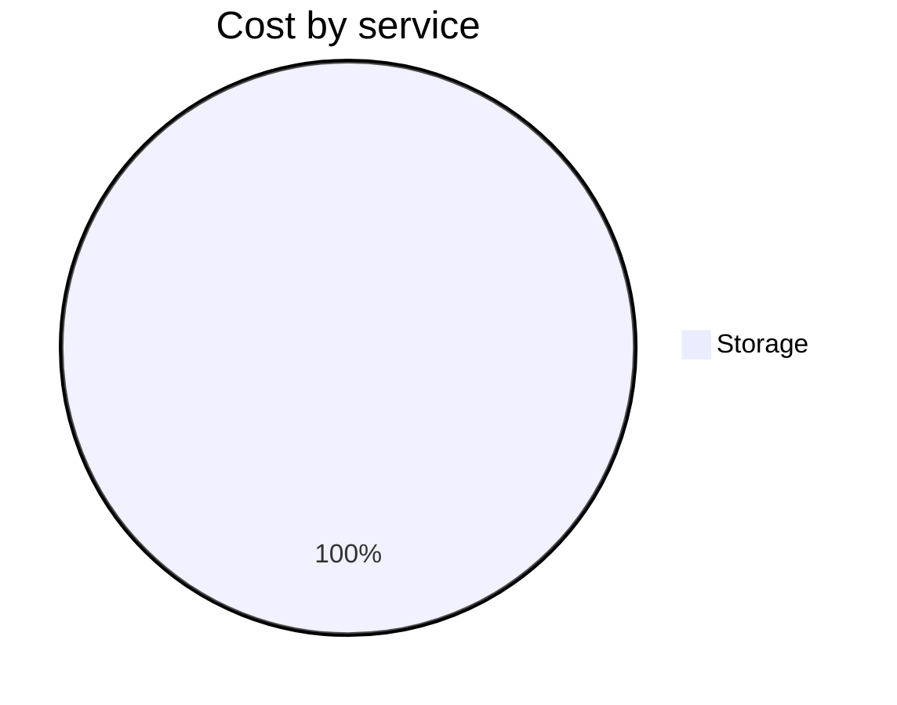
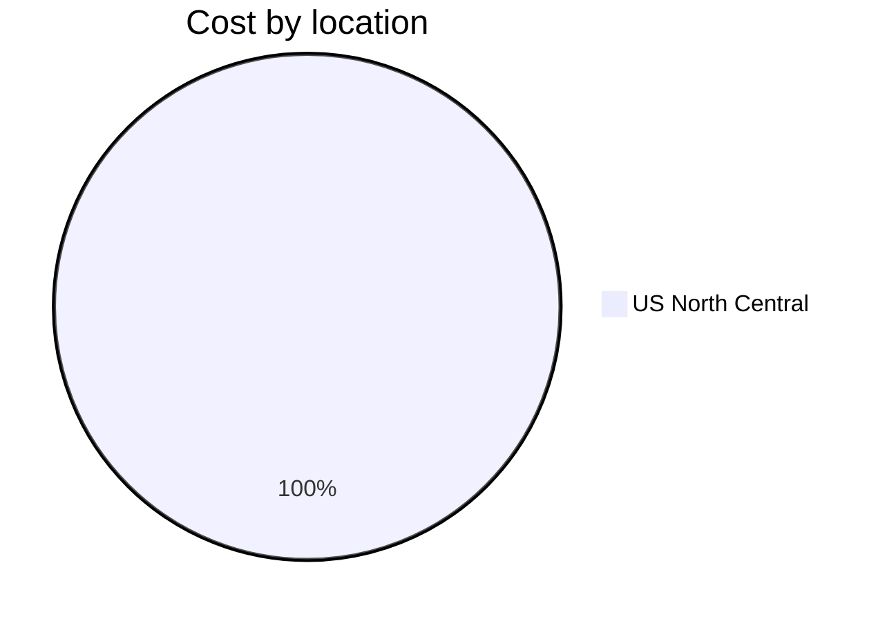
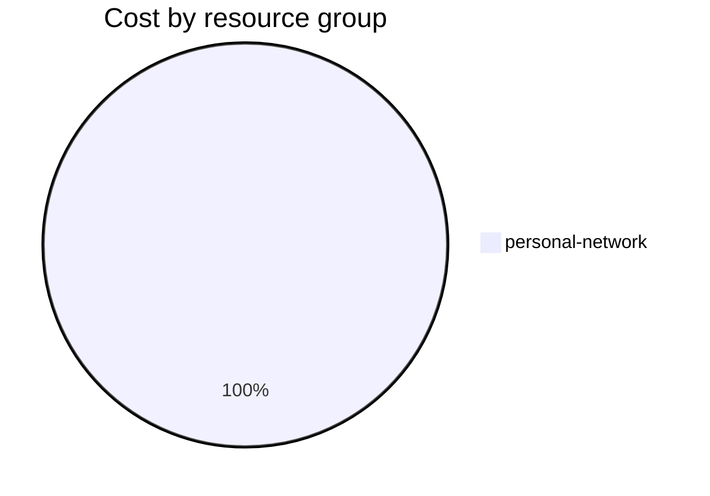

Fetching subscription details...
Fetching cost data...
Fetching forecasted cost data...
Fetching cost data by service name...
Fetching cost data by location...
Fetching cost data by resource group...
# Azure Cost Overview

> Accumulated cost for subscription id `JPF Pay-As-You-Go` from **10/01/2023** to **10/03/2023**

## Totals

|Period|Amount|
|---|---:|
|Today|0.00 USD|
|Yesterday|0.05 USD|
|Last 7 days|0.17 USD|
|Last 30 days|0.17 USD|

```mermaid
gantt
   title Accumulated cost
   dateFormat  X
   axisFormat %s
   section 01 Oct
   USD 0.06 :0, 6
   section 02 Oct
   USD 0.12 :0, 12
   section 03 Oct
   USD 0.17 :0, 17
   section 04 Oct
   USD 0.23 : done, 0, 23
   section 05 Oct
   USD 0.30 : done, 0, 30
   section 06 Oct
   USD 0.36 : done, 0, 36
   section 07 Oct
   USD 0.42 : done, 0, 42
   section 08 Oct
   USD 0.49 : done, 0, 49
   section 09 Oct
   USD 0.55 : done, 0, 55
   section 10 Oct
   USD 0.61 : done, 0, 61
   section 11 Oct
   USD 0.67 : done, 0, 67
   section 12 Oct
   USD 0.74 : done, 0, 74
   section 13 Oct
   USD 0.80 : done, 0, 80
   section 14 Oct
   USD 0.86 : done, 0, 86
   section 15 Oct
   USD 0.92 : done, 0, 92
   section 16 Oct
   USD 0.99 : done, 0, 99
   section 17 Oct
   USD 1.05 : done, 0, 105
   section 18 Oct
   USD 1.11 : done, 0, 111
   section 19 Oct
   USD 1.17 : done, 0, 117
   section 20 Oct
   USD 1.24 : done, 0, 124
   section 21 Oct
   USD 1.30 : done, 0, 130
   section 22 Oct
   USD 1.36 : done, 0, 136
   section 23 Oct
   USD 1.42 : done, 0, 142
   section 24 Oct
   USD 1.49 : done, 0, 149
   section 25 Oct
   USD 1.55 : done, 0, 155
   section 26 Oct
   USD 1.61 : done, 0, 161
   section 27 Oct
   USD 1.67 : done, 0, 167
   section 28 Oct
   USD 1.74 : done, 0, 174
   section 29 Oct
   USD 1.80 : done, 0, 180
   section 30 Oct
   USD 1.86 : done, 0, 186
   section 31 Oct
   USD 1.92 : done, 0, 192
```

## By Service Name

|Service|Amount|
|---|---:|
|Storage|0.17 USD|

## By Location

|Location|Amount|
|---|---:|
|US North Central|0.17 USD|

## By Resource Group

|Resource Group|Amount|
|---|---:|
|personal-network|0.17 USD|

Generated at 2023-10-04 11:18:30 for subscription with id `4913be3f-a345-4652-9bba-767418dd25e3`
