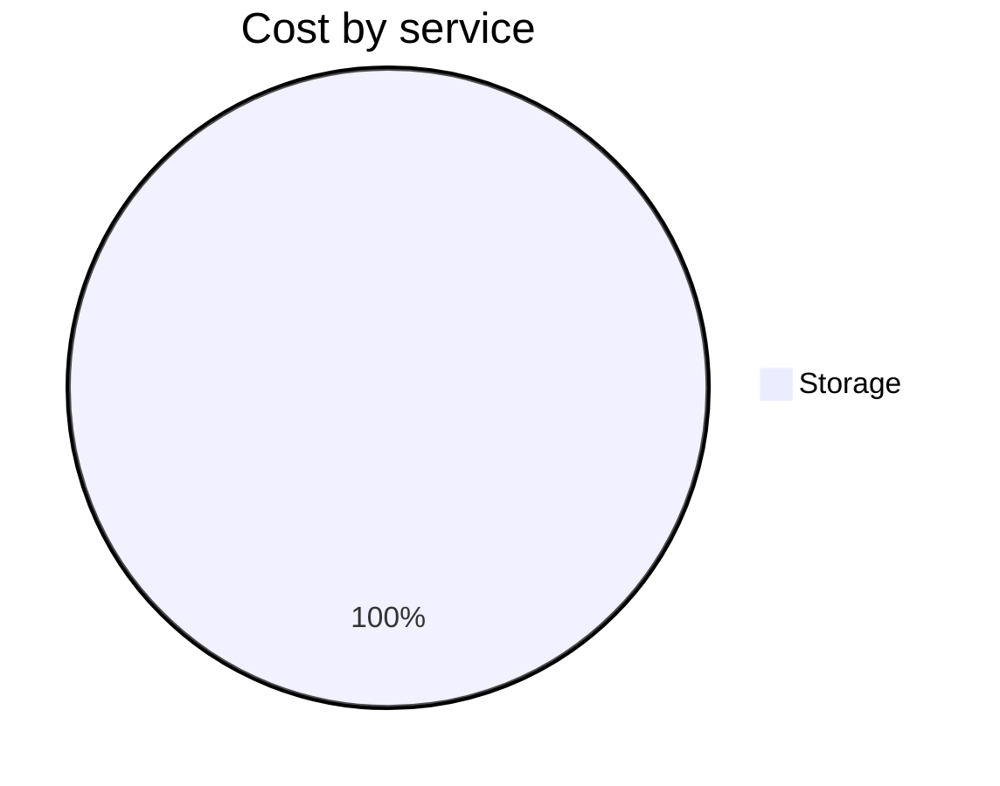
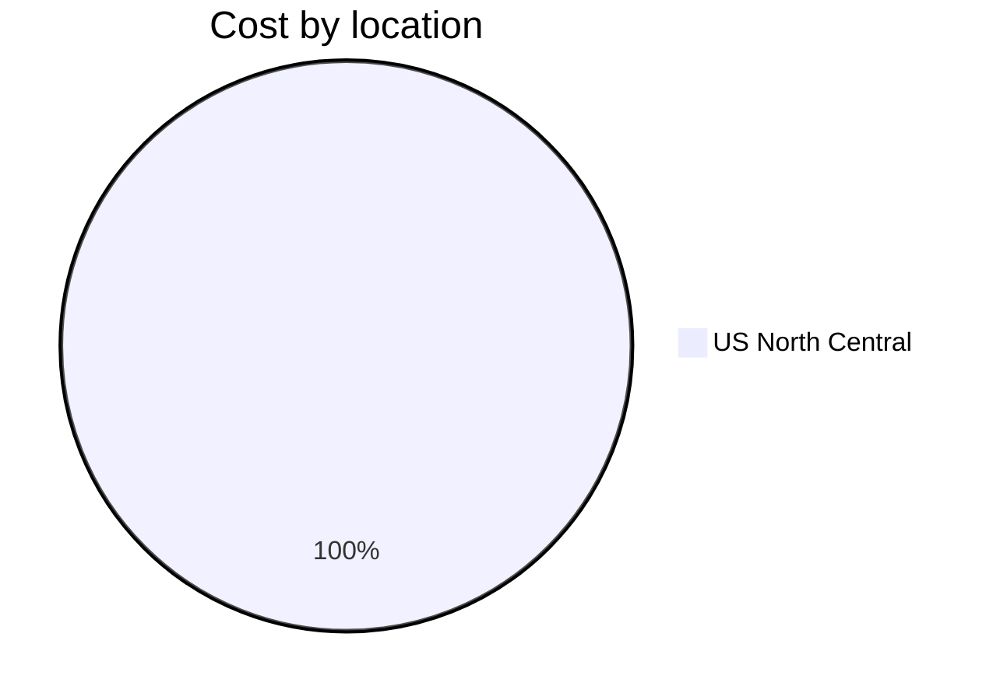
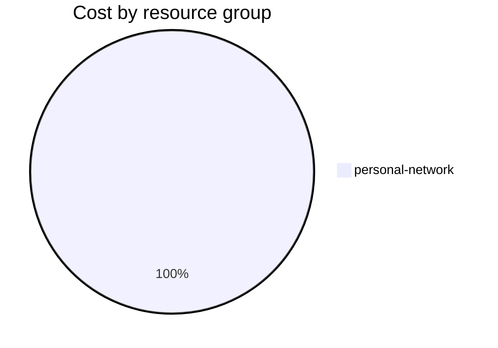

Fetching subscription details...
Fetching cost data...
Fetching forecasted cost data...
Fetching cost data by service name...
Fetching cost data by location...
Fetching cost data by resource group...
# Azure Cost Overview

> Accumulated cost for subscription id `JPF Pay-As-You-Go` from **09/15/2023** to **09/17/2023**

## Totals

|Period|Amount|
|---|---:|
|Today|0.00 USD|
|Yesterday|23.43 USD|
|Last 7 days|36.84 USD|
|Last 30 days|36.84 USD|

```mermaid
gantt
   title Accumulated cost
   dateFormat  X
   axisFormat %s
   section 15 Sep
   USD 2.74 :0, 274
   section 16 Sep
   USD 13.41 :0, 1341
   section 17 Sep
   USD 36.84 :0, 3684
```

## By Service Name

|Service|Amount|
|---|---:|
|Storage|36.84 USD|

## By Location

|Location|Amount|
|---|---:|
|US North Central|36.84 USD|

## By Resource Group

|Resource Group|Amount|
|---|---:|
|personal-network|36.84 USD|

Generated at 2023-09-18 11:22:39 for subscription with id `4913be3f-a345-4652-9bba-767418dd25e3`
