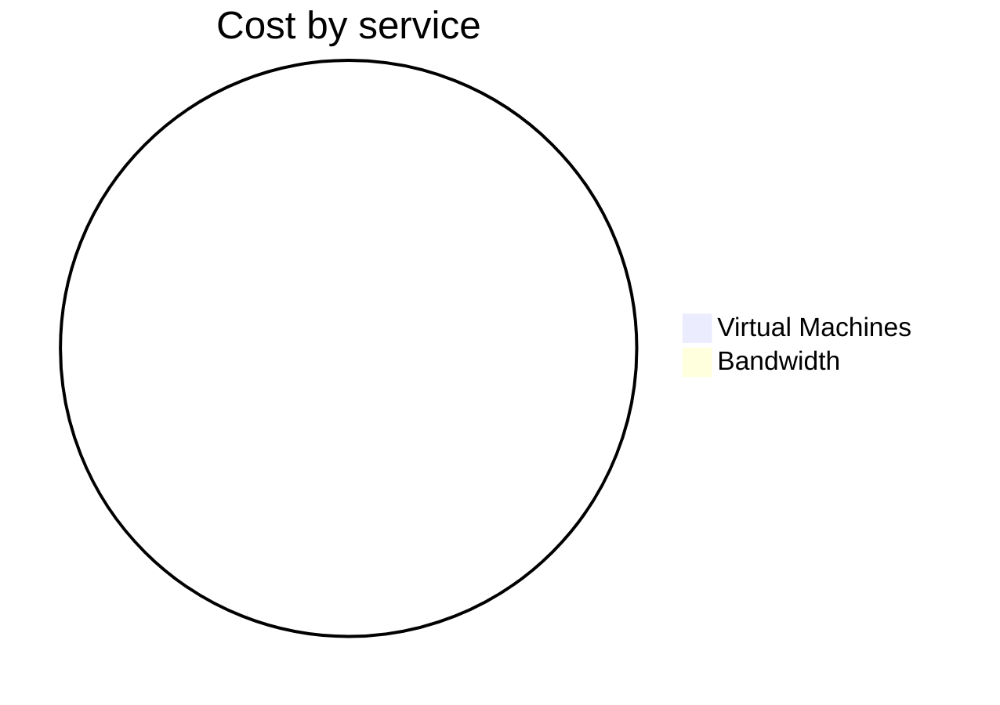

Fetching subscription details...
Fetching cost data...
Fetching forecasted cost data...
Fetching cost data by service name...
Fetching cost data by location...
Fetching cost data by resource group...
# Azure Cost Overview

> Accumulated cost for subscription id `JPF Pay-As-You-Go` from **09/01/2023** to **09/01/2023**

## Totals

|Period|Amount|
|---|---:|
|Today|0.00 USD|
|Yesterday|0.00 USD|
|Last 7 days|0.00 USD|
|Last 30 days|0.00 USD|

```mermaid
gantt
   title Accumulated cost
   dateFormat  X
   axisFormat %s
   section 01 Sep
   USD 0.00 :0, 0
```



## By Service Name

|Service|Amount|
|---|---:|
|Virtual Machines|0.00 USD|
|Bandwidth|0.00 USD|



## By Location

|Location|Amount|
|---|---:|
|US North Central|0.00 USD|

```mermaid
pie
   title Cost by location
   "US North Central" : 0.00
```

## By Resource Group

|Resource Group|Amount|
|---|---:|
|personal-network|0.00 USD|

```mermaid
pie
   title Cost by resource group
   "personal-network" : 0.00
```

<sup>Generated at 2023-09-16 05:34:06 for subscription with id `4913be3f-a345-4652-9bba-767418dd25e3`</sup>
