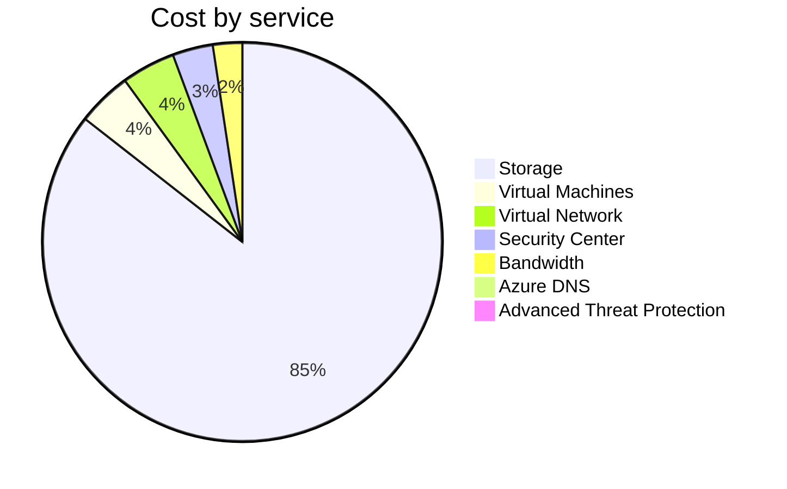
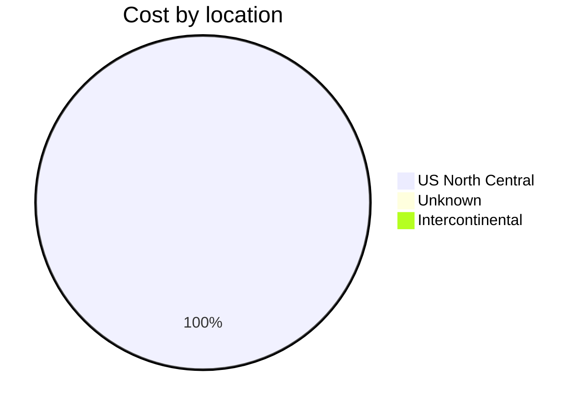
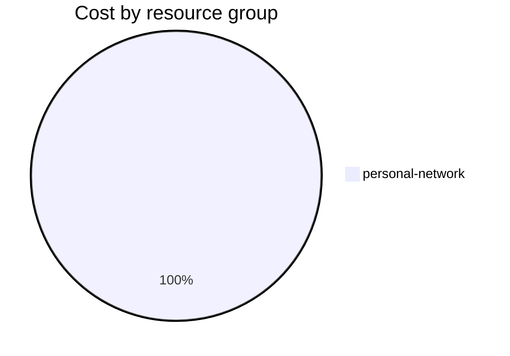

Fetching subscription details...
Fetching cost data...
Fetching forecasted cost data...
Fetching cost data by service name...
Fetching cost data by location...
Fetching cost data by resource group...
# Azure Cost Overview

> Accumulated cost for subscription id `JPF Pay-As-You-Go` from **09/01/2023** to **09/14/2023**

## Totals

|Period|Amount|
|---|---:|
|Today|21.46 USD|
|Yesterday|46.13 USD|
|Last 7 days|94.82 USD|
|Last 30 days|113.33 USD|

```mermaid
gantt
   title Accumulated cost
   dateFormat  X
   axisFormat %s
   section 01 Sep
   USD 3.20 :0, 320
   section 02 Sep
   USD 6.19 :0, 619
   section 03 Sep
   USD 9.27 :0, 927
   section 04 Sep
   USD 12.30 :0, 1230
   section 05 Sep
   USD 15.47 :0, 1547
   section 06 Sep
   USD 18.50 :0, 1850
   section 07 Sep
   USD 21.60 :0, 2160
   section 08 Sep
   USD 24.70 :0, 2470
   section 09 Sep
   USD 27.69 :0, 2769
   section 10 Sep
   USD 30.45 :0, 3045
   section 11 Sep
   USD 33.22 :0, 3322
   section 12 Sep
   USD 45.74 :0, 4574
   section 13 Sep
   USD 91.87 :0, 9187
   section 14 Sep
   USD 113.33 :0, 11333
   section 15 Sep
   USD 117.89 : done, 0, 11789
   section 16 Sep
   USD 122.36 : done, 0, 12236
   section 17 Sep
   USD 126.95 : done, 0, 12695
   section 18 Sep
   USD 131.58 : done, 0, 13158
   section 19 Sep
   USD 136.40 : done, 0, 13640
   section 20 Sep
   USD 141.14 : done, 0, 14114
   section 21 Sep
   USD 145.93 : done, 0, 14593
   section 22 Sep
   USD 150.96 : done, 0, 15096
   section 23 Sep
   USD 155.88 : done, 0, 15588
   section 24 Sep
   USD 160.94 : done, 0, 16094
   section 25 Sep
   USD 166.02 : done, 0, 16602
   section 26 Sep
   USD 171.31 : done, 0, 17131
   section 27 Sep
   USD 176.51 : done, 0, 17651
   section 28 Sep
   USD 181.77 : done, 0, 18177
   section 29 Sep
   USD 187.25 : done, 0, 18725
   section 30 Sep
   USD 192.64 : done, 0, 19264
```

## By Service Name

|Service|Amount|
|---|---:|
|Storage|96.80 USD|
|Virtual Machines|5.00 USD|
|Virtual Network|4.92 USD|
|Security Center|3.70 USD|
|Bandwidth|2.69 USD|
|Azure DNS|0.22 USD|
|Advanced Threat Protection|0.00 USD|

## By Location

|Location|Amount|
|---|---:|
|US North Central|113.11 USD|
|Unknown|0.22 USD|
|Intercontinental|0.00 USD|

## By Resource Group

|Resource Group|Amount|
|---|---:|
|personal-network|113.33 USD|

Generated at 2023-09-14 23:07:40 for subscription with id `4913be3f-a345-4652-9bba-767418dd25e3`
