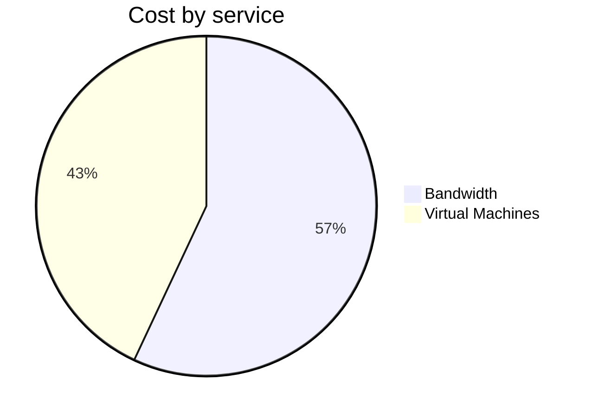
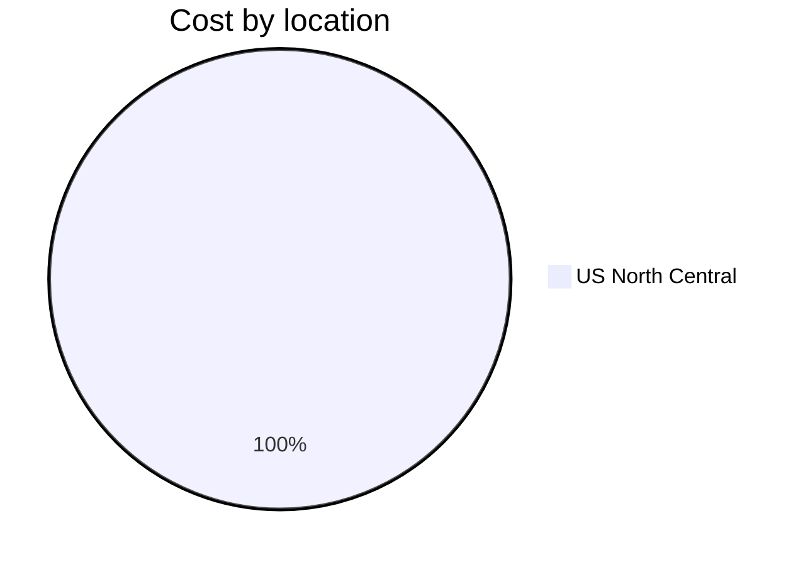
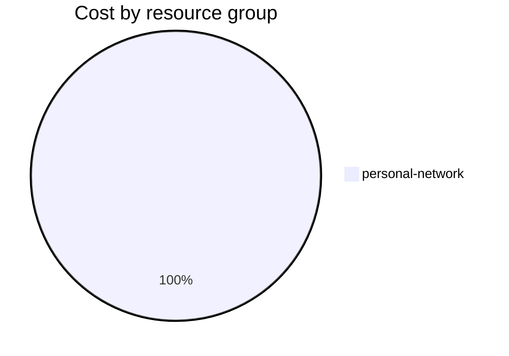

Fetching subscription details...
Fetching cost data...
Fetching forecasted cost data...
Fetching cost data by service name...
Fetching cost data by location...
Fetching cost data by resource group...
# Azure Cost Overview

> Accumulated cost for subscription id `JPF Pay-As-You-Go` from **09/15/2023** to **09/23/2023**

## Totals

|Period|Amount|
|---|---:|
|Today|0.05 USD|
|Yesterday|0.71 USD|
|Last 7 days|3.11 USD|
|Last 30 days|3.36 USD|

```mermaid
gantt
   title Accumulated cost
   dateFormat  X
   axisFormat %s
   section 15 Sep
   USD 0.25 :0, 25
   section 16 Sep
   USD 0.61 :0, 61
   section 17 Sep
   USD 0.95 :0, 95
   section 18 Sep
   USD 1.46 :0, 146
   section 19 Sep
   USD 1.79 :0, 179
   section 20 Sep
   USD 2.14 :0, 214
   section 21 Sep
   USD 2.60 :0, 260
   section 22 Sep
   USD 3.31 :0, 331
   section 23 Sep
   USD 3.36 :0, 336
   section 24 Sep
   USD 3.70 : done, 0, 370
   section 25 Sep
   USD 4.21 : done, 0, 421
   section 26 Sep
   USD 4.54 : done, 0, 454
   section 27 Sep
   USD 4.89 : done, 0, 489
   section 28 Sep
   USD 5.35 : done, 0, 535
   section 29 Sep
   USD 5.60 : done, 0, 560
   section 30 Sep
   USD 5.96 : done, 0, 596
```

## By Service Name

|Service|Amount|
|---|---:|
|Bandwidth|1.92 USD|
|Virtual Machines|1.45 USD|

## By Location

|Location|Amount|
|---|---:|
|US North Central|3.36 USD|

## By Resource Group

|Resource Group|Amount|
|---|---:|
|personal-network|3.36 USD|

Generated at 2023-09-23 11:28:13 for subscription with id `4913be3f-a345-4652-9bba-767418dd25e3`
