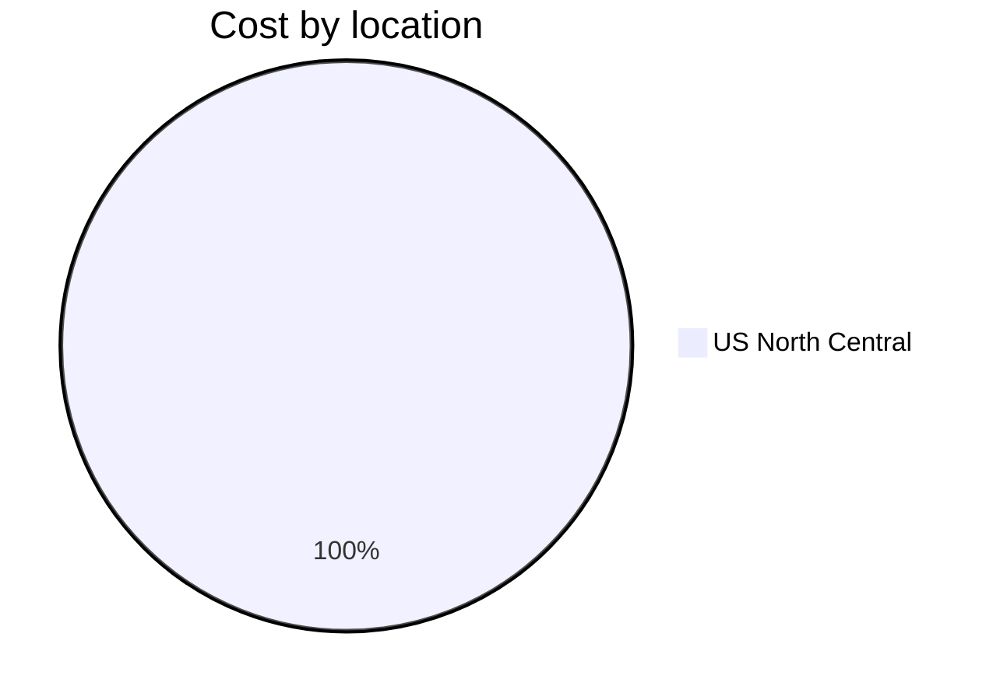
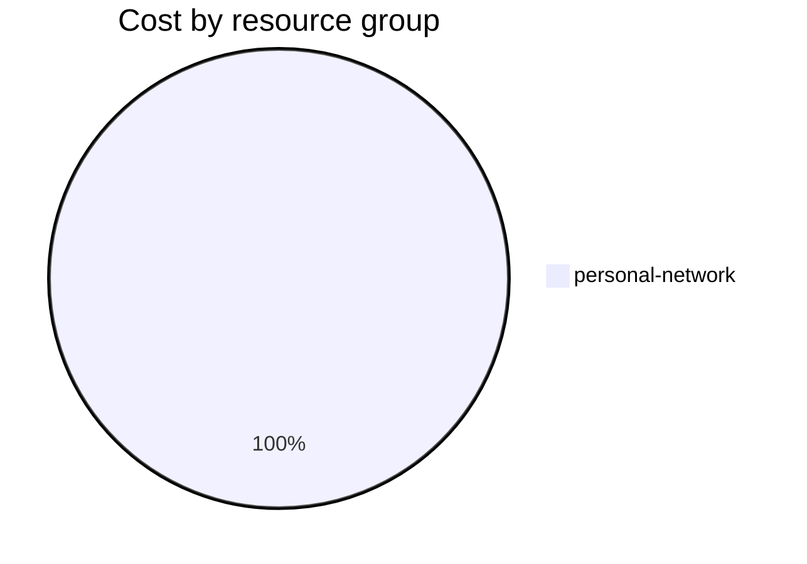

Fetching subscription details...
Fetching cost data...
Fetching forecasted cost data...
Fetching cost data by service name...
Fetching cost data by location...
Fetching cost data by resource group...
# Azure Cost Overview

> Accumulated cost for subscription id `JPF Pay-As-You-Go` from **10/01/2023** to **10/05/2023**

## Totals

|Period|Amount|
|---|---:|
|Today|0.04 USD|
|Yesterday|0.45 USD|
|Last 7 days|2.02 USD|
|Last 30 days|2.02 USD|

```mermaid
gantt
   title Accumulated cost
   dateFormat  X
   axisFormat %s
   section 01 Oct
   USD 0.53 :0, 53
   section 02 Oct
   USD 1.01 :0, 101
   section 03 Oct
   USD 1.53 :0, 153
   section 04 Oct
   USD 1.98 :0, 198
   section 05 Oct
   USD 2.02 :0, 202
   section 06 Oct
   USD 2.37 : done, 0, 237
   section 07 Oct
   USD 2.70 : done, 0, 270
   section 08 Oct
   USD 3.13 : done, 0, 313
   section 09 Oct
   USD 3.49 : done, 0, 349
   section 10 Oct
   USD 3.88 : done, 0, 388
   section 11 Oct
   USD 4.23 : done, 0, 423
   section 12 Oct
   USD 4.78 : done, 0, 478
   section 13 Oct
   USD 5.04 : done, 0, 504
   section 14 Oct
   USD 5.29 : done, 0, 529
   section 15 Oct
   USD 5.63 : done, 0, 563
   section 16 Oct
   USD 5.90 : done, 0, 590
   section 17 Oct
   USD 6.21 : done, 0, 621
   section 18 Oct
   USD 6.48 : done, 0, 648
   section 19 Oct
   USD 6.94 : done, 0, 694
   section 20 Oct
   USD 7.11 : done, 0, 711
   section 21 Oct
   USD 7.28 : done, 0, 728
   section 22 Oct
   USD 7.53 : done, 0, 753
   section 23 Oct
   USD 7.72 : done, 0, 772
   section 24 Oct
   USD 7.94 : done, 0, 794
   section 25 Oct
   USD 8.12 : done, 0, 812
   section 26 Oct
   USD 8.50 : done, 0, 850
   section 27 Oct
   USD 8.59 : done, 0, 859
   section 28 Oct
   USD 8.67 : done, 0, 867
   section 29 Oct
   USD 8.83 : done, 0, 883
   section 30 Oct
   USD 8.93 : done, 0, 893
   section 31 Oct
   USD 9.07 : done, 0, 907
```

## By Service Name

|Service|Amount|
|---|---:|
|Bandwidth|1.27 USD|
|Virtual Machines|0.76 USD|

## By Location

|Location|Amount|
|---|---:|
|US North Central|2.02 USD|

## By Resource Group

|Resource Group|Amount|
|---|---:|
|personal-network|2.02 USD|

Generated at 2023-10-05 11:26:15 for subscription with id `4913be3f-a345-4652-9bba-767418dd25e3`
