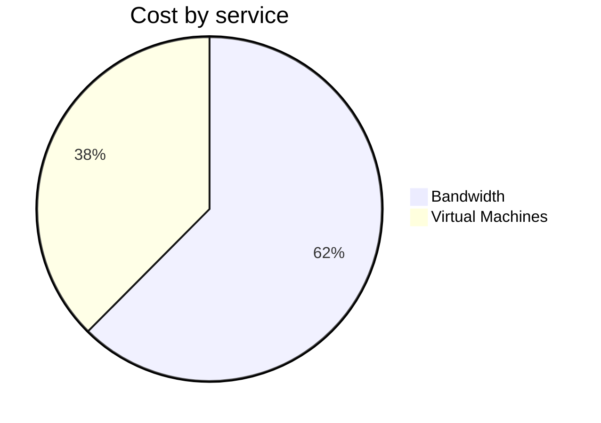
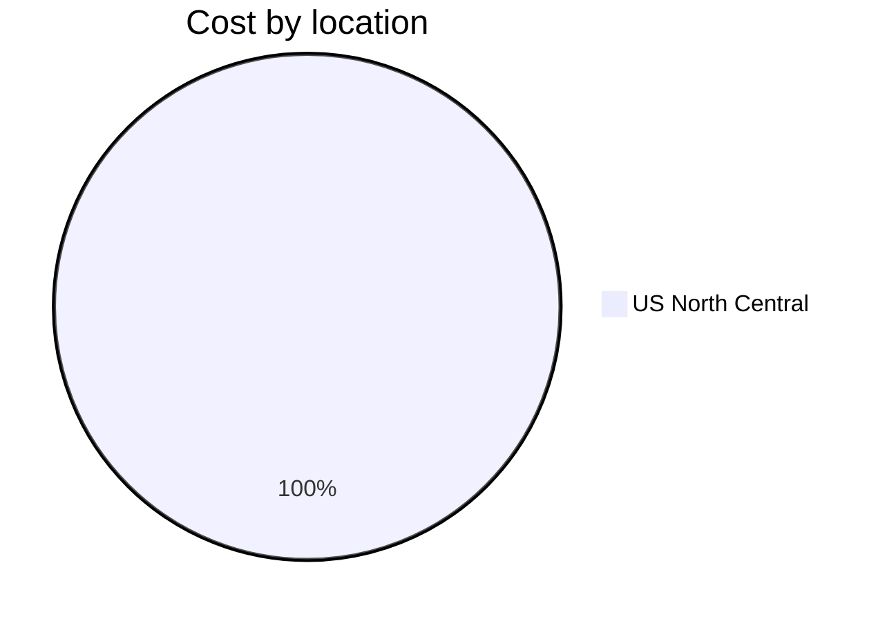
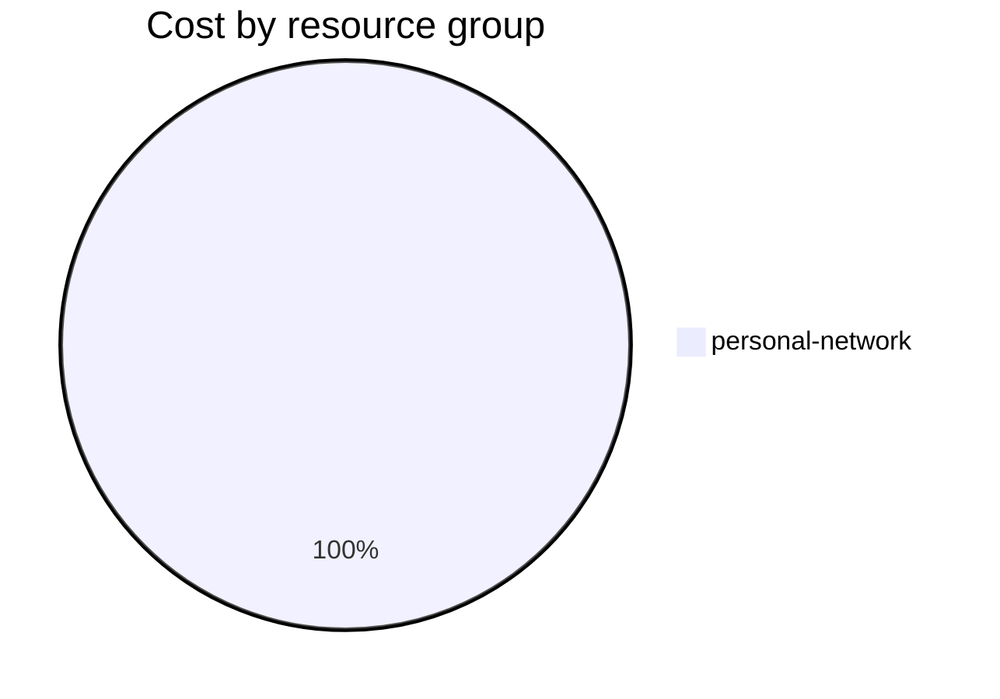

Fetching subscription details...
Fetching cost data...
Fetching forecasted cost data...
Fetching cost data by service name...
Fetching cost data by location...
Fetching cost data by resource group...
# Azure Cost Overview

> Accumulated cost for subscription id `JPF Pay-As-You-Go` from **03/01/2024** to **03/05/2024**

## Totals

|Period|Amount|
|---|---:|
|Today|0.04 USD|
|Yesterday|0.18 USD|
|Last 7 days|1.93 USD|
|Last 30 days|1.93 USD|

```mermaid
gantt
   title Accumulated cost
   dateFormat  X
   axisFormat %s
   section 01 Mar
   USD 1.36 :0, 136
   section 02 Mar
   USD 1.53 :0, 153
   section 03 Mar
   USD 1.71 :0, 171
   section 04 Mar
   USD 1.88 :0, 188
   section 05 Mar
   USD 1.93 :0, 193
   section 06 Mar
   USD 2.17 : done, 0, 217
   section 07 Mar
   USD 2.20 : done, 0, 220
   section 08 Mar
   USD 2.61 : done, 0, 261
   section 09 Mar
   USD 2.62 : done, 0, 262
   section 10 Mar
   USD 2.71 : done, 0, 271
   section 11 Mar
   USD 2.71 : done, 0, 271
   section 12 Mar
   USD 2.98 : done, 0, 298
   section 13 Mar
   USD 3.07 : done, 0, 307
   section 14 Mar
   USD 3.07 : done, 0, 307
   section 15 Mar
   USD 3.31 : done, 0, 331
   section 16 Mar
   USD 3.31 : done, 0, 331
   section 17 Mar
   USD 3.31 : done, 0, 331
   section 18 Mar
   USD 3.31 : done, 0, 331
   section 19 Mar
   USD 3.43 : done, 0, 343
   section 20 Mar
   USD 3.43 : done, 0, 343
   section 21 Mar
   USD 3.43 : done, 0, 343
   section 22 Mar
   USD 3.52 : done, 0, 352
   section 23 Mar
   USD 3.52 : done, 0, 352
   section 24 Mar
   USD 3.52 : done, 0, 352
   section 25 Mar
   USD 3.52 : done, 0, 352
   section 26 Mar
   USD 3.52 : done, 0, 352
   section 27 Mar
   USD 3.52 : done, 0, 352
   section 28 Mar
   USD 3.52 : done, 0, 352
   section 29 Mar
   USD 3.52 : done, 0, 352
   section 30 Mar
   USD 3.52 : done, 0, 352
   section 31 Mar
   USD 3.52 : done, 0, 352
```

## By Service Name

|Service|Amount|
|---|---:|
|Bandwidth|1.18 USD|
|Virtual Machines|0.71 USD|

## By Location

|Location|Amount|
|---|---:|
|US North Central|1.93 USD|

## By Resource Group

|Resource Group|Amount|
|---|---:|
|personal-network|1.93 USD|

Generated at 2024-03-05 11:29:12 for subscription with id `4913be3f-a345-4652-9bba-767418dd25e3`
