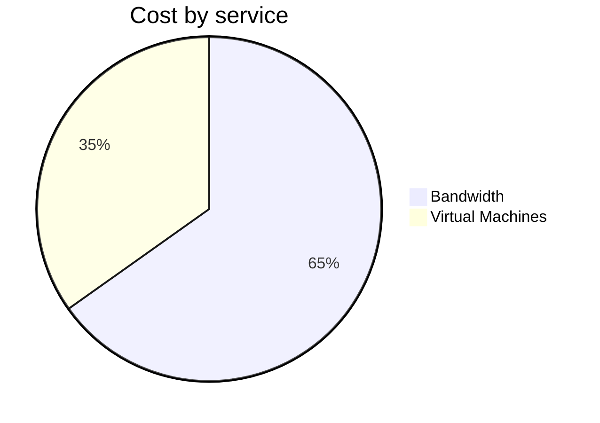
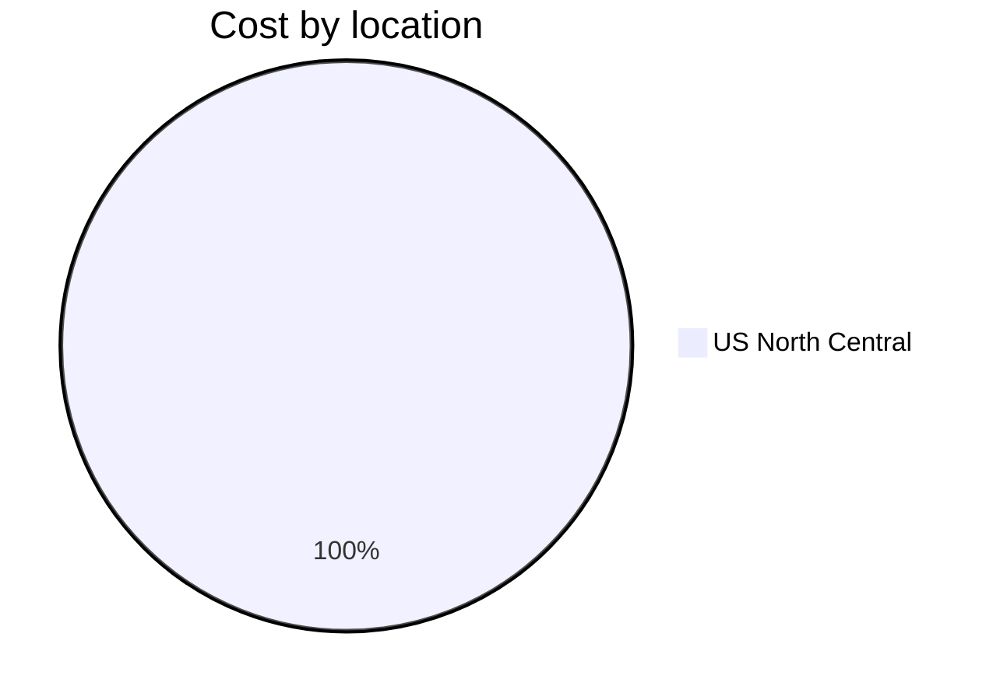
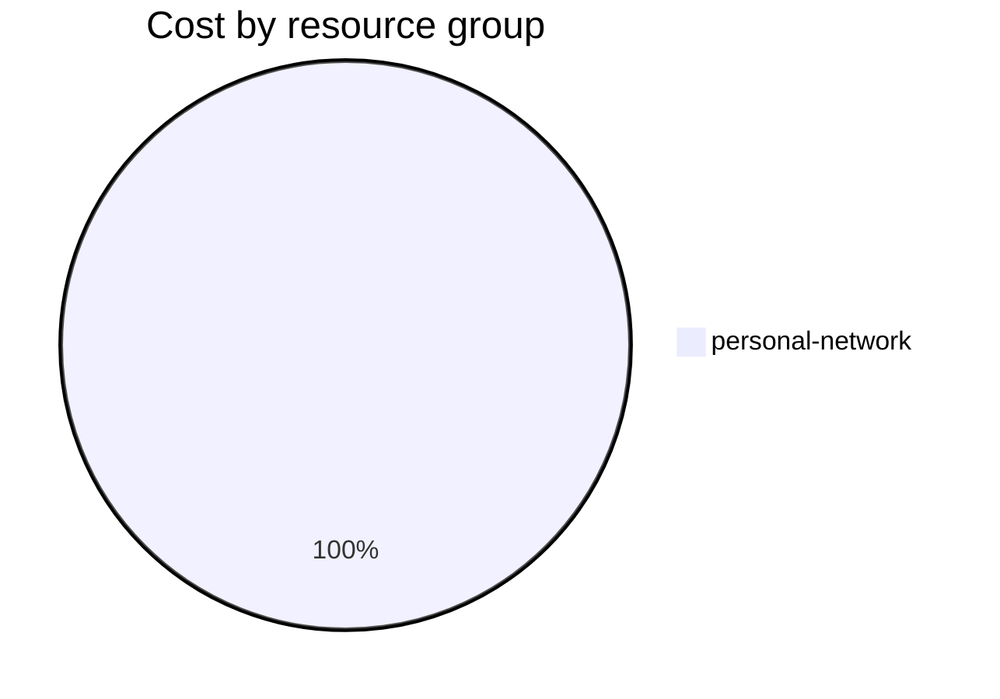

Fetching subscription details...
Fetching cost data...
Fetching forecasted cost data...
Fetching cost data by service name...
Fetching cost data by location...
Fetching cost data by resource group...
# Azure Cost Overview

> Accumulated cost for subscription id `JPF Pay-As-You-Go` from **01/01/2024** to **01/06/2024**

## Totals

|Period|Amount|
|---|---:|
|Today|0.06 USD|
|Yesterday|0.52 USD|
|Last 7 days|3.13 USD|
|Last 30 days|3.13 USD|

```mermaid
gantt
   title Accumulated cost
   dateFormat  X
   axisFormat %s
   section 01 Jan
   USD 0.61 :0, 61
   section 02 Jan
   USD 1.59 :0, 159
   section 03 Jan
   USD 2.03 :0, 203
   section 04 Jan
   USD 2.55 :0, 255
   section 05 Jan
   USD 3.07 :0, 307
   section 06 Jan
   USD 3.13 :0, 313
   section 07 Jan
   USD 3.61 : done, 0, 361
   section 08 Jan
   USD 4.20 : done, 0, 420
   section 09 Jan
   USD 4.80 : done, 0, 480
   section 10 Jan
   USD 5.13 : done, 0, 513
   section 11 Jan
   USD 5.53 : done, 0, 553
   section 12 Jan
   USD 5.75 : done, 0, 575
   section 13 Jan
   USD 6.13 : done, 0, 613
   section 14 Jan
   USD 6.58 : done, 0, 658
   section 15 Jan
   USD 7.16 : done, 0, 716
   section 16 Jan
   USD 7.73 : done, 0, 773
   section 17 Jan
   USD 8.04 : done, 0, 804
   section 18 Jan
   USD 8.42 : done, 0, 842
   section 19 Jan
   USD 8.62 : done, 0, 862
   section 20 Jan
   USD 8.98 : done, 0, 898
   section 21 Jan
   USD 9.41 : done, 0, 941
   section 22 Jan
   USD 9.97 : done, 0, 997
   section 23 Jan
   USD 10.52 : done, 0, 1052
   section 24 Jan
   USD 10.81 : done, 0, 1081
   section 25 Jan
   USD 11.17 : done, 0, 1117
   section 26 Jan
   USD 11.35 : done, 0, 1135
   section 27 Jan
   USD 11.68 : done, 0, 1168
   section 28 Jan
   USD 12.10 : done, 0, 1210
   section 29 Jan
   USD 12.63 : done, 0, 1263
   section 30 Jan
   USD 13.16 : done, 0, 1316
   section 31 Jan
   USD 13.44 : done, 0, 1344
```

## By Service Name

|Service|Amount|
|---|---:|
|Bandwidth|2.04 USD|
|Virtual Machines|1.09 USD|

## By Location

|Location|Amount|
|---|---:|
|US North Central|3.13 USD|

## By Resource Group

|Resource Group|Amount|
|---|---:|
|personal-network|3.13 USD|

Generated at 2024-01-06 11:30:12 for subscription with id `4913be3f-a345-4652-9bba-767418dd25e3`
