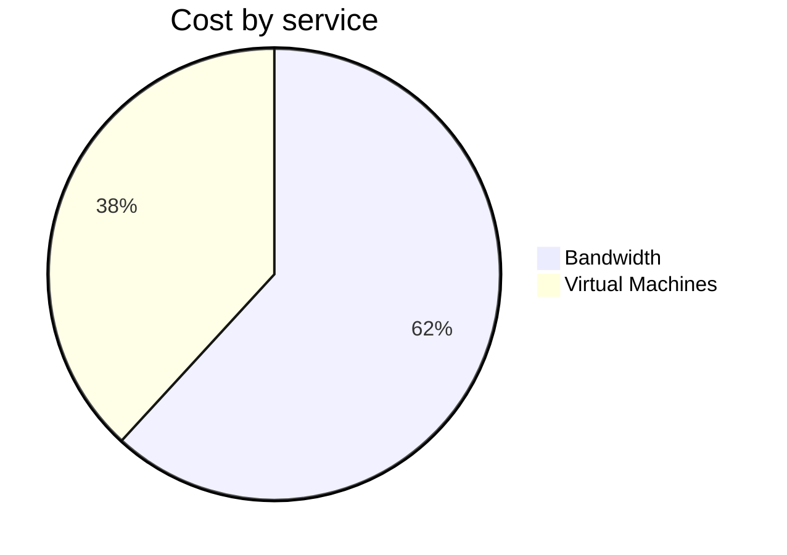
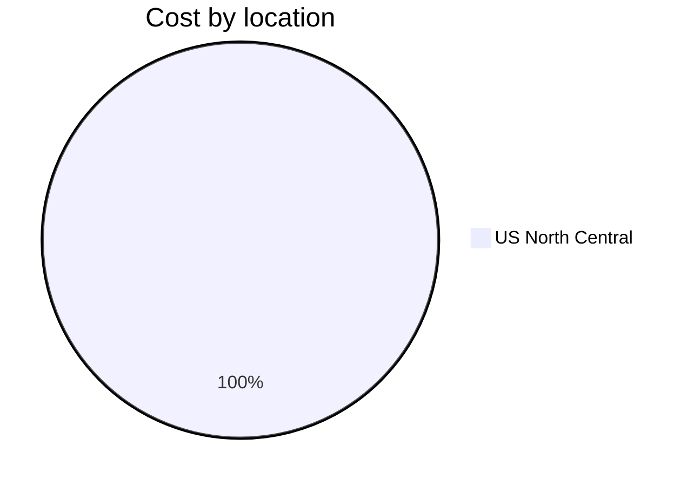
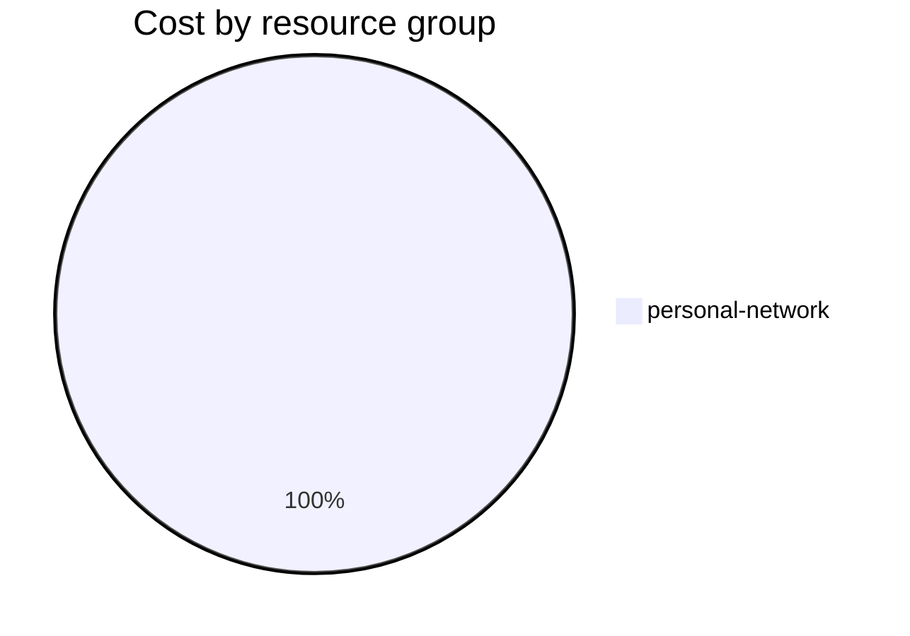

Fetching subscription details...
Fetching cost data...
Fetching forecasted cost data...
Fetching cost data by service name...
Fetching cost data by location...
Fetching cost data by resource group...
# Azure Cost Overview

> Accumulated cost for subscription id `JPF Pay-As-You-Go` from **12/01/2023** to **12/04/2023**

## Totals

|Period|Amount|
|---|---:|
|Today|0.04 USD|
|Yesterday|0.72 USD|
|Last 7 days|1.65 USD|
|Last 30 days|1.65 USD|

```mermaid
gantt
   title Accumulated cost
   dateFormat  X
   axisFormat %s
   section 01 Dec
   USD 0.40 :0, 40
   section 02 Dec
   USD 0.88 :0, 88
   section 03 Dec
   USD 1.61 :0, 161
   section 04 Dec
   USD 1.65 :0, 165
   section 05 Dec
   USD 2.19 : done, 0, 219
   section 06 Dec
   USD 2.55 : done, 0, 255
   section 07 Dec
   USD 2.94 : done, 0, 294
   section 08 Dec
   USD 3.30 : done, 0, 330
   section 09 Dec
   USD 3.71 : done, 0, 371
   section 10 Dec
   USD 4.04 : done, 0, 404
   section 11 Dec
   USD 4.47 : done, 0, 447
   section 12 Dec
   USD 4.99 : done, 0, 499
   section 13 Dec
   USD 5.35 : done, 0, 535
   section 14 Dec
   USD 5.72 : done, 0, 572
   section 15 Dec
   USD 6.06 : done, 0, 606
   section 16 Dec
   USD 6.46 : done, 0, 646
   section 17 Dec
   USD 6.78 : done, 0, 678
   section 18 Dec
   USD 7.20 : done, 0, 720
   section 19 Dec
   USD 7.71 : done, 0, 771
   section 20 Dec
   USD 8.04 : done, 0, 804
   section 21 Dec
   USD 8.40 : done, 0, 840
   section 22 Dec
   USD 8.74 : done, 0, 874
   section 23 Dec
   USD 9.12 : done, 0, 912
   section 24 Dec
   USD 9.43 : done, 0, 943
   section 25 Dec
   USD 9.83 : done, 0, 983
   section 26 Dec
   USD 10.32 : done, 0, 1032
   section 27 Dec
   USD 10.65 : done, 0, 1065
   section 28 Dec
   USD 10.99 : done, 0, 1099
   section 29 Dec
   USD 11.31 : done, 0, 1131
   section 30 Dec
   USD 11.68 : done, 0, 1168
   section 31 Dec
   USD 11.98 : done, 0, 1198
```

## By Service Name

|Service|Amount|
|---|---:|
|Bandwidth|1.02 USD|
|Virtual Machines|0.63 USD|

## By Location

|Location|Amount|
|---|---:|
|US North Central|1.65 USD|

## By Resource Group

|Resource Group|Amount|
|---|---:|
|personal-network|1.65 USD|

Generated at 2023-12-04 11:30:22 for subscription with id `4913be3f-a345-4652-9bba-767418dd25e3`
