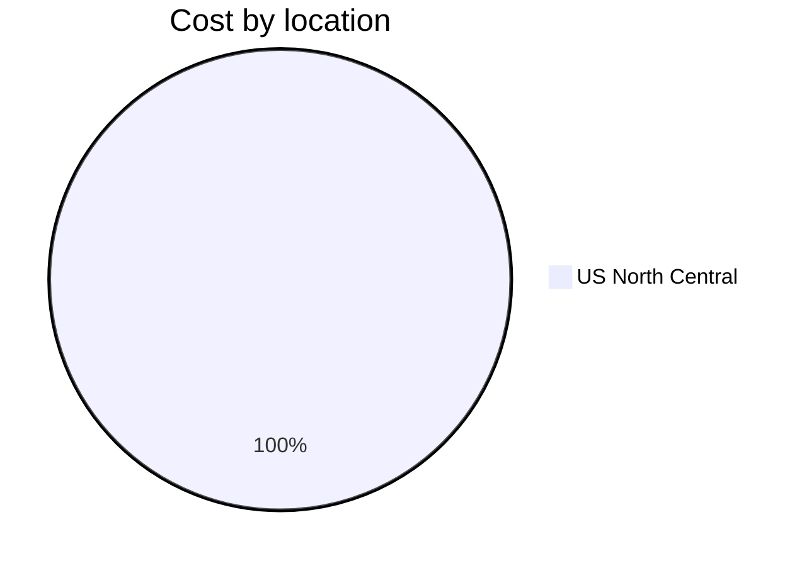
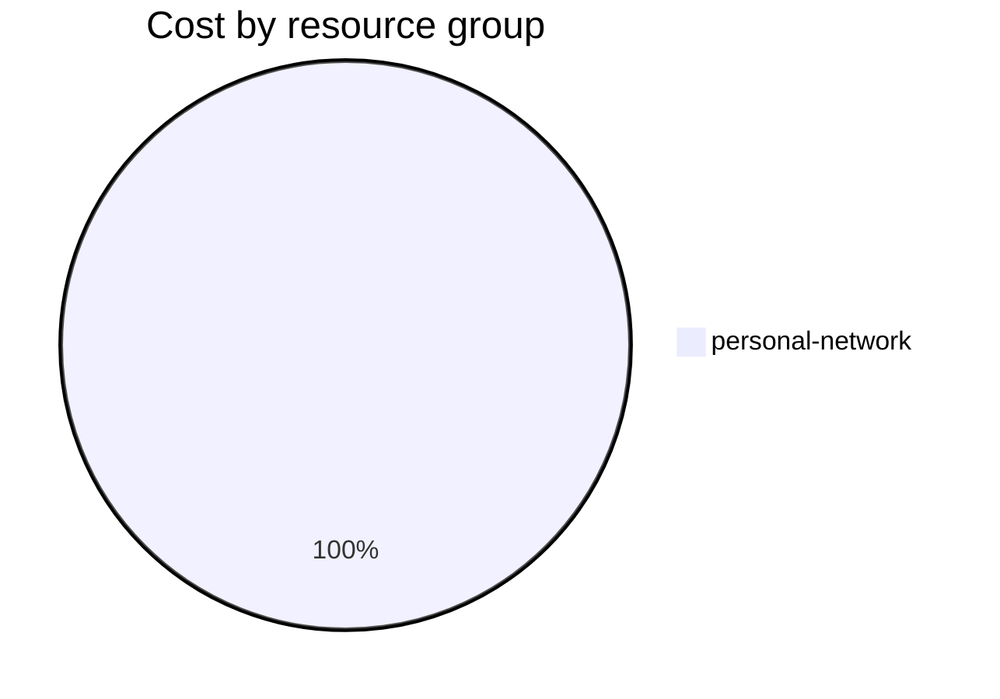

Fetching subscription details...
Fetching cost data...
Fetching forecasted cost data...
Fetching cost data by service name...
Fetching cost data by location...
Fetching cost data by resource group...
# Azure Cost Overview

> Accumulated cost for subscription id `JPF Pay-As-You-Go` from **01/01/2024** to **01/14/2024**

## Totals

|Period|Amount|
|---|---:|
|Today|0.05 USD|
|Yesterday|0.21 USD|
|Last 7 days|2.97 USD|
|Last 30 days|7.42 USD|

```mermaid
gantt
   title Accumulated cost
   dateFormat  X
   axisFormat %s
   section 01 Jan
   USD 0.69 :0, 69
   section 02 Jan
   USD 1.83 :0, 183
   section 03 Jan
   USD 2.31 :0, 231
   section 04 Jan
   USD 2.90 :0, 290
   section 05 Jan
   USD 3.52 :0, 352
   section 06 Jan
   USD 4.44 :0, 444
   section 07 Jan
   USD 4.87 :0, 487
   section 08 Jan
   USD 5.95 :0, 595
   section 09 Jan
   USD 6.54 :0, 654
   section 10 Jan
   USD 6.75 :0, 675
   section 11 Jan
   USD 6.95 :0, 695
   section 12 Jan
   USD 7.16 :0, 716
   section 13 Jan
   USD 7.36 :0, 736
   section 14 Jan
   USD 7.42 :0, 742
   section 15 Jan
   USD 8.29 : done, 0, 829
   section 16 Jan
   USD 9.20 : done, 0, 920
   section 17 Jan
   USD 9.67 : done, 0, 967
   section 18 Jan
   USD 10.14 : done, 0, 1014
   section 19 Jan
   USD 10.65 : done, 0, 1065
   section 20 Jan
   USD 11.53 : done, 0, 1153
   section 21 Jan
   USD 12.24 : done, 0, 1224
   section 22 Jan
   USD 13.17 : done, 0, 1317
   section 23 Jan
   USD 14.15 : done, 0, 1415
   section 24 Jan
   USD 14.69 : done, 0, 1469
   section 25 Jan
   USD 15.22 : done, 0, 1522
   section 26 Jan
   USD 15.79 : done, 0, 1579
   section 27 Jan
   USD 16.74 : done, 0, 1674
   section 28 Jan
   USD 17.51 : done, 0, 1751
   section 29 Jan
   USD 18.51 : done, 0, 1851
   section 30 Jan
   USD 19.55 : done, 0, 1955
   section 31 Jan
   USD 20.16 : done, 0, 2016
```

## By Service Name

|Service|Amount|
|---|---:|
|Bandwidth|4.68 USD|
|Virtual Machines|2.73 USD|

## By Location

|Location|Amount|
|---|---:|
|US North Central|7.42 USD|

## By Resource Group

|Resource Group|Amount|
|---|---:|
|personal-network|7.42 USD|

Generated at 2024-01-14 11:30:52 for subscription with id `4913be3f-a345-4652-9bba-767418dd25e3`
