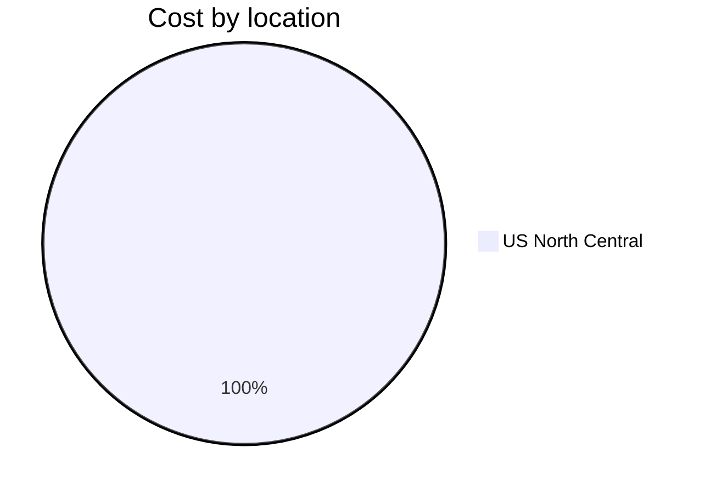
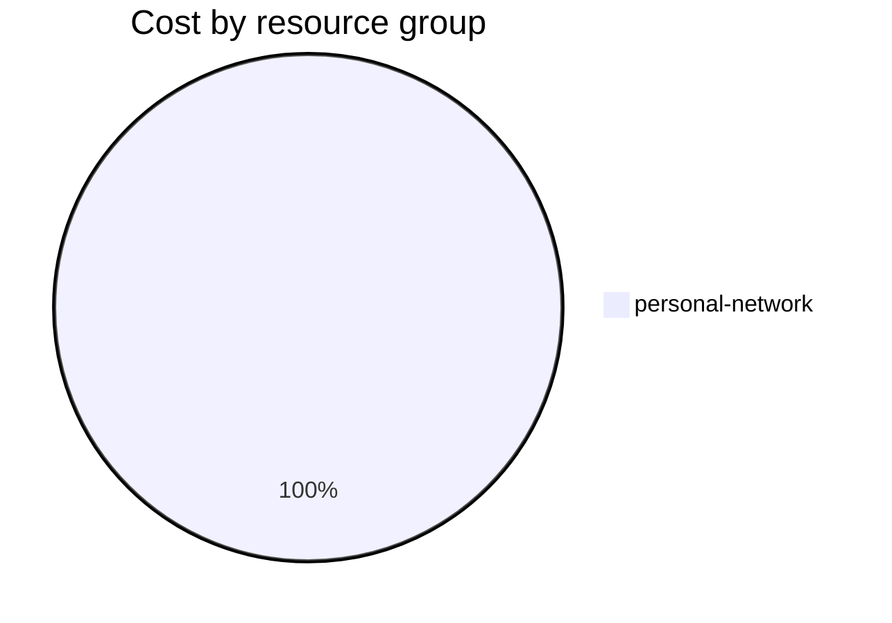

Fetching subscription details...
Fetching cost data...
Fetching forecasted cost data...
Fetching cost data by service name...
Fetching cost data by location...
Fetching cost data by resource group...
# Azure Cost Overview

> Accumulated cost for subscription id `JPF Pay-As-You-Go` from **10/01/2023** to **10/04/2023**

## Totals

|Period|Amount|
|---|---:|
|Today|0.04 USD|
|Yesterday|0.42 USD|
|Last 7 days|1.45 USD|
|Last 30 days|1.45 USD|

```mermaid
gantt
   title Accumulated cost
   dateFormat  X
   axisFormat %s
   section 01 Oct
   USD 0.51 :0, 51
   section 02 Oct
   USD 0.98 :0, 98
   section 03 Oct
   USD 1.40 :0, 140
   section 04 Oct
   USD 1.45 :0, 145
   section 05 Oct
   USD 2.06 : done, 0, 206
   section 06 Oct
   USD 2.38 : done, 0, 238
   section 07 Oct
   USD 2.70 : done, 0, 270
   section 08 Oct
   USD 3.10 : done, 0, 310
   section 09 Oct
   USD 3.44 : done, 0, 344
   section 10 Oct
   USD 3.78 : done, 0, 378
   section 11 Oct
   USD 4.11 : done, 0, 411
   section 12 Oct
   USD 4.63 : done, 0, 463
   section 13 Oct
   USD 4.87 : done, 0, 487
   section 14 Oct
   USD 5.09 : done, 0, 509
   section 15 Oct
   USD 5.40 : done, 0, 540
   section 16 Oct
   USD 5.65 : done, 0, 565
   section 17 Oct
   USD 5.90 : done, 0, 590
   section 18 Oct
   USD 6.14 : done, 0, 614
   section 19 Oct
   USD 6.58 : done, 0, 658
   section 20 Oct
   USD 6.72 : done, 0, 672
   section 21 Oct
   USD 6.86 : done, 0, 686
   section 22 Oct
   USD 7.08 : done, 0, 708
   section 23 Oct
   USD 7.24 : done, 0, 724
   section 24 Oct
   USD 7.40 : done, 0, 740
   section 25 Oct
   USD 7.55 : done, 0, 755
   section 26 Oct
   USD 7.90 : done, 0, 790
   section 27 Oct
   USD 7.95 : done, 0, 795
   section 28 Oct
   USD 8.00 : done, 0, 800
   section 29 Oct
   USD 8.13 : done, 0, 813
   section 30 Oct
   USD 8.21 : done, 0, 821
   section 31 Oct
   USD 8.28 : done, 0, 828
```

## By Service Name

|Service|Amount|
|---|---:|
|Bandwidth|0.87 USD|
|Virtual Machines|0.58 USD|

## By Location

|Location|Amount|
|---|---:|
|US North Central|1.45 USD|

## By Resource Group

|Resource Group|Amount|
|---|---:|
|personal-network|1.45 USD|

Generated at 2023-10-04 11:23:32 for subscription with id `4913be3f-a345-4652-9bba-767418dd25e3`
