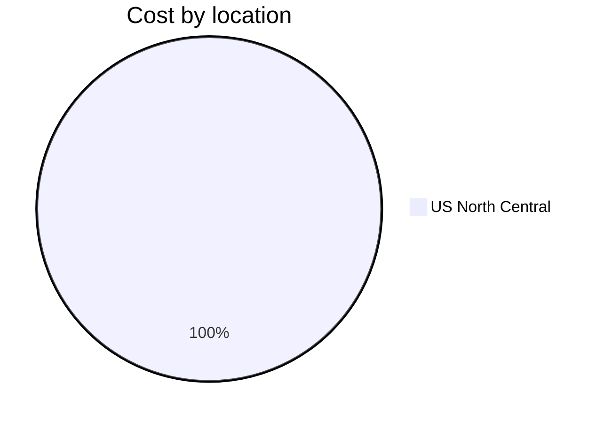
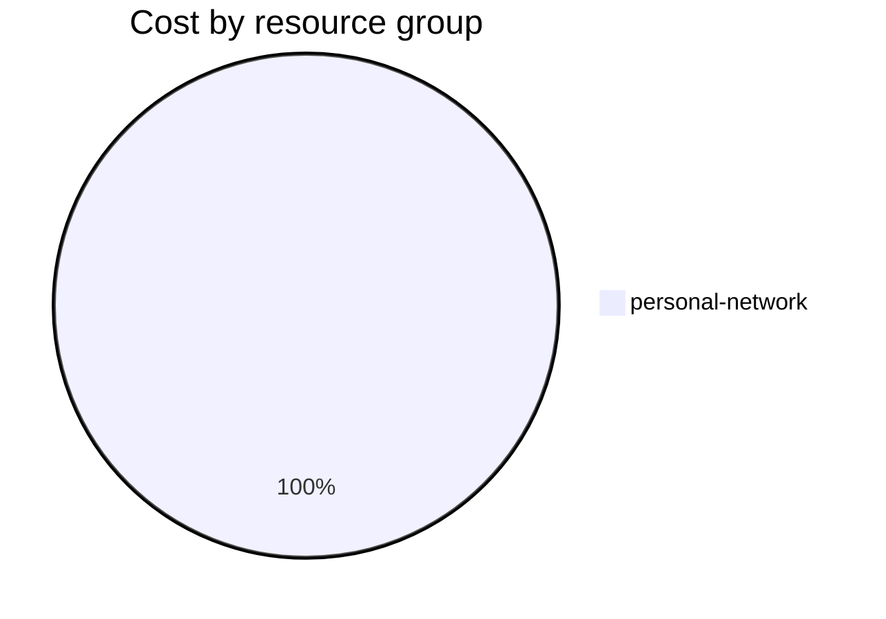

Fetching subscription details...
Fetching cost data...
Fetching forecasted cost data...
Fetching cost data by service name...
Fetching cost data by location...
Fetching cost data by resource group...
# Azure Cost Overview

> Accumulated cost for subscription id `JPF Pay-As-You-Go` from **01/01/2024** to **01/03/2024**

## Totals

|Period|Amount|
|---|---:|
|Today|0.05 USD|
|Yesterday|0.85 USD|
|Last 7 days|1.46 USD|
|Last 30 days|1.46 USD|

```mermaid
gantt
   title Accumulated cost
   dateFormat  X
   axisFormat %s
   section 01 Jan
   USD 0.56 :0, 56
   section 02 Jan
   USD 1.41 :0, 141
   section 03 Jan
   USD 1.46 :0, 146
   section 04 Jan
   USD 1.71 : done, 0, 171
   section 05 Jan
   USD 1.86 : done, 0, 186
   section 06 Jan
   USD 2.21 : done, 0, 221
   section 07 Jan
   USD 2.57 : done, 0, 257
   section 08 Jan
   USD 3.01 : done, 0, 301
   section 09 Jan
   USD 3.25 : done, 0, 325
   section 10 Jan
   USD 3.46 : done, 0, 346
   section 11 Jan
   USD 3.66 : done, 0, 366
   section 12 Jan
   USD 3.76 : done, 0, 376
   section 13 Jan
   USD 4.05 : done, 0, 405
   section 14 Jan
   USD 4.36 : done, 0, 436
   section 15 Jan
   USD 4.75 : done, 0, 475
   section 16 Jan
   USD 4.93 : done, 0, 493
   section 17 Jan
   USD 5.10 : done, 0, 510
   section 18 Jan
   USD 5.24 : done, 0, 524
   section 19 Jan
   USD 5.29 : done, 0, 529
   section 20 Jan
   USD 5.53 : done, 0, 553
   section 21 Jan
   USD 5.78 : done, 0, 578
   section 22 Jan
   USD 6.11 : done, 0, 611
   section 23 Jan
   USD 6.24 : done, 0, 624
   section 24 Jan
   USD 6.35 : done, 0, 635
   section 25 Jan
   USD 6.44 : done, 0, 644
   section 26 Jan
   USD 6.44 : done, 0, 644
   section 27 Jan
   USD 6.63 : done, 0, 663
   section 28 Jan
   USD 6.83 : done, 0, 683
   section 29 Jan
   USD 7.11 : done, 0, 711
   section 30 Jan
   USD 7.18 : done, 0, 718
   section 31 Jan
   USD 7.24 : done, 0, 724
```

## By Service Name

|Service|Amount|
|---|---:|
|Bandwidth|0.99 USD|
|Virtual Machines|0.46 USD|

## By Location

|Location|Amount|
|---|---:|
|US North Central|1.46 USD|

## By Resource Group

|Resource Group|Amount|
|---|---:|
|personal-network|1.46 USD|

Generated at 2024-01-03 11:27:26 for subscription with id `4913be3f-a345-4652-9bba-767418dd25e3`
