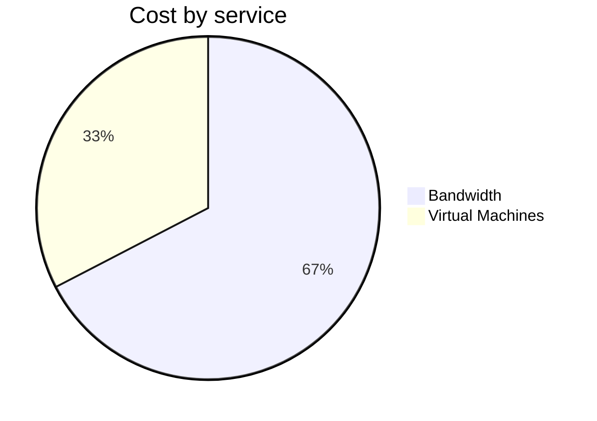
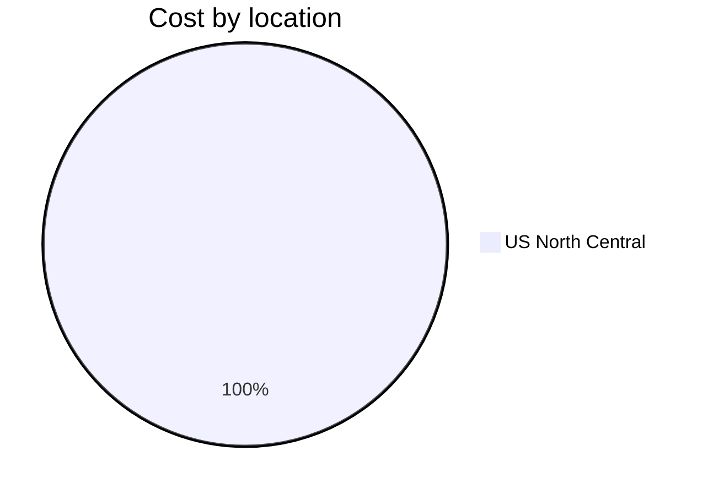
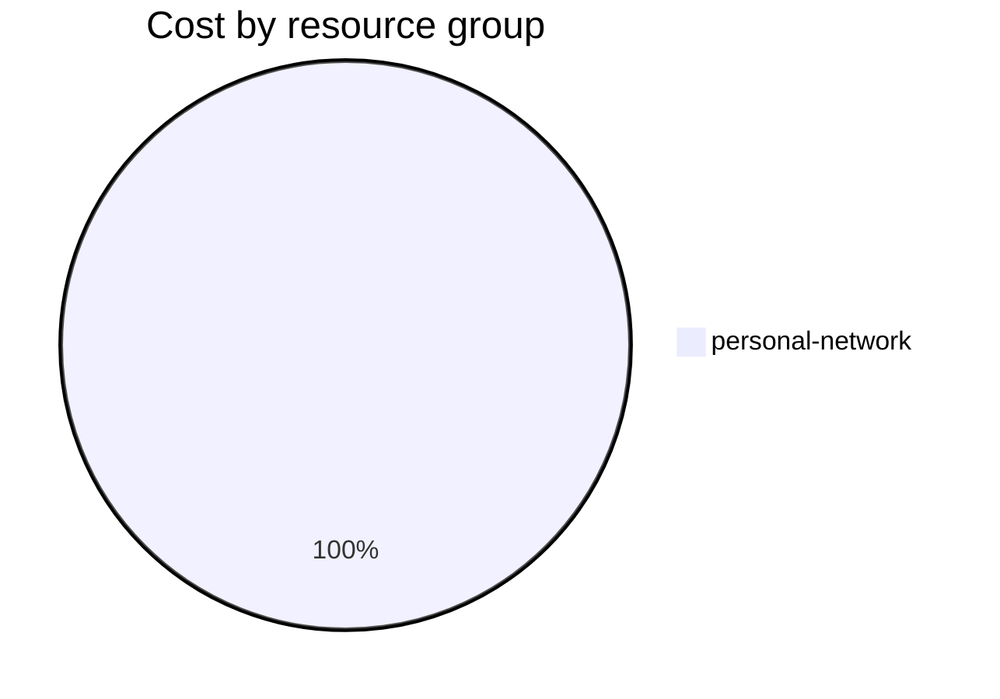

Fetching subscription details...
Fetching cost data...
Fetching forecasted cost data...
Fetching cost data by service name...
Fetching cost data by location...
Fetching cost data by resource group...
# Azure Cost Overview

> Accumulated cost for subscription id `JPF Pay-As-You-Go` from **01/01/2024** to **01/08/2024**

## Totals

|Period|Amount|
|---|---:|
|Today|0.05 USD|
|Yesterday|0.39 USD|
|Last 7 days|4.60 USD|
|Last 30 days|4.60 USD|

```mermaid
gantt
   title Accumulated cost
   dateFormat  X
   axisFormat %s
   section 01 Jan
   USD 0.65 :0, 65
   section 02 Jan
   USD 1.70 :0, 170
   section 03 Jan
   USD 2.16 :0, 216
   section 04 Jan
   USD 2.72 :0, 272
   section 05 Jan
   USD 3.30 :0, 330
   section 06 Jan
   USD 4.16 :0, 416
   section 07 Jan
   USD 4.55 :0, 455
   section 08 Jan
   USD 4.60 :0, 460
   section 09 Jan
   USD 5.30 : done, 0, 530
   section 10 Jan
   USD 5.73 : done, 0, 573
   section 11 Jan
   USD 6.16 : done, 0, 616
   section 12 Jan
   USD 6.64 : done, 0, 664
   section 13 Jan
   USD 7.15 : done, 0, 715
   section 14 Jan
   USD 7.72 : done, 0, 772
   section 15 Jan
   USD 8.43 : done, 0, 843
   section 16 Jan
   USD 9.14 : done, 0, 914
   section 17 Jan
   USD 9.57 : done, 0, 957
   section 18 Jan
   USD 10.00 : done, 0, 1000
   section 19 Jan
   USD 10.49 : done, 0, 1049
   section 20 Jan
   USD 11.00 : done, 0, 1100
   section 21 Jan
   USD 11.57 : done, 0, 1157
   section 22 Jan
   USD 12.29 : done, 0, 1229
   section 23 Jan
   USD 13.00 : done, 0, 1300
   section 24 Jan
   USD 13.43 : done, 0, 1343
   section 25 Jan
   USD 13.86 : done, 0, 1386
   section 26 Jan
   USD 14.36 : done, 0, 1436
   section 27 Jan
   USD 14.87 : done, 0, 1487
   section 28 Jan
   USD 15.45 : done, 0, 1545
   section 29 Jan
   USD 16.17 : done, 0, 1617
   section 30 Jan
   USD 16.88 : done, 0, 1688
   section 31 Jan
   USD 17.32 : done, 0, 1732
```

## By Service Name

|Service|Amount|
|---|---:|
|Bandwidth|3.10 USD|
|Virtual Machines|1.50 USD|

## By Location

|Location|Amount|
|---|---:|
|US North Central|4.60 USD|

## By Resource Group

|Resource Group|Amount|
|---|---:|
|personal-network|4.60 USD|

Generated at 2024-01-08 11:30:59 for subscription with id `4913be3f-a345-4652-9bba-767418dd25e3`
