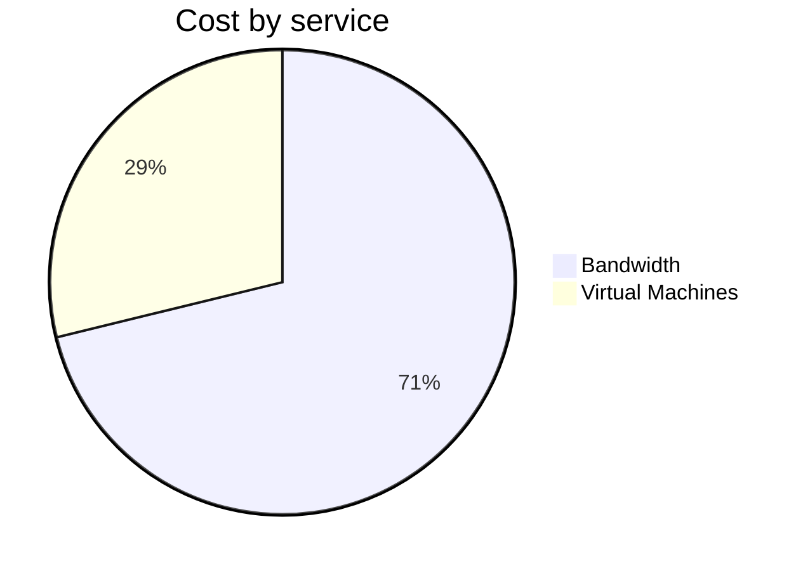
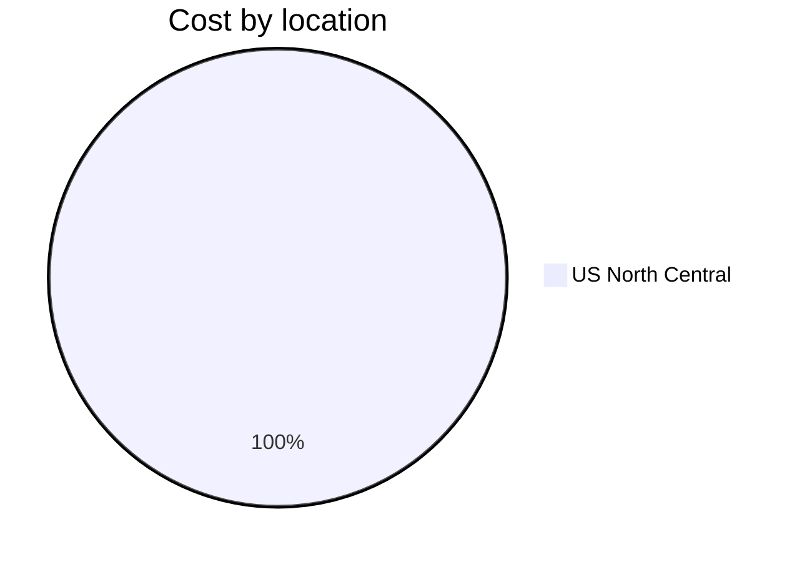
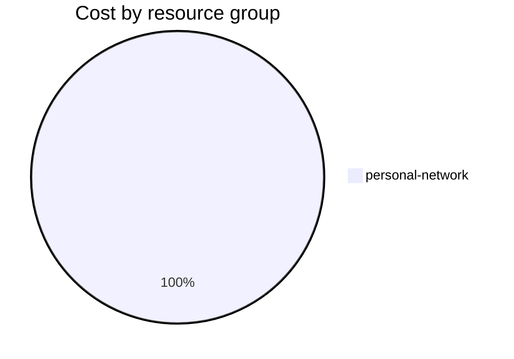

Fetching subscription details...
Fetching cost data...
Fetching forecasted cost data...
Fetching cost data by service name...
Fetching cost data by location...
Fetching cost data by resource group...
# Azure Cost Overview

> Accumulated cost for subscription id `JPF Pay-As-You-Go` from **01/01/2024** to **01/09/2024**

## Totals

|Period|Amount|
|---|---:|
|Today|0.05 USD|
|Yesterday|1.06 USD|
|Last 7 days|5.22 USD|
|Last 30 days|5.90 USD|

```mermaid
gantt
   title Accumulated cost
   dateFormat  X
   axisFormat %s
   section 01 Jan
   USD 0.68 :0, 68
   section 02 Jan
   USD 1.79 :0, 179
   section 03 Jan
   USD 2.27 :0, 227
   section 04 Jan
   USD 2.85 :0, 285
   section 05 Jan
   USD 3.46 :0, 346
   section 06 Jan
   USD 4.36 :0, 436
   section 07 Jan
   USD 4.79 :0, 479
   section 08 Jan
   USD 5.85 :0, 585
   section 09 Jan
   USD 5.90 :0, 590
   section 10 Jan
   USD 6.28 : done, 0, 628
   section 11 Jan
   USD 6.66 : done, 0, 666
   section 12 Jan
   USD 7.09 : done, 0, 709
   section 13 Jan
   USD 7.73 : done, 0, 773
   section 14 Jan
   USD 8.22 : done, 0, 822
   section 15 Jan
   USD 8.89 : done, 0, 889
   section 16 Jan
   USD 9.56 : done, 0, 956
   section 17 Jan
   USD 9.93 : done, 0, 993
   section 18 Jan
   USD 10.29 : done, 0, 1029
   section 19 Jan
   USD 10.72 : done, 0, 1072
   section 20 Jan
   USD 11.34 : done, 0, 1134
   section 21 Jan
   USD 11.82 : done, 0, 1182
   section 22 Jan
   USD 12.48 : done, 0, 1248
   section 23 Jan
   USD 13.14 : done, 0, 1314
   section 24 Jan
   USD 13.49 : done, 0, 1349
   section 25 Jan
   USD 13.84 : done, 0, 1384
   section 26 Jan
   USD 14.26 : done, 0, 1426
   section 27 Jan
   USD 14.86 : done, 0, 1486
   section 28 Jan
   USD 15.34 : done, 0, 1534
   section 29 Jan
   USD 15.98 : done, 0, 1598
   section 30 Jan
   USD 16.62 : done, 0, 1662
   section 31 Jan
   USD 16.96 : done, 0, 1696
```

## By Service Name

|Service|Amount|
|---|---:|
|Bandwidth|4.20 USD|
|Virtual Machines|1.70 USD|

## By Location

|Location|Amount|
|---|---:|
|US North Central|5.90 USD|

## By Resource Group

|Resource Group|Amount|
|---|---:|
|personal-network|5.90 USD|

Generated at 2024-01-09 11:29:18 for subscription with id `4913be3f-a345-4652-9bba-767418dd25e3`
