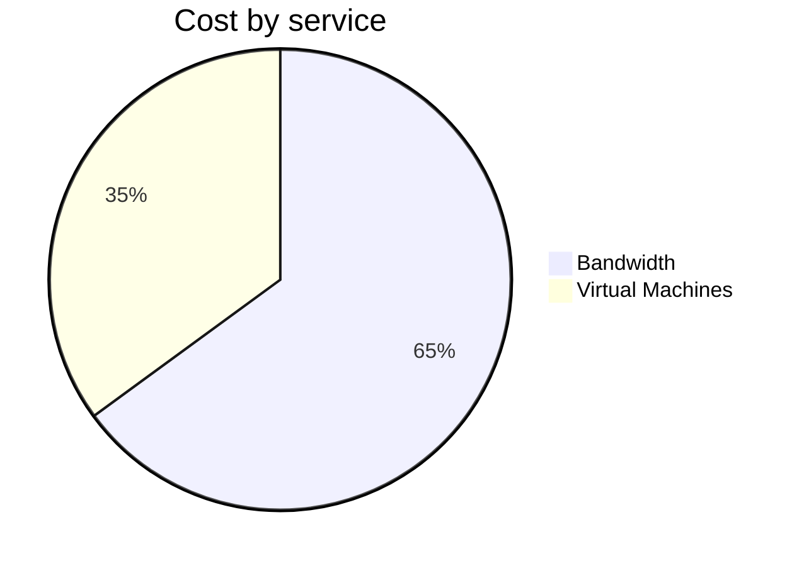
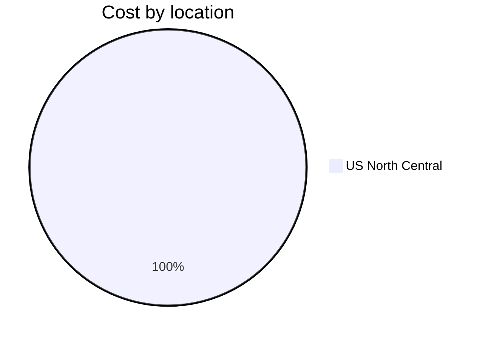
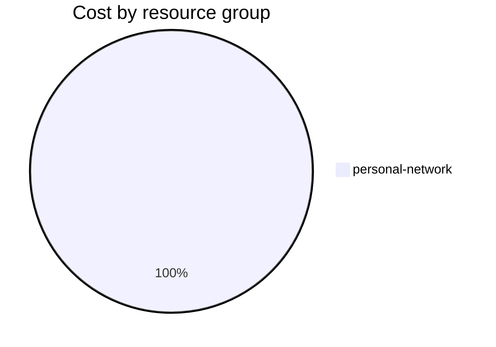

Fetching subscription details...
Fetching cost data...
Fetching forecasted cost data...
Fetching cost data by service name...
Fetching cost data by location...
Fetching cost data by resource group...
# Azure Cost Overview

> Accumulated cost for subscription id `JPF Pay-As-You-Go` from **01/01/2024** to **01/05/2024**

## Totals

|Period|Amount|
|---|---:|
|Today|0.05 USD|
|Yesterday|0.49 USD|
|Last 7 days|2.51 USD|
|Last 30 days|2.51 USD|

```mermaid
gantt
   title Accumulated cost
   dateFormat  X
   axisFormat %s
   section 01 Jan
   USD 0.59 :0, 59
   section 02 Jan
   USD 1.54 :0, 154
   section 03 Jan
   USD 1.96 :0, 196
   section 04 Jan
   USD 2.46 :0, 246
   section 05 Jan
   USD 2.51 :0, 251
   section 06 Jan
   USD 2.83 : done, 0, 283
   section 07 Jan
   USD 3.23 : done, 0, 323
   section 08 Jan
   USD 3.73 : done, 0, 373
   section 09 Jan
   USD 4.23 : done, 0, 423
   section 10 Jan
   USD 4.55 : done, 0, 455
   section 11 Jan
   USD 4.79 : done, 0, 479
   section 12 Jan
   USD 4.93 : done, 0, 493
   section 13 Jan
   USD 5.20 : done, 0, 520
   section 14 Jan
   USD 5.55 : done, 0, 555
   section 15 Jan
   USD 6.00 : done, 0, 600
   section 16 Jan
   USD 6.45 : done, 0, 645
   section 17 Jan
   USD 6.72 : done, 0, 672
   section 18 Jan
   USD 6.91 : done, 0, 691
   section 19 Jan
   USD 7.00 : done, 0, 700
   section 20 Jan
   USD 7.23 : done, 0, 723
   section 21 Jan
   USD 7.52 : done, 0, 752
   section 22 Jan
   USD 7.93 : done, 0, 793
   section 23 Jan
   USD 8.33 : done, 0, 833
   section 24 Jan
   USD 8.55 : done, 0, 855
   section 25 Jan
   USD 8.70 : done, 0, 870
   section 26 Jan
   USD 8.73 : done, 0, 873
   section 27 Jan
   USD 8.91 : done, 0, 891
   section 28 Jan
   USD 9.16 : done, 0, 916
   section 29 Jan
   USD 9.51 : done, 0, 951
   section 30 Jan
   USD 9.87 : done, 0, 987
   section 31 Jan
   USD 10.04 : done, 0, 1004
```

## By Service Name

|Service|Amount|
|---|---:|
|Bandwidth|1.63 USD|
|Virtual Machines|0.88 USD|

## By Location

|Location|Amount|
|---|---:|
|US North Central|2.51 USD|

## By Resource Group

|Resource Group|Amount|
|---|---:|
|personal-network|2.51 USD|

Generated at 2024-01-05 11:28:10 for subscription with id `4913be3f-a345-4652-9bba-767418dd25e3`
