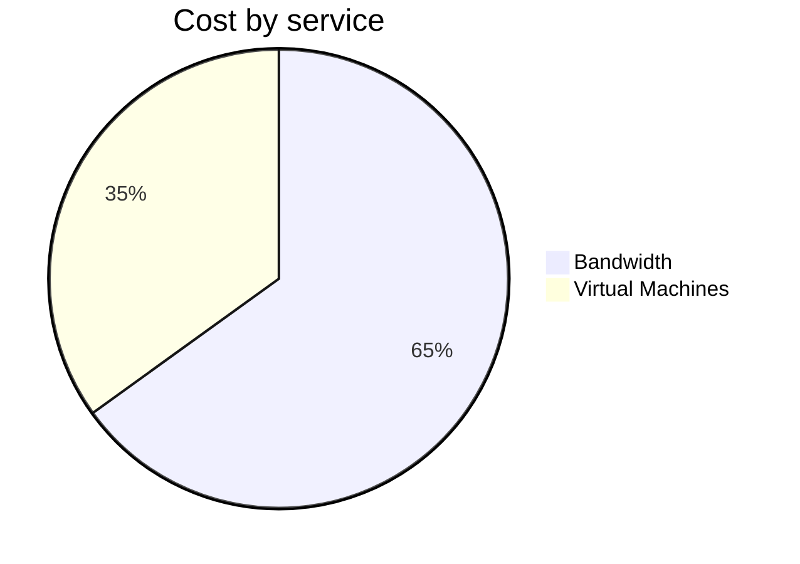
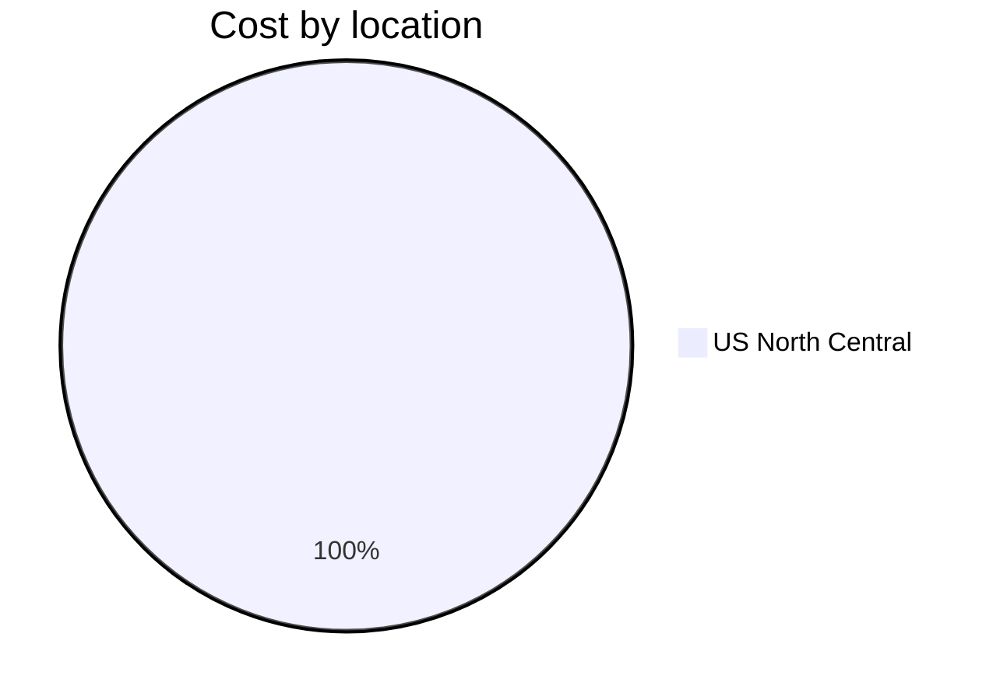
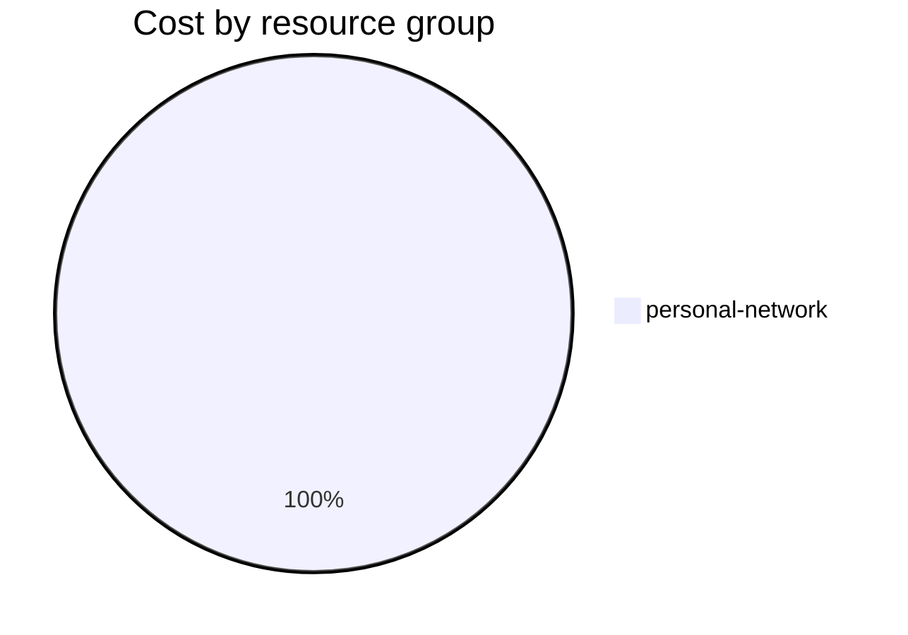

Fetching subscription details...
Fetching cost data...
Fetching forecasted cost data...
Fetching cost data by service name...
Fetching cost data by location...
Fetching cost data by resource group...
# Azure Cost Overview

> Accumulated cost for subscription id `JPF Pay-As-You-Go` from **09/15/2023** to **09/30/2023**

## Totals

|Period|Amount|
|---|---:|
|Today|0.05 USD|
|Yesterday|0.34 USD|
|Last 7 days|2.73 USD|
|Last 30 days|7.64 USD|

```mermaid
gantt
   title Accumulated cost
   dateFormat  X
   axisFormat %s
   section 15 Sep
   USD 0.31 :0, 31
   section 16 Sep
   USD 0.83 :0, 83
   section 17 Sep
   USD 1.31 :0, 131
   section 18 Sep
   USD 2.10 :0, 210
   section 19 Sep
   USD 2.55 :0, 255
   section 20 Sep
   USD 3.05 :0, 305
   section 21 Sep
   USD 3.74 :0, 374
   section 22 Sep
   USD 4.90 :0, 490
   section 23 Sep
   USD 5.21 :0, 521
   section 24 Sep
   USD 5.55 :0, 555
   section 25 Sep
   USD 5.96 :0, 596
   section 26 Sep
   USD 6.37 :0, 637
   section 27 Sep
   USD 6.73 :0, 673
   section 28 Sep
   USD 7.24 :0, 724
   section 29 Sep
   USD 7.59 :0, 759
   section 30 Sep
   USD 7.64 :0, 764
```

## By Service Name

|Service|Amount|
|---|---:|
|Bandwidth|4.97 USD|
|Virtual Machines|2.67 USD|

## By Location

|Location|Amount|
|---|---:|
|US North Central|7.64 USD|

## By Resource Group

|Resource Group|Amount|
|---|---:|
|personal-network|7.64 USD|

Generated at 2023-09-30 11:29:03 for subscription with id `4913be3f-a345-4652-9bba-767418dd25e3`
