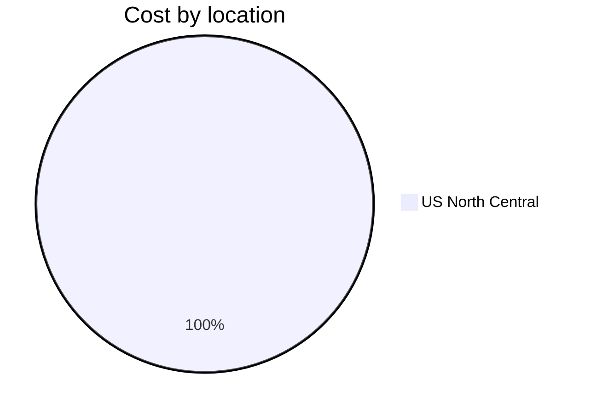
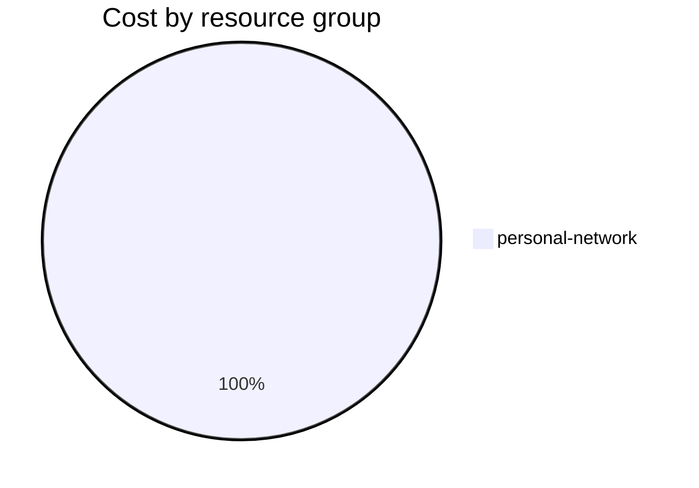

Fetching subscription details...
Fetching cost data...
Fetching forecasted cost data...
Fetching cost data by service name...
Fetching cost data by location...
Fetching cost data by resource group...
# Azure Cost Overview

> Accumulated cost for subscription id `JPF Pay-As-You-Go` from **10/01/2023** to **10/06/2023**

## Totals

|Period|Amount|
|---|---:|
|Today|0.04 USD|
|Yesterday|0.39 USD|
|Last 7 days|2.54 USD|
|Last 30 days|2.54 USD|

```mermaid
gantt
   title Accumulated cost
   dateFormat  X
   axisFormat %s
   section 01 Oct
   USD 0.54 :0, 54
   section 02 Oct
   USD 1.03 :0, 103
   section 03 Oct
   USD 1.56 :0, 156
   section 04 Oct
   USD 2.11 :0, 211
   section 05 Oct
   USD 2.50 :0, 250
   section 06 Oct
   USD 2.54 :0, 254
   section 07 Oct
   USD 2.89 : done, 0, 289
   section 08 Oct
   USD 3.33 : done, 0, 333
   section 09 Oct
   USD 3.71 : done, 0, 371
   section 10 Oct
   USD 4.13 : done, 0, 413
   section 11 Oct
   USD 4.54 : done, 0, 454
   section 12 Oct
   USD 5.12 : done, 0, 512
   section 13 Oct
   USD 5.40 : done, 0, 540
   section 14 Oct
   USD 5.67 : done, 0, 567
   section 15 Oct
   USD 6.03 : done, 0, 603
   section 16 Oct
   USD 6.32 : done, 0, 632
   section 17 Oct
   USD 6.66 : done, 0, 666
   section 18 Oct
   USD 6.99 : done, 0, 699
   section 19 Oct
   USD 7.49 : done, 0, 749
   section 20 Oct
   USD 7.68 : done, 0, 768
   section 21 Oct
   USD 7.87 : done, 0, 787
   section 22 Oct
   USD 8.15 : done, 0, 815
   section 23 Oct
   USD 8.36 : done, 0, 836
   section 24 Oct
   USD 8.61 : done, 0, 861
   section 25 Oct
   USD 8.86 : done, 0, 886
   section 26 Oct
   USD 9.28 : done, 0, 928
   section 27 Oct
   USD 9.39 : done, 0, 939
   section 28 Oct
   USD 9.50 : done, 0, 950
   section 29 Oct
   USD 9.70 : done, 0, 970
   section 30 Oct
   USD 9.83 : done, 0, 983
   section 31 Oct
   USD 10.00 : done, 0, 1000
```

## By Service Name

|Service|Amount|
|---|---:|
|Bandwidth|1.61 USD|
|Virtual Machines|0.93 USD|

## By Location

|Location|Amount|
|---|---:|
|US North Central|2.54 USD|

## By Resource Group

|Resource Group|Amount|
|---|---:|
|personal-network|2.54 USD|

Generated at 2023-10-06 11:25:07 for subscription with id `4913be3f-a345-4652-9bba-767418dd25e3`
