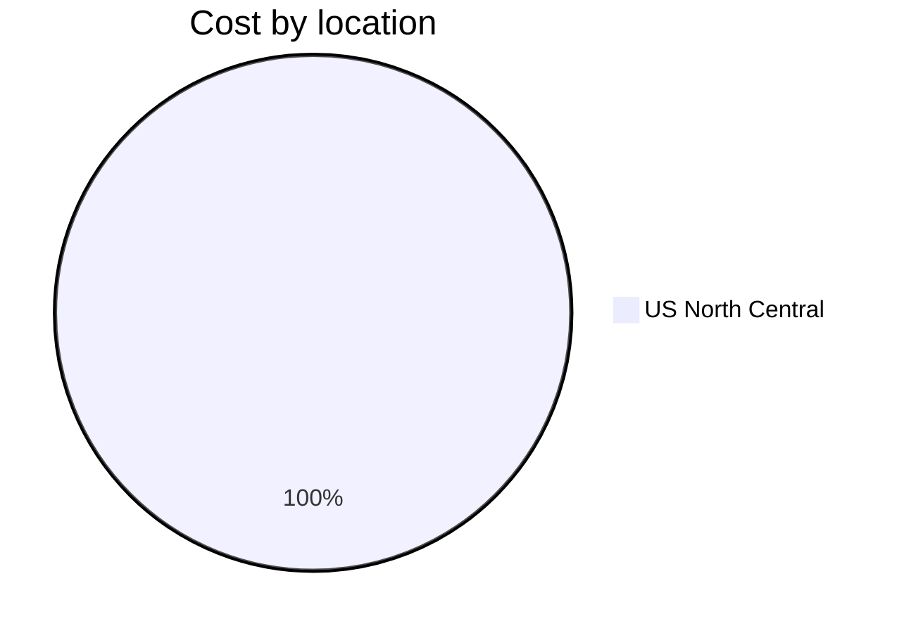
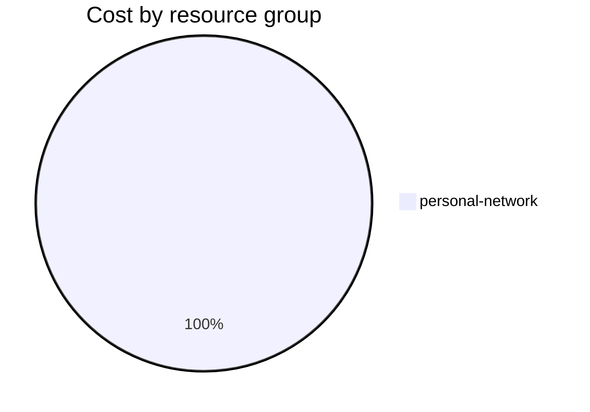

Fetching subscription details...
Fetching cost data...
Fetching forecasted cost data...
Fetching cost data by service name...
Fetching cost data by location...
Fetching cost data by resource group...
# Azure Cost Overview

> Accumulated cost for subscription id `JPF Pay-As-You-Go` from **12/01/2023** to **12/09/2023**

## Totals

|Period|Amount|
|---|---:|
|Today|0.04 USD|
|Yesterday|0.21 USD|
|Last 7 days|3.59 USD|
|Last 30 days|4.03 USD|

```mermaid
gantt
   title Accumulated cost
   dateFormat  X
   axisFormat %s
   section 01 Dec
   USD 0.44 :0, 44
   section 02 Dec
   USD 0.98 :0, 98
   section 03 Dec
   USD 1.87 :0, 187
   section 04 Dec
   USD 2.17 :0, 217
   section 05 Dec
   USD 2.46 :0, 246
   section 06 Dec
   USD 3.30 :0, 330
   section 07 Dec
   USD 3.78 :0, 378
   section 08 Dec
   USD 3.99 :0, 399
   section 09 Dec
   USD 4.03 :0, 403
   section 10 Dec
   USD 4.55 : done, 0, 455
   section 11 Dec
   USD 5.04 : done, 0, 504
   section 12 Dec
   USD 5.69 : done, 0, 569
   section 13 Dec
   USD 6.22 : done, 0, 622
   section 14 Dec
   USD 6.79 : done, 0, 679
   section 15 Dec
   USD 7.32 : done, 0, 732
   section 16 Dec
   USD 7.87 : done, 0, 787
   section 17 Dec
   USD 8.41 : done, 0, 841
   section 18 Dec
   USD 8.92 : done, 0, 892
   section 19 Dec
   USD 9.58 : done, 0, 958
   section 20 Dec
   USD 10.14 : done, 0, 1014
   section 21 Dec
   USD 10.72 : done, 0, 1072
   section 22 Dec
   USD 11.28 : done, 0, 1128
   section 23 Dec
   USD 11.85 : done, 0, 1185
   section 24 Dec
   USD 12.41 : done, 0, 1241
   section 25 Dec
   USD 12.94 : done, 0, 1294
   section 26 Dec
   USD 13.62 : done, 0, 1362
   section 27 Dec
   USD 14.20 : done, 0, 1420
   section 28 Dec
   USD 14.81 : done, 0, 1481
   section 29 Dec
   USD 15.38 : done, 0, 1538
   section 30 Dec
   USD 15.97 : done, 0, 1597
   section 31 Dec
   USD 16.55 : done, 0, 1655
```

## By Service Name

|Service|Amount|
|---|---:|
|Bandwidth|2.42 USD|
|Virtual Machines|1.61 USD|

## By Location

|Location|Amount|
|---|---:|
|US North Central|4.03 USD|

## By Resource Group

|Resource Group|Amount|
|---|---:|
|personal-network|4.03 USD|

Generated at 2023-12-09 11:27:51 for subscription with id `4913be3f-a345-4652-9bba-767418dd25e3`
