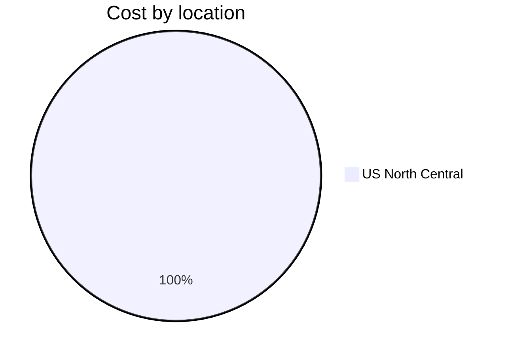
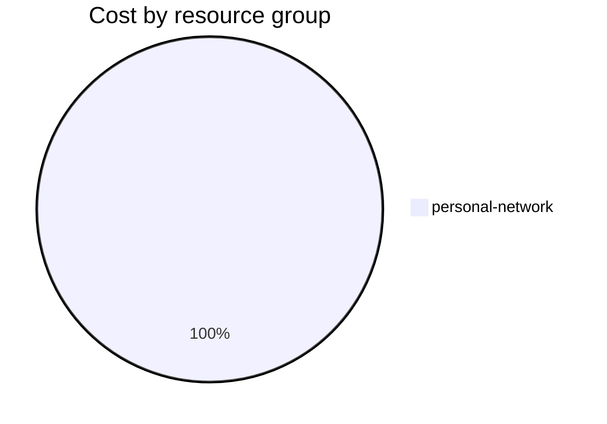

Fetching subscription details...
Fetching cost data...
Fetching forecasted cost data...
Fetching cost data by service name...
Fetching cost data by location...
Fetching cost data by resource group...
# Azure Cost Overview

> Accumulated cost for subscription id `JPF Pay-As-You-Go` from **09/15/2023** to **09/29/2023**

## Totals

|Period|Amount|
|---|---:|
|Today|0.05 USD|
|Yesterday|0.46 USD|
|Last 7 days|3.41 USD|
|Last 30 days|7.02 USD|

```mermaid
gantt
   title Accumulated cost
   dateFormat  X
   axisFormat %s
   section 15 Sep
   USD 0.31 :0, 31
   section 16 Sep
   USD 0.81 :0, 81
   section 17 Sep
   USD 1.27 :0, 127
   section 18 Sep
   USD 2.03 :0, 203
   section 19 Sep
   USD 2.47 :0, 247
   section 20 Sep
   USD 2.95 :0, 295
   section 21 Sep
   USD 3.62 :0, 362
   section 22 Sep
   USD 4.73 :0, 473
   section 23 Sep
   USD 5.03 :0, 503
   section 24 Sep
   USD 5.36 :0, 536
   section 25 Sep
   USD 5.76 :0, 576
   section 26 Sep
   USD 6.15 :0, 615
   section 27 Sep
   USD 6.51 :0, 651
   section 28 Sep
   USD 6.97 :0, 697
   section 29 Sep
   USD 7.02 :0, 702
   section 30 Sep
   USD 7.42 : done, 0, 742
```

## By Service Name

|Service|Amount|
|---|---:|
|Bandwidth|4.53 USD|
|Virtual Machines|2.50 USD|

## By Location

|Location|Amount|
|---|---:|
|US North Central|7.02 USD|

## By Resource Group

|Resource Group|Amount|
|---|---:|
|personal-network|7.02 USD|

Generated at 2023-09-29 11:28:15 for subscription with id `4913be3f-a345-4652-9bba-767418dd25e3`
