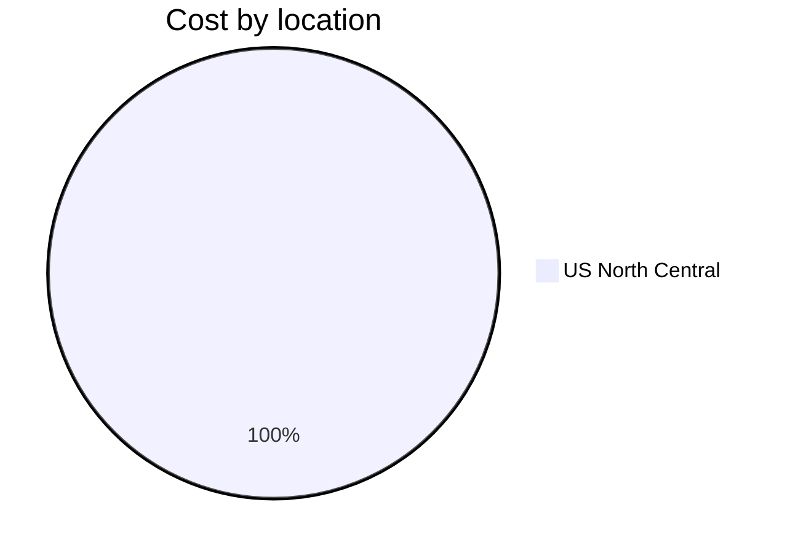
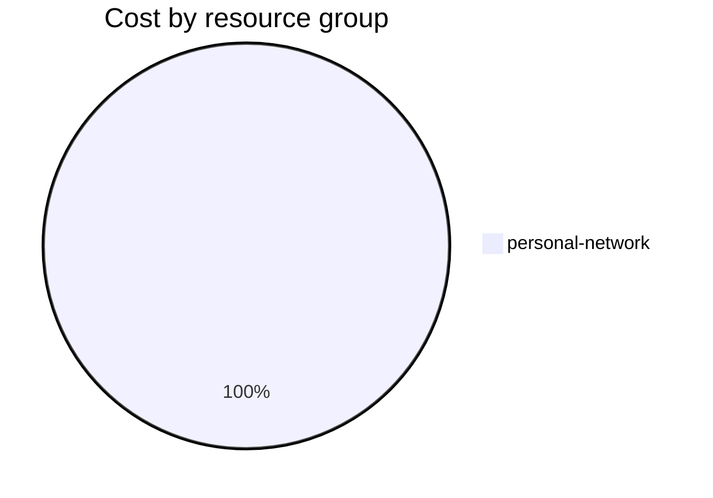

Fetching subscription details...
Fetching cost data...
Fetching forecasted cost data...
Fetching cost data by service name...
Fetching cost data by location...
Fetching cost data by resource group...
# Azure Cost Overview

> Accumulated cost for subscription id `JPF Pay-As-You-Go` from **09/15/2023** to **09/24/2023**

## Totals

|Period|Amount|
|---|---:|
|Today|0.04 USD|
|Yesterday|0.25 USD|
|Last 7 days|3.16 USD|
|Last 30 days|3.79 USD|

```mermaid
gantt
   title Accumulated cost
   dateFormat  X
   axisFormat %s
   section 15 Sep
   USD 0.26 :0, 26
   section 16 Sep
   USD 0.64 :0, 64
   section 17 Sep
   USD 0.99 :0, 99
   section 18 Sep
   USD 1.53 :0, 153
   section 19 Sep
   USD 1.88 :0, 188
   section 20 Sep
   USD 2.25 :0, 225
   section 21 Sep
   USD 2.73 :0, 273
   section 22 Sep
   USD 3.50 :0, 350
   section 23 Sep
   USD 3.75 :0, 375
   section 24 Sep
   USD 3.79 :0, 379
   section 25 Sep
   USD 4.61 : done, 0, 461
   section 26 Sep
   USD 5.27 : done, 0, 527
   section 27 Sep
   USD 6.00 : done, 0, 600
   section 28 Sep
   USD 6.89 : done, 0, 689
   section 29 Sep
   USD 7.84 : done, 0, 784
   section 30 Sep
   USD 8.71 : done, 0, 871
```

## By Service Name

|Service|Amount|
|---|---:|
|Bandwidth|2.18 USD|
|Virtual Machines|1.61 USD|

## By Location

|Location|Amount|
|---|---:|
|US North Central|3.79 USD|

## By Resource Group

|Resource Group|Amount|
|---|---:|
|personal-network|3.79 USD|

Generated at 2023-09-24 11:29:07 for subscription with id `4913be3f-a345-4652-9bba-767418dd25e3`
