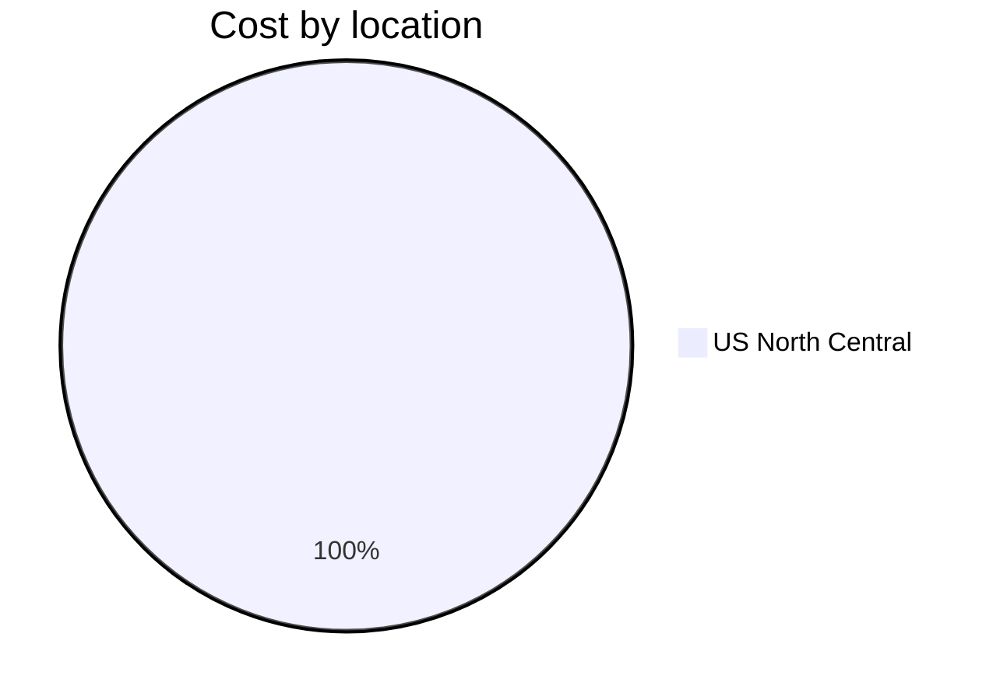
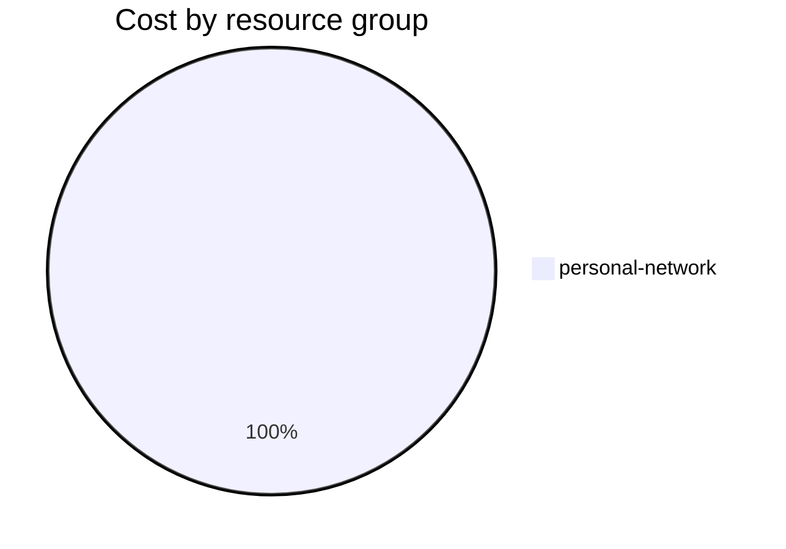

Fetching subscription details...
Fetching cost data...
Fetching forecasted cost data...
Fetching cost data by service name...
Fetching cost data by location...
Fetching cost data by resource group...
# Azure Cost Overview

> Accumulated cost for subscription id `JPF Pay-As-You-Go` from **01/01/2024** to **01/07/2024**

## Totals

|Period|Amount|
|---|---:|
|Today|0.05 USD|
|Yesterday|0.83 USD|
|Last 7 days|4.15 USD|
|Last 30 days|4.15 USD|

```mermaid
gantt
   title Accumulated cost
   dateFormat  X
   axisFormat %s
   section 01 Jan
   USD 0.64 :0, 64
   section 02 Jan
   USD 1.68 :0, 168
   section 03 Jan
   USD 2.13 :0, 213
   section 04 Jan
   USD 2.68 :0, 268
   section 05 Jan
   USD 3.26 :0, 326
   section 06 Jan
   USD 4.10 :0, 410
   section 07 Jan
   USD 4.15 :0, 415
   section 08 Jan
   USD 4.84 : done, 0, 484
   section 09 Jan
   USD 5.52 : done, 0, 552
   section 10 Jan
   USD 5.93 : done, 0, 593
   section 11 Jan
   USD 6.35 : done, 0, 635
   section 12 Jan
   USD 6.67 : done, 0, 667
   section 13 Jan
   USD 7.12 : done, 0, 712
   section 14 Jan
   USD 7.67 : done, 0, 767
   section 15 Jan
   USD 8.36 : done, 0, 836
   section 16 Jan
   USD 9.04 : done, 0, 904
   section 17 Jan
   USD 9.45 : done, 0, 945
   section 18 Jan
   USD 9.86 : done, 0, 986
   section 19 Jan
   USD 10.18 : done, 0, 1018
   section 20 Jan
   USD 10.63 : done, 0, 1063
   section 21 Jan
   USD 11.17 : done, 0, 1117
   section 22 Jan
   USD 11.85 : done, 0, 1185
   section 23 Jan
   USD 12.53 : done, 0, 1253
   section 24 Jan
   USD 12.94 : done, 0, 1294
   section 25 Jan
   USD 13.34 : done, 0, 1334
   section 26 Jan
   USD 13.66 : done, 0, 1366
   section 27 Jan
   USD 14.10 : done, 0, 1410
   section 28 Jan
   USD 14.65 : done, 0, 1465
   section 29 Jan
   USD 15.32 : done, 0, 1532
   section 30 Jan
   USD 16.00 : done, 0, 1600
   section 31 Jan
   USD 16.40 : done, 0, 1640
```

## By Service Name

|Service|Amount|
|---|---:|
|Bandwidth|2.86 USD|
|Virtual Machines|1.29 USD|

## By Location

|Location|Amount|
|---|---:|
|US North Central|4.15 USD|

## By Resource Group

|Resource Group|Amount|
|---|---:|
|personal-network|4.15 USD|

Generated at 2024-01-07 11:29:42 for subscription with id `4913be3f-a345-4652-9bba-767418dd25e3`
