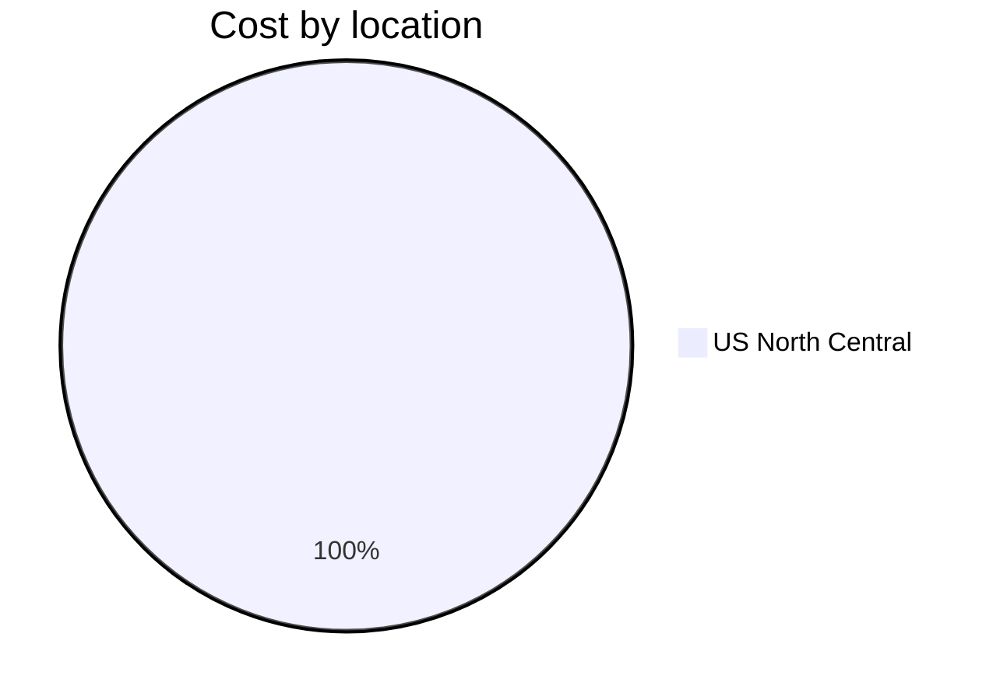
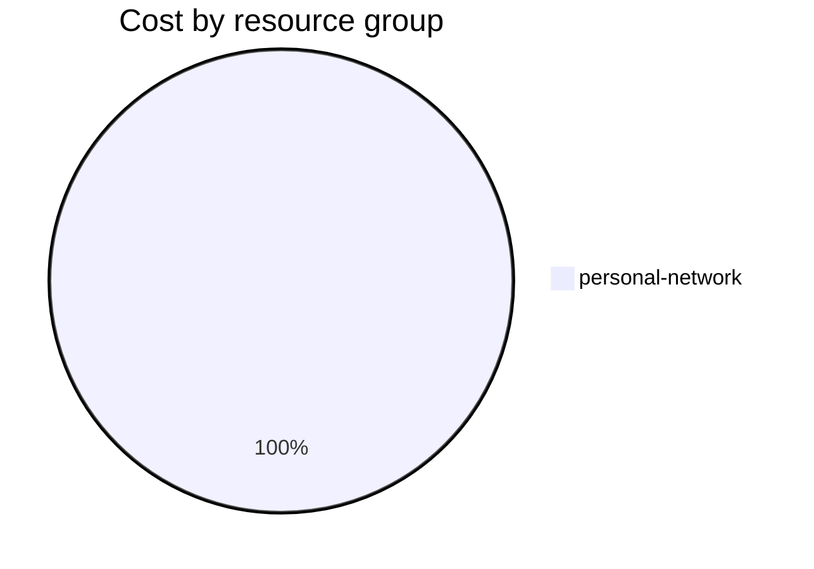

Fetching subscription details...
Fetching cost data...
Fetching forecasted cost data...
Fetching cost data by service name...
Fetching cost data by location...
Fetching cost data by resource group...
# Azure Cost Overview

> Accumulated cost for subscription id `JPF Pay-As-You-Go` from **09/15/2023** to **09/28/2023**

## Totals

|Period|Amount|
|---|---:|
|Today|0.05 USD|
|Yesterday|0.31 USD|
|Last 7 days|3.35 USD|
|Last 30 days|6.12 USD|

```mermaid
gantt
   title Accumulated cost
   dateFormat  X
   axisFormat %s
   section 15 Sep
   USD 0.29 :0, 29
   section 16 Sep
   USD 0.76 :0, 76
   section 17 Sep
   USD 1.20 :0, 120
   section 18 Sep
   USD 1.90 :0, 190
   section 19 Sep
   USD 2.31 :0, 231
   section 20 Sep
   USD 2.77 :0, 277
   section 21 Sep
   USD 3.39 :0, 339
   section 22 Sep
   USD 4.41 :0, 441
   section 23 Sep
   USD 4.70 :0, 470
   section 24 Sep
   USD 5.02 :0, 502
   section 25 Sep
   USD 5.39 :0, 539
   section 26 Sep
   USD 5.76 :0, 576
   section 27 Sep
   USD 6.07 :0, 607
   section 28 Sep
   USD 6.12 :0, 612
   section 29 Sep
   USD 6.79 : done, 0, 679
   section 30 Sep
   USD 7.18 : done, 0, 718
```

## By Service Name

|Service|Amount|
|---|---:|
|Bandwidth|3.80 USD|
|Virtual Machines|2.32 USD|

## By Location

|Location|Amount|
|---|---:|
|US North Central|6.12 USD|

## By Resource Group

|Resource Group|Amount|
|---|---:|
|personal-network|6.12 USD|

Generated at 2023-09-28 11:24:30 for subscription with id `4913be3f-a345-4652-9bba-767418dd25e3`
