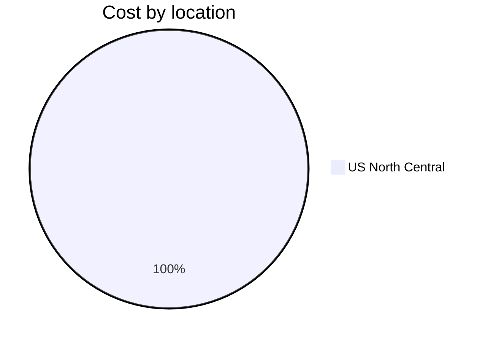
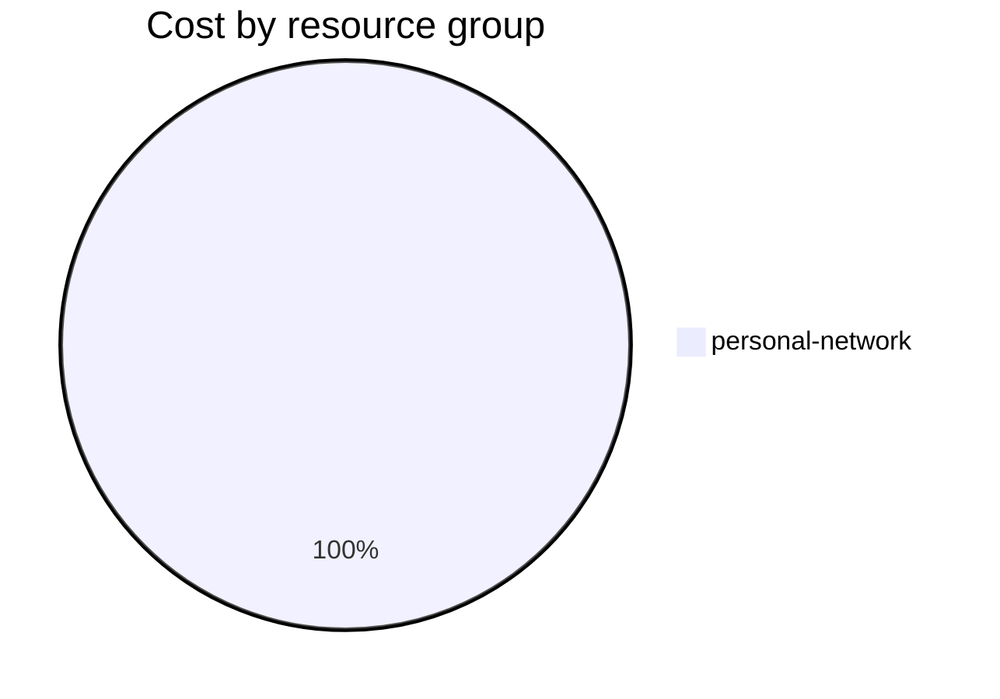

Fetching subscription details...
Fetching cost data...
Fetching forecasted cost data...
Fetching cost data by service name...
Fetching cost data by location...
Fetching cost data by resource group...
# Azure Cost Overview

> Accumulated cost for subscription id `JPF Pay-As-You-Go` from **10/01/2023** to **10/03/2023**

## Totals

|Period|Amount|
|---|---:|
|Today|0.04 USD|
|Yesterday|0.41 USD|
|Last 7 days|0.96 USD|
|Last 30 days|0.96 USD|

```mermaid
gantt
   title Accumulated cost
   dateFormat  X
   axisFormat %s
   section 01 Oct
   USD 0.50 :0, 50
   section 02 Oct
   USD 0.91 :0, 91
   section 03 Oct
   USD 0.96 :0, 96
   section 04 Oct
   USD 1.35 : done, 0, 135
   section 05 Oct
   USD 1.93 : done, 0, 193
   section 06 Oct
   USD 2.23 : done, 0, 223
   section 07 Oct
   USD 2.52 : done, 0, 252
   section 08 Oct
   USD 2.90 : done, 0, 290
   section 09 Oct
   USD 3.42 : done, 0, 342
   section 10 Oct
   USD 3.74 : done, 0, 374
   section 11 Oct
   USD 4.05 : done, 0, 405
   section 12 Oct
   USD 4.55 : done, 0, 455
   section 13 Oct
   USD 4.77 : done, 0, 477
   section 14 Oct
   USD 4.98 : done, 0, 498
   section 15 Oct
   USD 5.28 : done, 0, 528
   section 16 Oct
   USD 5.72 : done, 0, 572
   section 17 Oct
   USD 5.96 : done, 0, 596
   section 18 Oct
   USD 6.19 : done, 0, 619
   section 19 Oct
   USD 6.60 : done, 0, 660
   section 20 Oct
   USD 6.74 : done, 0, 674
   section 21 Oct
   USD 6.88 : done, 0, 688
   section 22 Oct
   USD 7.09 : done, 0, 709
   section 23 Oct
   USD 7.45 : done, 0, 745
   section 24 Oct
   USD 7.61 : done, 0, 761
   section 25 Oct
   USD 7.76 : done, 0, 776
   section 26 Oct
   USD 8.09 : done, 0, 809
   section 27 Oct
   USD 8.15 : done, 0, 815
   section 28 Oct
   USD 8.20 : done, 0, 820
   section 29 Oct
   USD 8.33 : done, 0, 833
   section 30 Oct
   USD 8.62 : done, 0, 862
   section 31 Oct
   USD 8.69 : done, 0, 869
```

## By Service Name

|Service|Amount|
|---|---:|
|Bandwidth|0.56 USD|
|Virtual Machines|0.40 USD|

## By Location

|Location|Amount|
|---|---:|
|US North Central|0.96 USD|

## By Resource Group

|Resource Group|Amount|
|---|---:|
|personal-network|0.96 USD|

Generated at 2023-10-03 11:28:08 for subscription with id `4913be3f-a345-4652-9bba-767418dd25e3`
