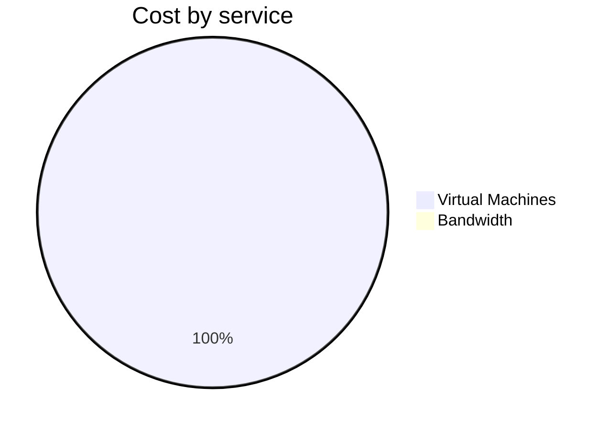
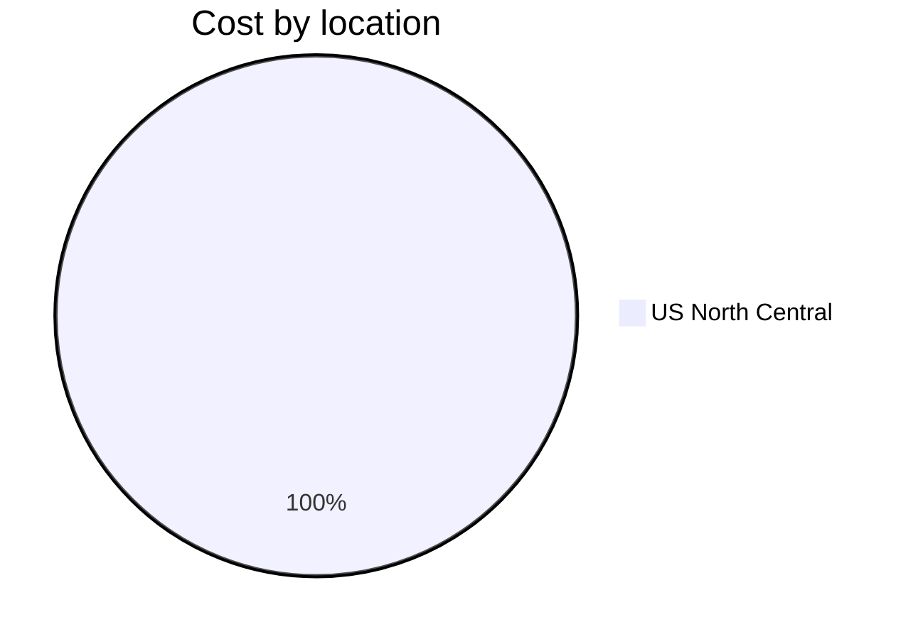
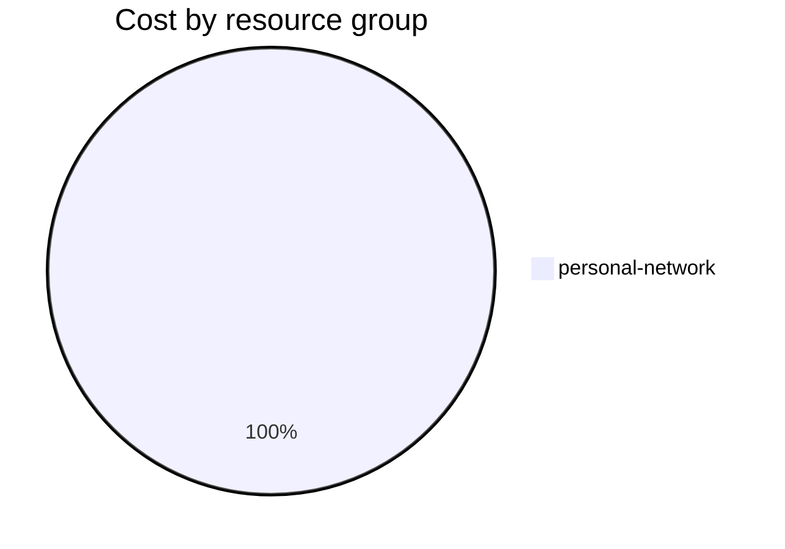

Fetching subscription details...
Fetching cost data...
Fetching forecasted cost data...
Fetching cost data by service name...
Fetching cost data by location...
Fetching cost data by resource group...
# Azure Cost Overview

> Accumulated cost for subscription id `JPF Pay-As-You-Go` from **09/15/2023** to **09/21/2023**

## Totals

|Period|Amount|
|---|---:|
|Today|0.06 USD|
|Yesterday|0.18 USD|
|Last 7 days|1.10 USD|
|Last 30 days|1.10 USD|

```mermaid
gantt
   title Accumulated cost
   dateFormat  X
   axisFormat %s
   section 15 Sep
   USD 0.17 :0, 17
   section 16 Sep
   USD 0.34 :0, 34
   section 17 Sep
   USD 0.52 :0, 52
   section 18 Sep
   USD 0.69 :0, 69
   section 19 Sep
   USD 0.87 :0, 87
   section 20 Sep
   USD 1.04 :0, 104
   section 21 Sep
   USD 1.10 :0, 110
   section 22 Sep
   USD 1.27 : done, 0, 127
   section 23 Sep
   USD 1.45 : done, 0, 145
   section 24 Sep
   USD 1.62 : done, 0, 162
   section 25 Sep
   USD 1.80 : done, 0, 180
   section 26 Sep
   USD 1.97 : done, 0, 197
   section 27 Sep
   USD 1.97 : done, 0, 197
   section 28 Sep
   USD 1.97 : done, 0, 197
   section 29 Sep
   USD 2.14 : done, 0, 214
   section 30 Sep
   USD 2.32 : done, 0, 232
```

## By Service Name

|Service|Amount|
|---|---:|
|Virtual Machines|1.10 USD|
|Bandwidth|0.00 USD|

## By Location

|Location|Amount|
|---|---:|
|US North Central|1.10 USD|

## By Resource Group

|Resource Group|Amount|
|---|---:|
|personal-network|1.10 USD|

Generated at 2023-09-21 11:27:38 for subscription with id `4913be3f-a345-4652-9bba-767418dd25e3`
