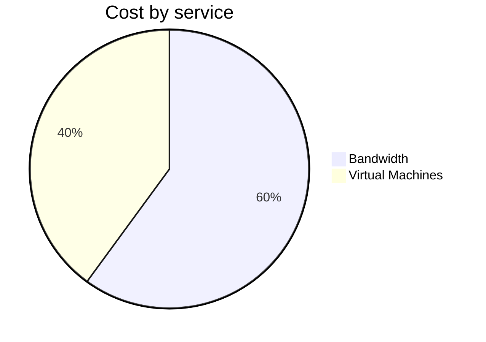
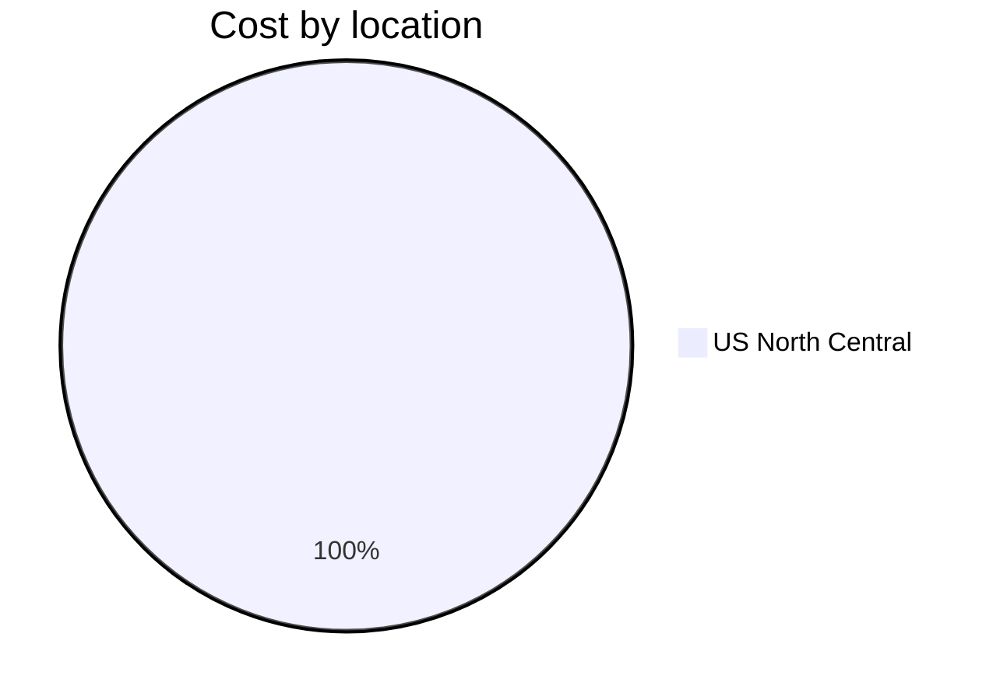
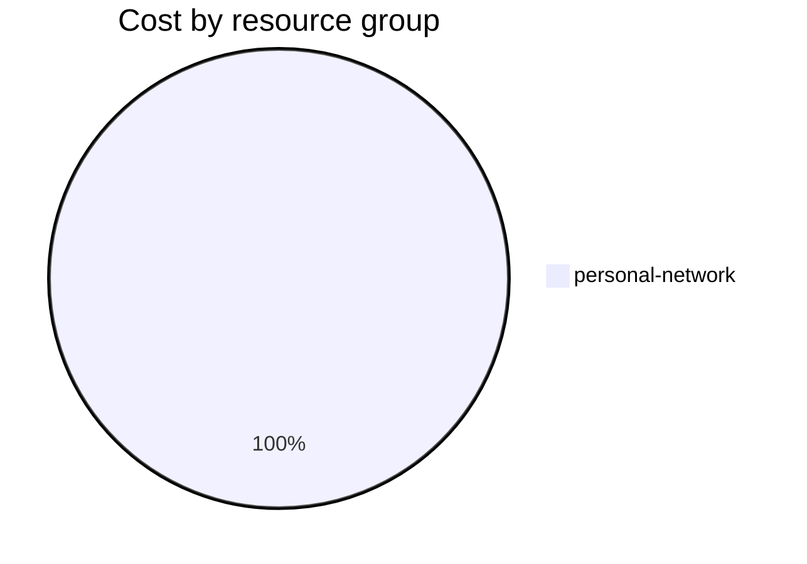

Fetching subscription details...
Fetching cost data...
Fetching forecasted cost data...
Fetching cost data by service name...
Fetching cost data by location...
Fetching cost data by resource group...
# Azure Cost Overview

> Accumulated cost for subscription id `JPF Pay-As-You-Go` from **09/15/2023** to **09/26/2023**

## Totals

|Period|Amount|
|---|---:|
|Today|0.05 USD|
|Yesterday|0.33 USD|
|Last 7 days|3.20 USD|
|Last 30 days|4.93 USD|

```mermaid
gantt
   title Accumulated cost
   dateFormat  X
   axisFormat %s
   section 15 Sep
   USD 0.28 :0, 28
   section 16 Sep
   USD 0.70 :0, 70
   section 17 Sep
   USD 1.10 :0, 110
   section 18 Sep
   USD 1.73 :0, 173
   section 19 Sep
   USD 2.11 :0, 211
   section 20 Sep
   USD 2.52 :0, 252
   section 21 Sep
   USD 3.08 :0, 308
   section 22 Sep
   USD 3.97 :0, 397
   section 23 Sep
   USD 4.25 :0, 425
   section 24 Sep
   USD 4.55 :0, 455
   section 25 Sep
   USD 4.88 :0, 488
   section 26 Sep
   USD 4.93 :0, 493
   section 27 Sep
   USD 5.46 : done, 0, 546
   section 28 Sep
   USD 6.15 : done, 0, 615
   section 29 Sep
   USD 6.88 : done, 0, 688
   section 30 Sep
   USD 7.40 : done, 0, 740
```

## By Service Name

|Service|Amount|
|---|---:|
|Bandwidth|2.96 USD|
|Virtual Machines|1.97 USD|

## By Location

|Location|Amount|
|---|---:|
|US North Central|4.93 USD|

## By Resource Group

|Resource Group|Amount|
|---|---:|
|personal-network|4.93 USD|

Generated at 2023-09-26 11:26:24 for subscription with id `4913be3f-a345-4652-9bba-767418dd25e3`
