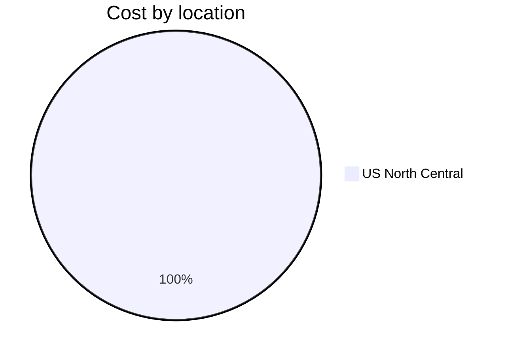
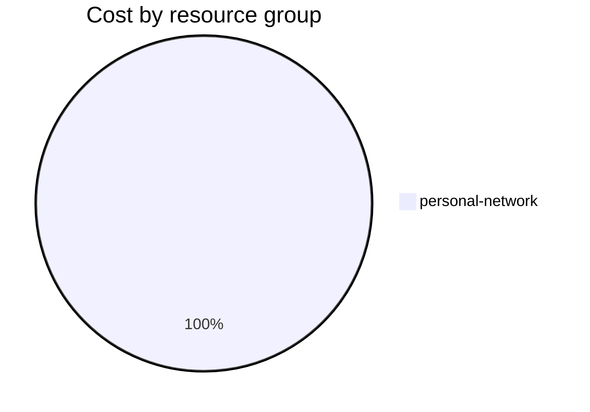

Fetching subscription details...
Fetching cost data...
Fetching forecasted cost data...
Fetching cost data by service name...
Fetching cost data by location...
Fetching cost data by resource group...
# Azure Cost Overview

> Accumulated cost for subscription id `JPF Pay-As-You-Go` from **01/01/2024** to **01/10/2024**

## Totals

|Period|Amount|
|---|---:|
|Today|0.05 USD|
|Yesterday|0.59 USD|
|Last 7 days|4.77 USD|
|Last 30 days|6.59 USD|

```mermaid
gantt
   title Accumulated cost
   dateFormat  X
   axisFormat %s
   section 01 Jan
   USD 0.69 :0, 69
   section 02 Jan
   USD 1.83 :0, 183
   section 03 Jan
   USD 2.31 :0, 231
   section 04 Jan
   USD 2.90 :0, 290
   section 05 Jan
   USD 3.52 :0, 352
   section 06 Jan
   USD 4.44 :0, 444
   section 07 Jan
   USD 4.87 :0, 487
   section 08 Jan
   USD 5.95 :0, 595
   section 09 Jan
   USD 6.54 :0, 654
   section 10 Jan
   USD 6.59 :0, 659
   section 11 Jan
   USD 7.12 : done, 0, 712
   section 12 Jan
   USD 7.71 : done, 0, 771
   section 13 Jan
   USD 8.52 : done, 0, 852
   section 14 Jan
   USD 9.15 : done, 0, 915
   section 15 Jan
   USD 10.02 : done, 0, 1002
   section 16 Jan
   USD 10.89 : done, 0, 1089
   section 17 Jan
   USD 11.46 : done, 0, 1146
   section 18 Jan
   USD 12.03 : done, 0, 1203
   section 19 Jan
   USD 12.68 : done, 0, 1268
   section 20 Jan
   USD 13.54 : done, 0, 1354
   section 21 Jan
   USD 14.22 : done, 0, 1422
   section 22 Jan
   USD 15.14 : done, 0, 1514
   section 23 Jan
   USD 16.06 : done, 0, 1606
   section 24 Jan
   USD 16.68 : done, 0, 1668
   section 25 Jan
   USD 17.30 : done, 0, 1730
   section 26 Jan
   USD 18.00 : done, 0, 1800
   section 27 Jan
   USD 18.91 : done, 0, 1891
   section 28 Jan
   USD 19.64 : done, 0, 1964
   section 29 Jan
   USD 20.61 : done, 0, 2061
   section 30 Jan
   USD 21.58 : done, 0, 2158
   section 31 Jan
   USD 22.25 : done, 0, 2225
```

## By Service Name

|Service|Amount|
|---|---:|
|Bandwidth|4.68 USD|
|Virtual Machines|1.91 USD|

## By Location

|Location|Amount|
|---|---:|
|US North Central|6.59 USD|

## By Resource Group

|Resource Group|Amount|
|---|---:|
|personal-network|6.59 USD|

Generated at 2024-01-10 11:29:35 for subscription with id `4913be3f-a345-4652-9bba-767418dd25e3`
