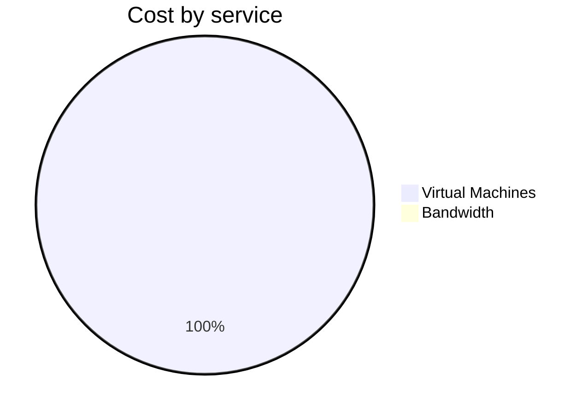
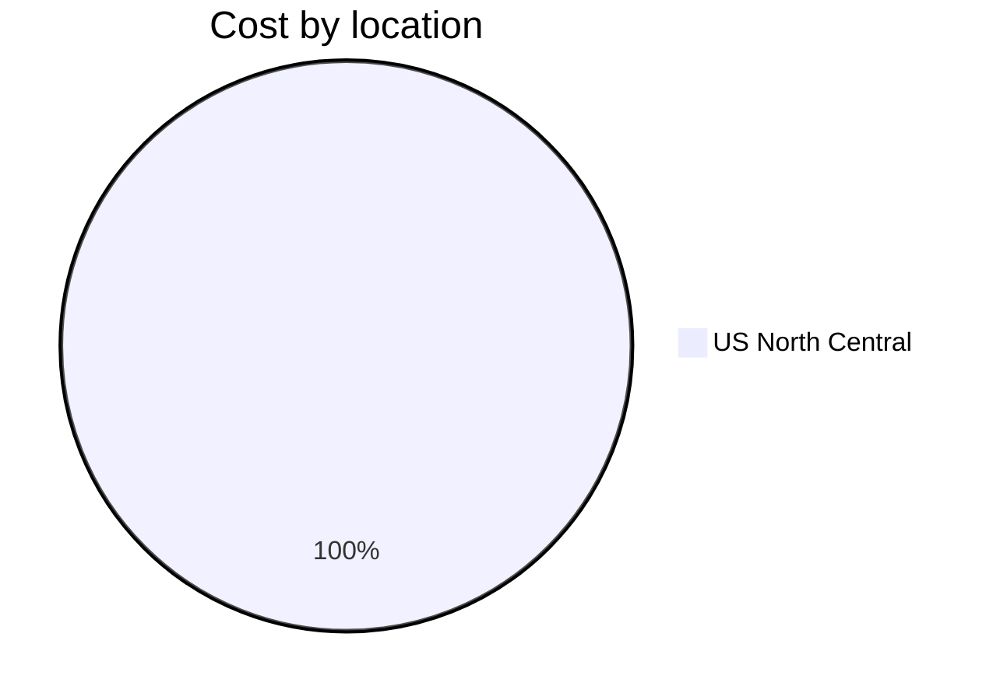
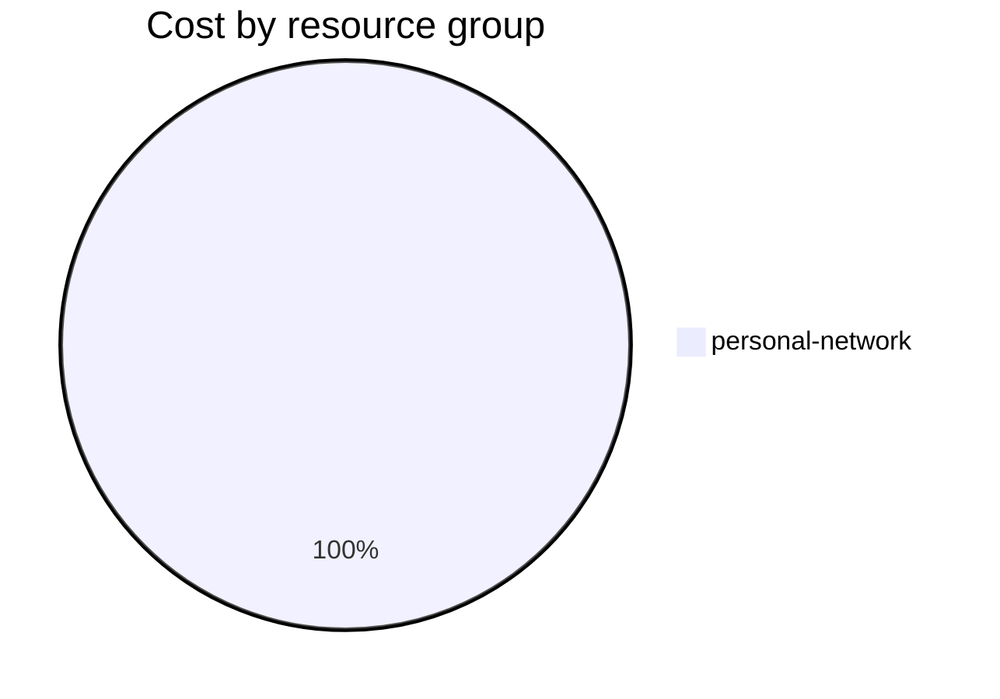

Fetching subscription details...
Fetching cost data...
Fetching forecasted cost data...
Fetching cost data by service name...
Fetching cost data by location...
Fetching cost data by resource group...
# Azure Cost Overview

> Accumulated cost for subscription id `JPF Pay-As-You-Go` from **09/15/2023** to **09/18/2023**

## Totals

|Period|Amount|
|---|---:|
|Today|0.04 USD|
|Yesterday|0.17 USD|
|Last 7 days|0.56 USD|
|Last 30 days|0.56 USD|

```mermaid
gantt
   title Accumulated cost
   dateFormat  X
   axisFormat %s
   section 15 Sep
   USD 0.17 :0, 17
   section 16 Sep
   USD 0.34 :0, 34
   section 17 Sep
   USD 0.52 :0, 52
   section 18 Sep
   USD 0.56 :0, 56
```

## By Service Name

|Service|Amount|
|---|---:|
|Virtual Machines|0.56 USD|
|Bandwidth|0.00 USD|

## By Location

|Location|Amount|
|---|---:|
|US North Central|0.56 USD|

## By Resource Group

|Resource Group|Amount|
|---|---:|
|personal-network|0.56 USD|

Generated at 2023-09-18 11:32:57 for subscription with id `4913be3f-a345-4652-9bba-767418dd25e3`
