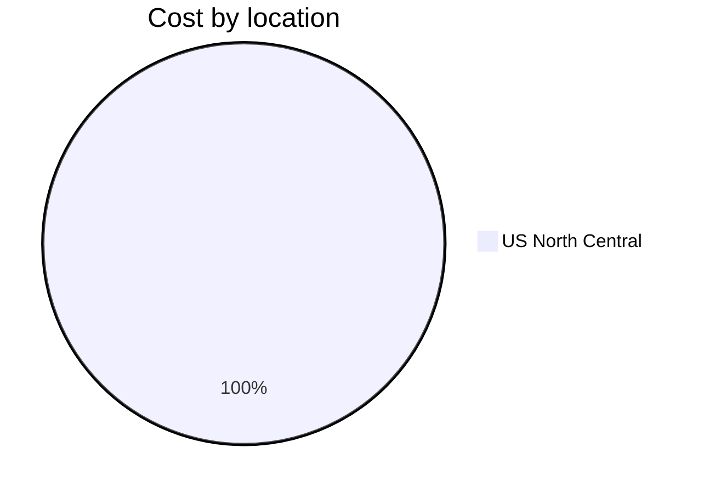
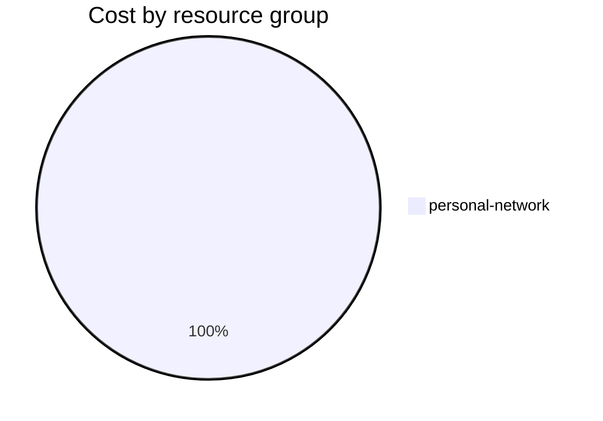

Fetching subscription details...
Fetching cost data...
Fetching forecasted cost data...
Fetching cost data by service name...
Fetching cost data by location...
Fetching cost data by resource group...
# Azure Cost Overview

> Accumulated cost for subscription id `JPF Pay-As-You-Go` from **09/15/2023** to **09/25/2023**

## Totals

|Period|Amount|
|---|---:|
|Today|0.04 USD|
|Yesterday|0.29 USD|
|Last 7 days|3.27 USD|
|Last 30 days|4.31 USD|

```mermaid
gantt
   title Accumulated cost
   dateFormat  X
   axisFormat %s
   section 15 Sep
   USD 0.27 :0, 27
   section 16 Sep
   USD 0.67 :0, 67
   section 17 Sep
   USD 1.04 :0, 104
   section 18 Sep
   USD 1.62 :0, 162
   section 19 Sep
   USD 1.98 :0, 198
   section 20 Sep
   USD 2.37 :0, 237
   section 21 Sep
   USD 2.89 :0, 289
   section 22 Sep
   USD 3.72 :0, 372
   section 23 Sep
   USD 3.98 :0, 398
   section 24 Sep
   USD 4.26 :0, 426
   section 25 Sep
   USD 4.31 :0, 431
   section 26 Sep
   USD 4.84 : done, 0, 484
   section 27 Sep
   USD 5.42 : done, 0, 542
   section 28 Sep
   USD 6.16 : done, 0, 616
   section 29 Sep
   USD 6.96 : done, 0, 696
   section 30 Sep
   USD 7.56 : done, 0, 756
```

## By Service Name

|Service|Amount|
|---|---:|
|Bandwidth|2.52 USD|
|Virtual Machines|1.79 USD|

## By Location

|Location|Amount|
|---|---:|
|US North Central|4.31 USD|

## By Resource Group

|Resource Group|Amount|
|---|---:|
|personal-network|4.31 USD|

Generated at 2023-09-25 11:29:30 for subscription with id `4913be3f-a345-4652-9bba-767418dd25e3`
