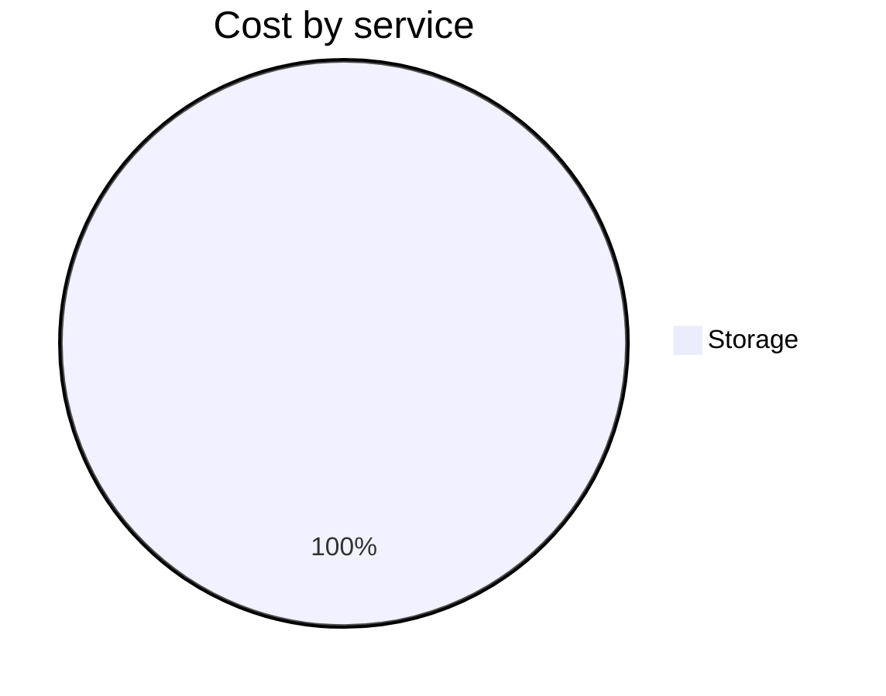
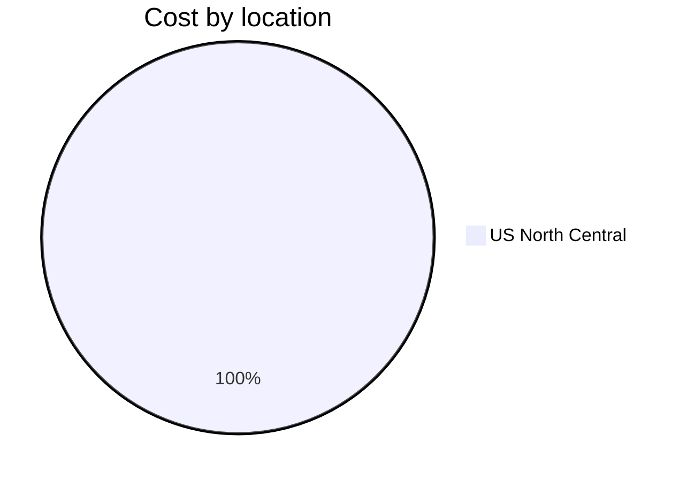
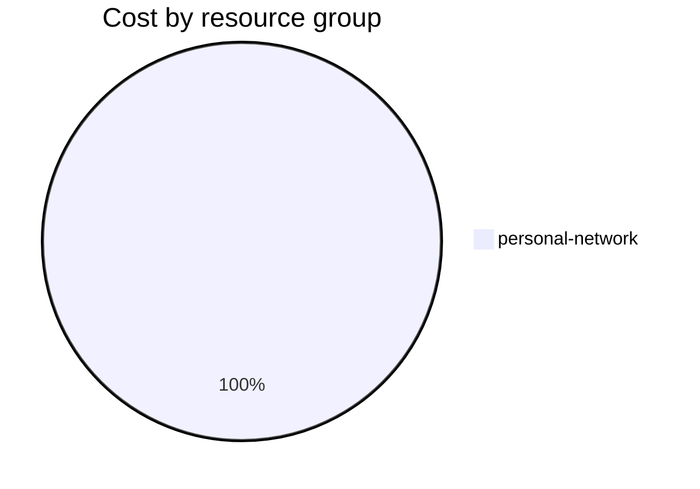

Fetching subscription details...
Fetching cost data...
Fetching forecasted cost data...
Fetching cost data by service name...
Fetching cost data by location...
Fetching cost data by resource group...
# Azure Cost Overview

> Accumulated cost for subscription id `JPF Pay-As-You-Go` from **03/01/2024** to **03/04/2024**

## Totals

|Period|Amount|
|---|---:|
|Today|0.00 USD|
|Yesterday|0.05 USD|
|Last 7 days|0.24 USD|
|Last 30 days|0.24 USD|

```mermaid
gantt
   title Accumulated cost
   dateFormat  X
   axisFormat %s
   section 01 Mar
   USD 0.06 :0, 6
   section 02 Mar
   USD 0.12 :0, 12
   section 03 Mar
   USD 0.19 :0, 19
   section 04 Mar
   USD 0.24 :0, 24
   section 05 Mar
   USD 0.30 : done, 0, 30
   section 06 Mar
   USD 0.36 : done, 0, 36
   section 07 Mar
   USD 0.43 : done, 0, 43
   section 08 Mar
   USD 0.49 : done, 0, 49
   section 09 Mar
   USD 0.55 : done, 0, 55
   section 10 Mar
   USD 0.62 : done, 0, 62
   section 11 Mar
   USD 0.68 : done, 0, 68
   section 12 Mar
   USD 0.75 : done, 0, 75
   section 13 Mar
   USD 0.81 : done, 0, 81
   section 14 Mar
   USD 0.87 : done, 0, 87
   section 15 Mar
   USD 0.94 : done, 0, 94
   section 16 Mar
   USD 1.00 : done, 0, 100
   section 17 Mar
   USD 1.06 : done, 0, 106
   section 18 Mar
   USD 1.13 : done, 0, 113
   section 19 Mar
   USD 1.19 : done, 0, 119
   section 20 Mar
   USD 1.25 : done, 0, 125
   section 21 Mar
   USD 1.32 : done, 0, 132
   section 22 Mar
   USD 1.38 : done, 0, 138
   section 23 Mar
   USD 1.44 : done, 0, 144
   section 24 Mar
   USD 1.50 : done, 0, 150
   section 25 Mar
   USD 1.57 : done, 0, 157
   section 26 Mar
   USD 1.63 : done, 0, 163
   section 27 Mar
   USD 1.69 : done, 0, 169
   section 28 Mar
   USD 1.76 : done, 0, 176
   section 29 Mar
   USD 1.82 : done, 0, 182
   section 30 Mar
   USD 1.88 : done, 0, 188
   section 31 Mar
   USD 1.94 : done, 0, 194
```

## By Service Name

|Service|Amount|
|---|---:|
|Storage|0.24 USD|

## By Location

|Location|Amount|
|---|---:|
|US North Central|0.24 USD|

## By Resource Group

|Resource Group|Amount|
|---|---:|
|personal-network|0.24 USD|

Generated at 2024-03-05 11:32:15 for subscription with id `4913be3f-a345-4652-9bba-767418dd25e3`
