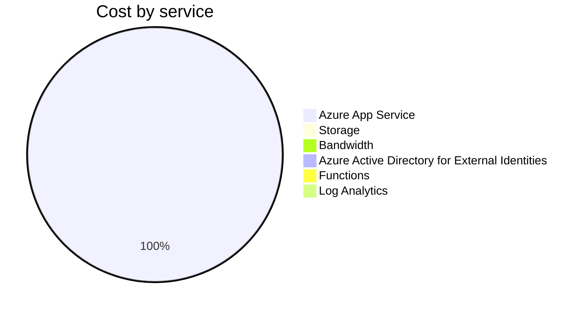
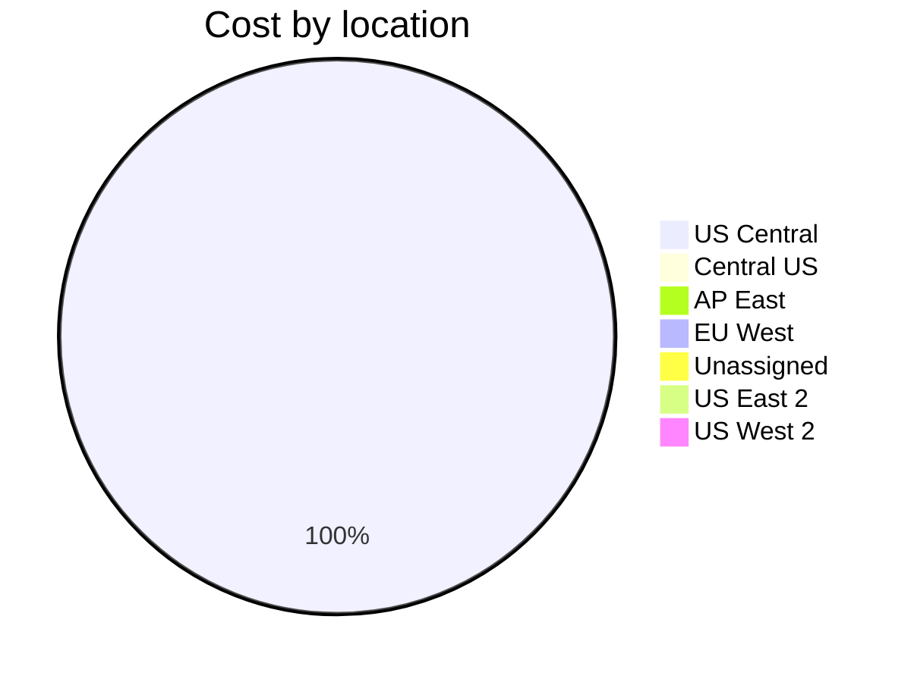
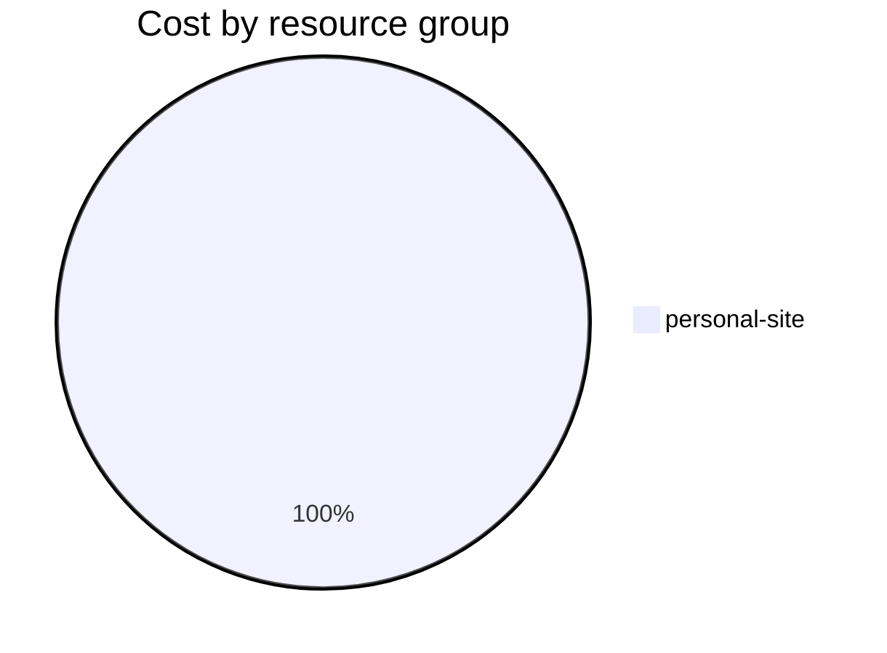

Fetching subscription details...
Fetching cost data...
Fetching forecasted cost data...
Fetching cost data by service name...
Fetching cost data by location...
Fetching cost data by resource group...
# Azure Cost Overview

> Accumulated cost for subscription id `JPF Pay-As-You-Go` from **10/01/2023** to **10/30/2023**

## Totals

|Period|Amount|
|---|---:|
|Today|0.00 USD|
|Yesterday|0.52 USD|
|Last 7 days|4.08 USD|
|Last 30 days|17.75 USD|

```mermaid
gantt
   title Accumulated cost
   dateFormat  X
   axisFormat %s
   section 01 Oct
   USD 0.59 :0, 59
   section 02 Oct
   USD 1.19 :0, 119
   section 03 Oct
   USD 1.78 :0, 178
   section 04 Oct
   USD 2.38 :0, 238
   section 05 Oct
   USD 2.97 :0, 297
   section 06 Oct
   USD 3.56 :0, 356
   section 07 Oct
   USD 4.16 :0, 416
   section 08 Oct
   USD 4.75 :0, 475
   section 09 Oct
   USD 5.35 :0, 535
   section 10 Oct
   USD 5.94 :0, 594
   section 11 Oct
   USD 6.54 :0, 654
   section 12 Oct
   USD 7.13 :0, 713
   section 13 Oct
   USD 7.73 :0, 773
   section 14 Oct
   USD 8.32 :0, 832
   section 15 Oct
   USD 8.91 :0, 891
   section 16 Oct
   USD 9.51 :0, 951
   section 17 Oct
   USD 10.10 :0, 1010
   section 18 Oct
   USD 10.70 :0, 1070
   section 19 Oct
   USD 11.29 :0, 1129
   section 20 Oct
   USD 11.88 :0, 1188
   section 21 Oct
   USD 12.48 :0, 1248
   section 22 Oct
   USD 13.07 :0, 1307
   section 23 Oct
   USD 13.67 :0, 1367
   section 24 Oct
   USD 14.26 :0, 1426
   section 25 Oct
   USD 14.85 :0, 1485
   section 26 Oct
   USD 15.45 :0, 1545
   section 27 Oct
   USD 16.04 :0, 1604
   section 28 Oct
   USD 16.64 :0, 1664
   section 29 Oct
   USD 17.23 :0, 1723
   section 30 Oct
   USD 17.75 :0, 1775
   section 31 Oct
   USD 18.34 : done, 0, 1834
```

## By Service Name

|Service|Amount|
|---|---:|
|Azure App Service|17.68 USD|
|Storage|0.07 USD|
|Bandwidth|0.00 USD|
|Azure Active Directory for External Identities|0.00 USD|
|Functions|0.00 USD|
|Log Analytics|0.00 USD|

## By Location

|Location|Amount|
|---|---:|
|US Central|17.68 USD|
|Central US|0.07 USD|
|AP East|0.00 USD|
|EU West|0.00 USD|
|Unassigned|0.00 USD|
|US East 2|0.00 USD|
|US West 2|0.00 USD|

## By Resource Group

|Resource Group|Amount|
|---|---:|
|personal-site|17.75 USD|

Generated at 2023-10-31 11:06:28 for subscription with id `4913be3f-a345-4652-9bba-767418dd25e3`
