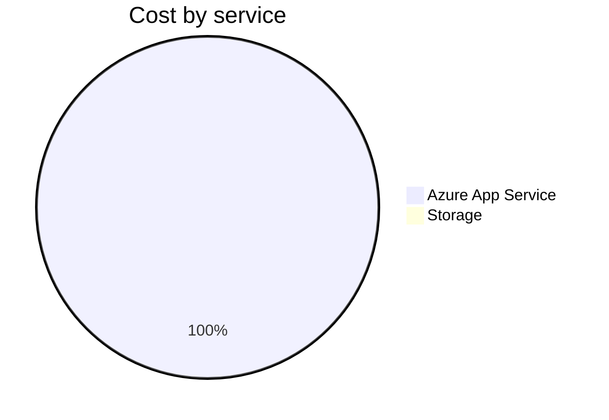
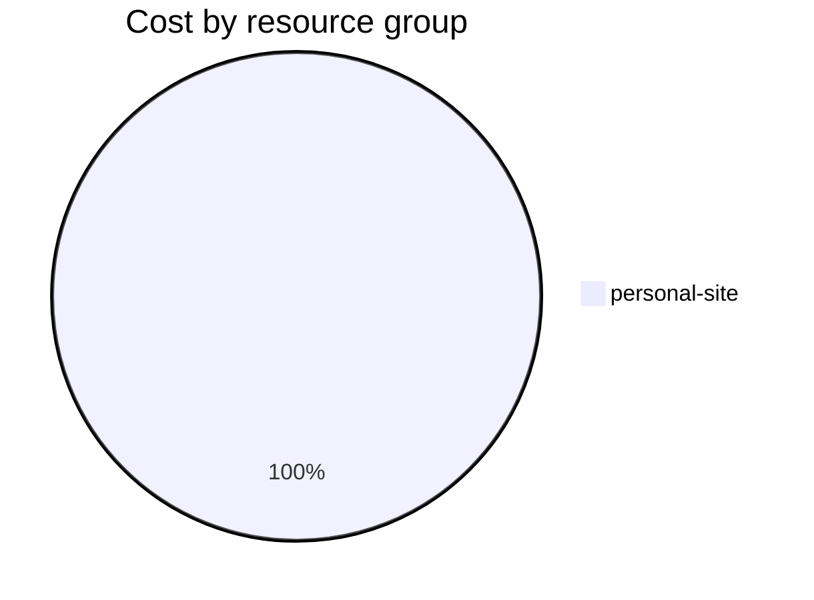

Fetching subscription details...
Fetching cost data...
Fetching forecasted cost data...
Fetching cost data by service name...
Fetching cost data by location...
Fetching cost data by resource group...
# Azure Cost Overview

> Accumulated cost for subscription id `JPF Pay-As-You-Go` from **11/01/2023** to **11/01/2023**

## Totals

|Period|Amount|
|---|---:|
|Today|0.00 USD|
|Yesterday|0.40 USD|
|Last 7 days|0.40 USD|
|Last 30 days|0.40 USD|

```mermaid
gantt
   title Accumulated cost
   dateFormat  X
   axisFormat %s
   section 01 Nov
   USD 0.40 :0, 40
   section 02 Nov
   USD 0.99 : done, 0, 99
   section 03 Nov
   USD 1.58 : done, 0, 158
   section 04 Nov
   USD 2.18 : done, 0, 218
   section 05 Nov
   USD 2.77 : done, 0, 277
   section 06 Nov
   USD 3.37 : done, 0, 337
   section 07 Nov
   USD 3.96 : done, 0, 396
   section 08 Nov
   USD 4.55 : done, 0, 455
   section 09 Nov
   USD 5.15 : done, 0, 515
   section 10 Nov
   USD 5.74 : done, 0, 574
   section 11 Nov
   USD 6.33 : done, 0, 633
   section 12 Nov
   USD 6.93 : done, 0, 693
   section 13 Nov
   USD 7.52 : done, 0, 752
   section 14 Nov
   USD 8.12 : done, 0, 812
   section 15 Nov
   USD 8.71 : done, 0, 871
   section 16 Nov
   USD 9.30 : done, 0, 930
   section 17 Nov
   USD 9.90 : done, 0, 990
   section 18 Nov
   USD 10.49 : done, 0, 1049
   section 19 Nov
   USD 11.08 : done, 0, 1108
   section 20 Nov
   USD 11.68 : done, 0, 1168
   section 21 Nov
   USD 12.27 : done, 0, 1227
   section 22 Nov
   USD 12.86 : done, 0, 1286
   section 23 Nov
   USD 13.46 : done, 0, 1346
   section 24 Nov
   USD 14.05 : done, 0, 1405
   section 25 Nov
   USD 14.65 : done, 0, 1465
   section 26 Nov
   USD 15.24 : done, 0, 1524
   section 27 Nov
   USD 15.83 : done, 0, 1583
   section 28 Nov
   USD 16.43 : done, 0, 1643
   section 29 Nov
   USD 17.02 : done, 0, 1702
   section 30 Nov
   USD 17.61 : done, 0, 1761
```

## By Service Name

|Service|Amount|
|---|---:|
|Azure App Service|0.39 USD|
|Storage|0.00 USD|

## By Location

|Location|Amount|
|---|---:|
|US Central|0.39 USD|
|Central US|0.00 USD|
|AP East|0.00 USD|
|EU West|0.00 USD|
|US East 2|0.00 USD|
|US West 2|0.00 USD|

## By Resource Group

|Resource Group|Amount|
|---|---:|
|personal-site|0.40 USD|

Generated at 2023-11-02 11:07:26 for subscription with id `4913be3f-a345-4652-9bba-767418dd25e3`
