Fetching subscription details...
Fetching cost data...
Fetching forecasted cost data...
Fetching cost data by service name...
Fetching cost data by location...
Fetching cost data by resource group...
# Azure Cost Overview

> Accumulated cost for subscription id `JPF Pay-As-You-Go` from **10/01/2023** to **10/04/2023**

## Totals

|Period|Amount|
|---|---:|
|Today|0.00 USD|
|Yesterday|0.50 USD|
|Last 7 days|2.28 USD|
|Last 30 days|2.28 USD|

```mermaid
gantt
   title Accumulated cost
   dateFormat  X
   axisFormat %s
   section 01 Oct
   USD 0.59 :0, 59
   section 02 Oct
   USD 1.19 :0, 119
   section 03 Oct
   USD 1.78 :0, 178
   section 04 Oct
   USD 2.28 :0, 228
   section 05 Oct
   USD 2.51 : done, 0, 251
   section 06 Oct
   USD 2.71 : done, 0, 271
   section 07 Oct
   USD 2.87 : done, 0, 287
   section 08 Oct
   USD 3.00 : done, 0, 300
   section 09 Oct
   USD 3.08 : done, 0, 308
   section 10 Oct
   USD 3.13 : done, 0, 313
   section 11 Oct
   USD 3.14 : done, 0, 314
   section 12 Oct
   USD 3.14 : done, 0, 314
   section 13 Oct
   USD 3.14 : done, 0, 314
   section 14 Oct
   USD 3.14 : done, 0, 314
   section 15 Oct
   USD 3.14 : done, 0, 314
   section 16 Oct
   USD 3.14 : done, 0, 314
   section 17 Oct
   USD 3.14 : done, 0, 314
   section 18 Oct
   USD 3.14 : done, 0, 314
   section 19 Oct
   USD 3.14 : done, 0, 314
   section 20 Oct
   USD 3.14 : done, 0, 314
   section 21 Oct
   USD 3.14 : done, 0, 314
   section 22 Oct
   USD 3.14 : done, 0, 314
   section 23 Oct
   USD 3.14 : done, 0, 314
   section 24 Oct
   USD 3.14 : done, 0, 314
   section 25 Oct
   USD 3.14 : done, 0, 314
   section 26 Oct
   USD 3.14 : done, 0, 314
   section 27 Oct
   USD 3.14 : done, 0, 314
   section 28 Oct
   USD 3.14 : done, 0, 314
   section 29 Oct
   USD 3.14 : done, 0, 314
   section 30 Oct
   USD 3.14 : done, 0, 314
   section 31 Oct
   USD 3.14 : done, 0, 314
```

## By Service Name

|Service|Amount|
|---|---:|
|Azure App Service|2.27 USD|
|Storage|0.01 USD|
|Bandwidth|0.00 USD|
|Functions|0.00 USD|
|Log Analytics|0.00 USD|

## By Location

|Location|Amount|
|---|---:|
|US Central|2.28 USD|
|AP East|0.00 USD|
|EU West|0.00 USD|
|US East 2|0.00 USD|
|US West 2|0.00 USD|

## By Resource Group

|Resource Group|Amount|
|---|---:|
|personal-site|2.28 USD|

Generated at 2023-10-05 11:07:12 for subscription with id `4913be3f-a345-4652-9bba-767418dd25e3`
