Fetching subscription details...
Fetching cost data...
Fetching forecasted cost data...
Fetching cost data by service name...
Fetching cost data by location...
Fetching cost data by resource group...
# Azure Cost Overview

> Accumulated cost for subscription id `JPF Pay-As-You-Go` from **05/01/2024** to **05/22/2024**

## Totals

|Period|Amount|
|---|---:|
|Today|0.00 USD|
|Yesterday|0.52 USD|
|Last 7 days|4.08 USD|
|Last 30 days|13.01 USD|

```mermaid
gantt
   title Accumulated cost
   dateFormat  X
   axisFormat %s
   section 01 May
   USD 0.59 :0, 59
   section 02 May
   USD 1.19 :0, 119
   section 03 May
   USD 1.78 :0, 178
   section 04 May
   USD 2.38 :0, 238
   section 05 May
   USD 2.97 :0, 297
   section 06 May
   USD 3.56 :0, 356
   section 07 May
   USD 4.16 :0, 416
   section 08 May
   USD 4.75 :0, 475
   section 09 May
   USD 5.37 :0, 537
   section 10 May
   USD 5.96 :0, 596
   section 11 May
   USD 6.56 :0, 656
   section 12 May
   USD 7.15 :0, 715
   section 13 May
   USD 7.74 :0, 774
   section 14 May
   USD 8.34 :0, 834
   section 15 May
   USD 8.93 :0, 893
   section 16 May
   USD 9.52 :0, 952
   section 17 May
   USD 10.12 :0, 1012
   section 18 May
   USD 10.71 :0, 1071
   section 19 May
   USD 11.30 :0, 1130
   section 20 May
   USD 11.90 :0, 1190
   section 21 May
   USD 12.49 :0, 1249
   section 22 May
   USD 13.01 :0, 1301
   section 23 May
   USD 13.60 : done, 0, 1360
   section 24 May
   USD 14.20 : done, 0, 1420
   section 25 May
   USD 14.79 : done, 0, 1479
   section 26 May
   USD 15.38 : done, 0, 1538
   section 27 May
   USD 15.98 : done, 0, 1598
   section 28 May
   USD 16.57 : done, 0, 1657
   section 29 May
   USD 17.17 : done, 0, 1717
   section 30 May
   USD 17.76 : done, 0, 1776
   section 31 May
   USD 18.36 : done, 0, 1836
```

## By Service Name

|Service|Amount|
|---|---:|
|Azure App Service|12.97 USD|
|Storage|0.04 USD|
|Bandwidth|0.00 USD|
|Functions|0.00 USD|
|Log Analytics|0.00 USD|

## By Location

|Location|Amount|
|---|---:|
|US Central|13.01 USD|
|AP East|0.00 USD|
|EU West|0.00 USD|
|US East 2|0.00 USD|
|US West 2|0.00 USD|

## By Resource Group

|Resource Group|Amount|
|---|---:|
|personal-site|13.01 USD|

Generated at 2024-05-23 11:06:04 for subscription with id `4913be3f-a345-4652-9bba-767418dd25e3`
