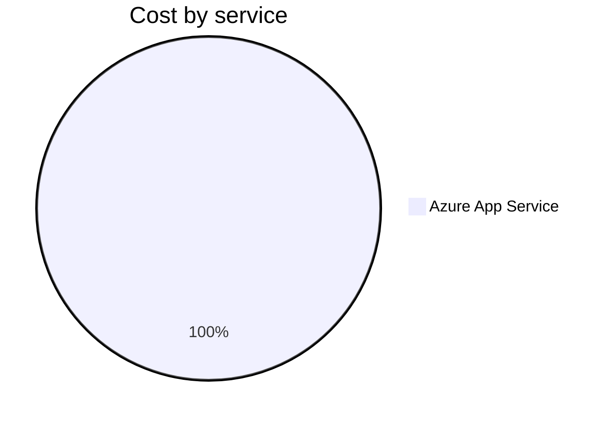
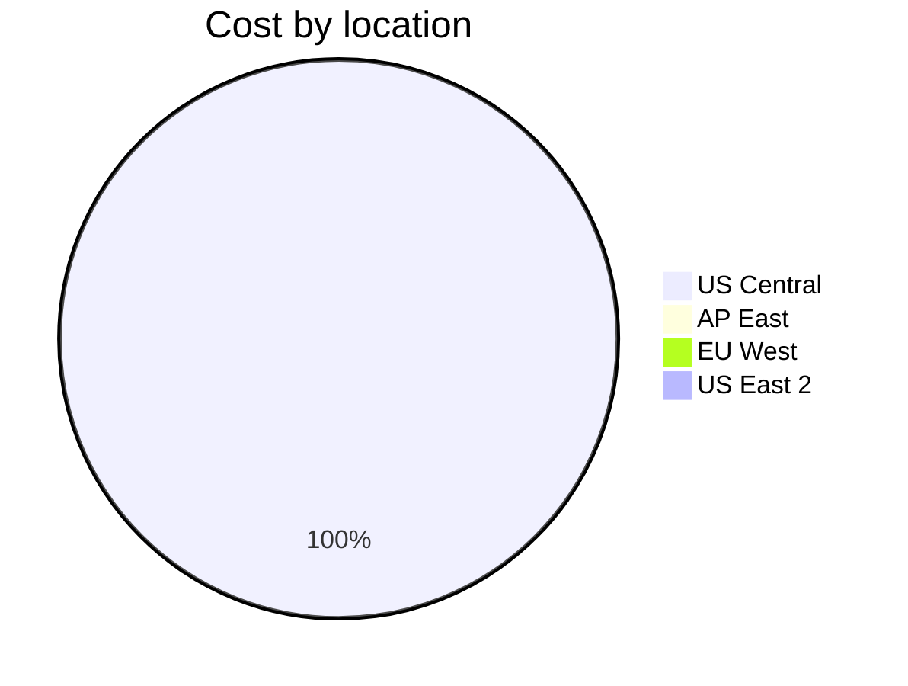
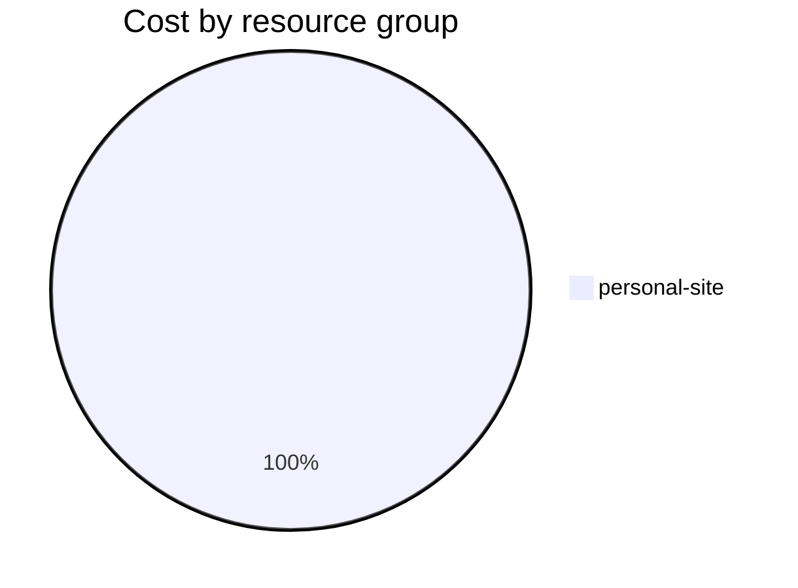

Fetching subscription details...
Fetching cost data...
Fetching forecasted cost data...
Fetching cost data by service name...
Fetching cost data by location...
Fetching cost data by resource group...
# Azure Cost Overview

> Accumulated cost for subscription id `JPF Pay-As-You-Go` from **07/01/2024** to **07/08/2024**

## Totals

|Period|Amount|
|---|---:|
|Today|0.00 USD|
|Yesterday|0.11 USD|
|Last 7 days|1.89 USD|
|Last 30 days|2.18 USD|

```mermaid
gantt
   title Accumulated cost
   dateFormat  X
   axisFormat %s
   section 01 Jul
   USD 0.30 :0, 30
   section 02 Jul
   USD 0.59 :0, 59
   section 03 Jul
   USD 0.89 :0, 89
   section 04 Jul
   USD 1.18 :0, 118
   section 05 Jul
   USD 1.48 :0, 148
   section 06 Jul
   USD 1.78 :0, 178
   section 07 Jul
   USD 2.07 :0, 207
   section 08 Jul
   USD 2.18 :0, 218
   section 09 Jul
   USD 2.48 : done, 0, 248
   section 10 Jul
   USD 2.77 : done, 0, 277
   section 11 Jul
   USD 3.07 : done, 0, 307
   section 12 Jul
   USD 3.37 : done, 0, 337
   section 13 Jul
   USD 3.66 : done, 0, 366
   section 14 Jul
   USD 3.96 : done, 0, 396
   section 15 Jul
   USD 4.25 : done, 0, 425
   section 16 Jul
   USD 4.55 : done, 0, 455
   section 17 Jul
   USD 4.85 : done, 0, 485
   section 18 Jul
   USD 5.14 : done, 0, 514
   section 19 Jul
   USD 5.44 : done, 0, 544
   section 20 Jul
   USD 5.73 : done, 0, 573
   section 21 Jul
   USD 6.03 : done, 0, 603
   section 22 Jul
   USD 6.32 : done, 0, 632
   section 23 Jul
   USD 6.62 : done, 0, 662
   section 24 Jul
   USD 6.92 : done, 0, 692
   section 25 Jul
   USD 7.21 : done, 0, 721
   section 26 Jul
   USD 7.51 : done, 0, 751
   section 27 Jul
   USD 7.80 : done, 0, 780
   section 28 Jul
   USD 8.10 : done, 0, 810
   section 29 Jul
   USD 8.40 : done, 0, 840
   section 30 Jul
   USD 8.69 : done, 0, 869
   section 31 Jul
   USD 8.99 : done, 0, 899
```

## By Service Name

|Service|Amount|
|---|---:|
|Azure App Service|2.18 USD|

## By Location

|Location|Amount|
|---|---:|
|US Central|2.18 USD|
|AP East|0.00 USD|
|EU West|0.00 USD|
|US East 2|0.00 USD|

## By Resource Group

|Resource Group|Amount|
|---|---:|
|personal-site|2.18 USD|

Generated at 2024-07-09 11:18:13 for subscription with id `4913be3f-a345-4652-9bba-767418dd25e3`
