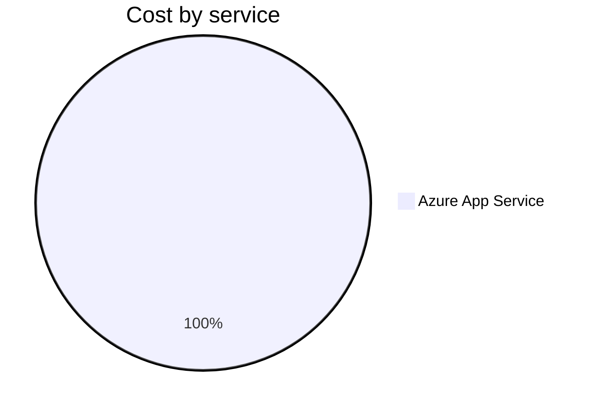
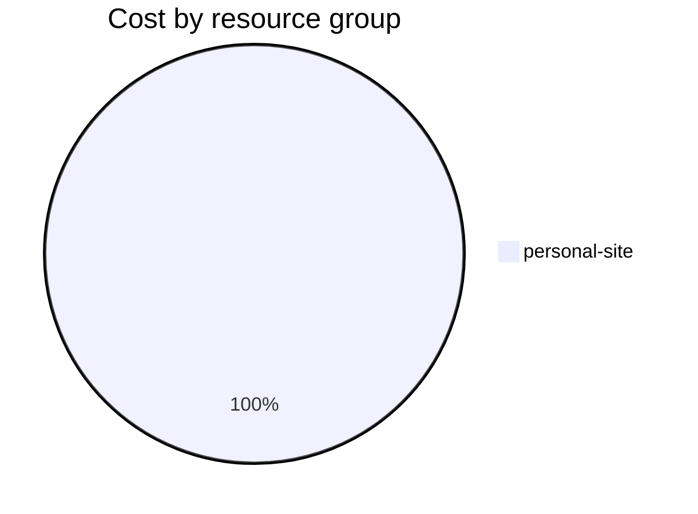

Fetching subscription details...
Fetching cost data...
Fetching forecasted cost data...
Fetching cost data by service name...
Fetching cost data by location...
Fetching cost data by resource group...
# Azure Cost Overview

> Accumulated cost for subscription id `JPF Pay-As-You-Go` from **03/01/2024** to **03/02/2024**

## Totals

|Period|Amount|
|---|---:|
|Today|0.00 USD|
|Yesterday|0.15 USD|
|Last 7 days|0.44 USD|
|Last 30 days|0.44 USD|

```mermaid
gantt
   title Accumulated cost
   dateFormat  X
   axisFormat %s
   section 01 Mar
   USD 0.30 :0, 30
   section 02 Mar
   USD 0.44 :0, 44
   section 03 Mar
   USD 0.74 : done, 0, 74
   section 04 Mar
   USD 1.04 : done, 0, 104
   section 05 Mar
   USD 1.33 : done, 0, 133
   section 06 Mar
   USD 1.63 : done, 0, 163
   section 07 Mar
   USD 1.92 : done, 0, 192
   section 08 Mar
   USD 2.22 : done, 0, 222
   section 09 Mar
   USD 2.51 : done, 0, 251
   section 10 Mar
   USD 2.81 : done, 0, 281
   section 11 Mar
   USD 3.11 : done, 0, 311
   section 12 Mar
   USD 3.40 : done, 0, 340
   section 13 Mar
   USD 3.70 : done, 0, 370
   section 14 Mar
   USD 3.99 : done, 0, 399
   section 15 Mar
   USD 4.29 : done, 0, 429
   section 16 Mar
   USD 4.59 : done, 0, 459
   section 17 Mar
   USD 4.88 : done, 0, 488
   section 18 Mar
   USD 5.18 : done, 0, 518
   section 19 Mar
   USD 5.47 : done, 0, 547
   section 20 Mar
   USD 5.77 : done, 0, 577
   section 21 Mar
   USD 6.06 : done, 0, 606
   section 22 Mar
   USD 6.36 : done, 0, 636
   section 23 Mar
   USD 6.66 : done, 0, 666
   section 24 Mar
   USD 6.95 : done, 0, 695
   section 25 Mar
   USD 7.25 : done, 0, 725
   section 26 Mar
   USD 7.54 : done, 0, 754
   section 27 Mar
   USD 7.84 : done, 0, 784
   section 28 Mar
   USD 8.14 : done, 0, 814
   section 29 Mar
   USD 8.43 : done, 0, 843
   section 30 Mar
   USD 8.73 : done, 0, 873
   section 31 Mar
   USD 9.02 : done, 0, 902
```

## By Service Name

|Service|Amount|
|---|---:|
|Azure App Service|0.52 USD|

## By Location

|Location|Amount|
|---|---:|
|US Central|0.52 USD|
|EU West|0.00 USD|
|US East 2|0.00 USD|

## By Resource Group

|Resource Group|Amount|
|---|---:|
|personal-site|0.52 USD|

Generated at 2024-03-03 11:28:08 for subscription with id `4913be3f-a345-4652-9bba-767418dd25e3`
