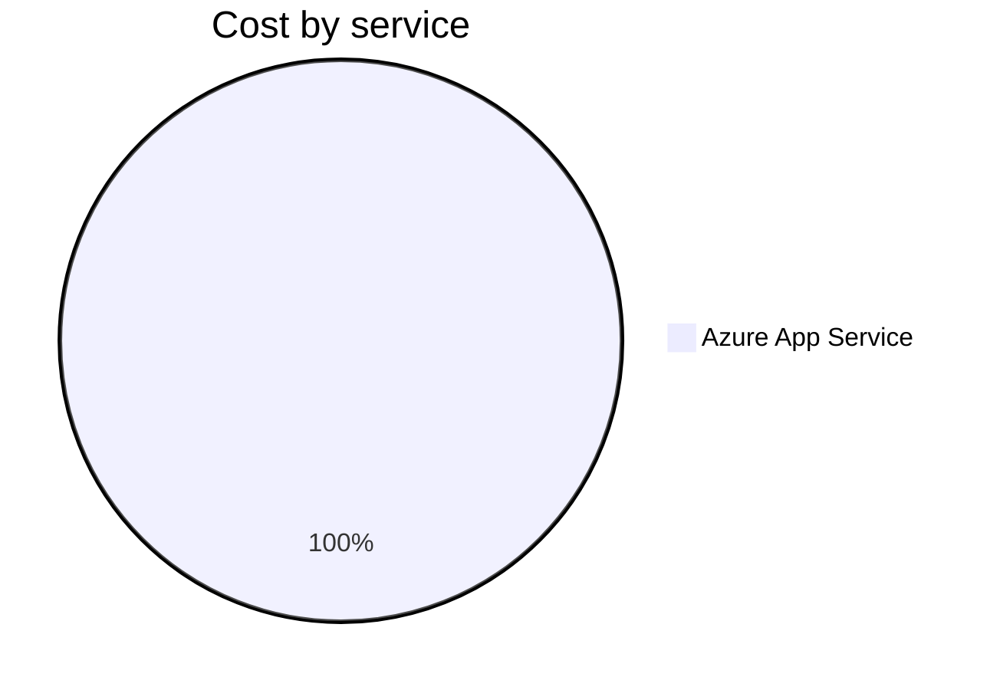
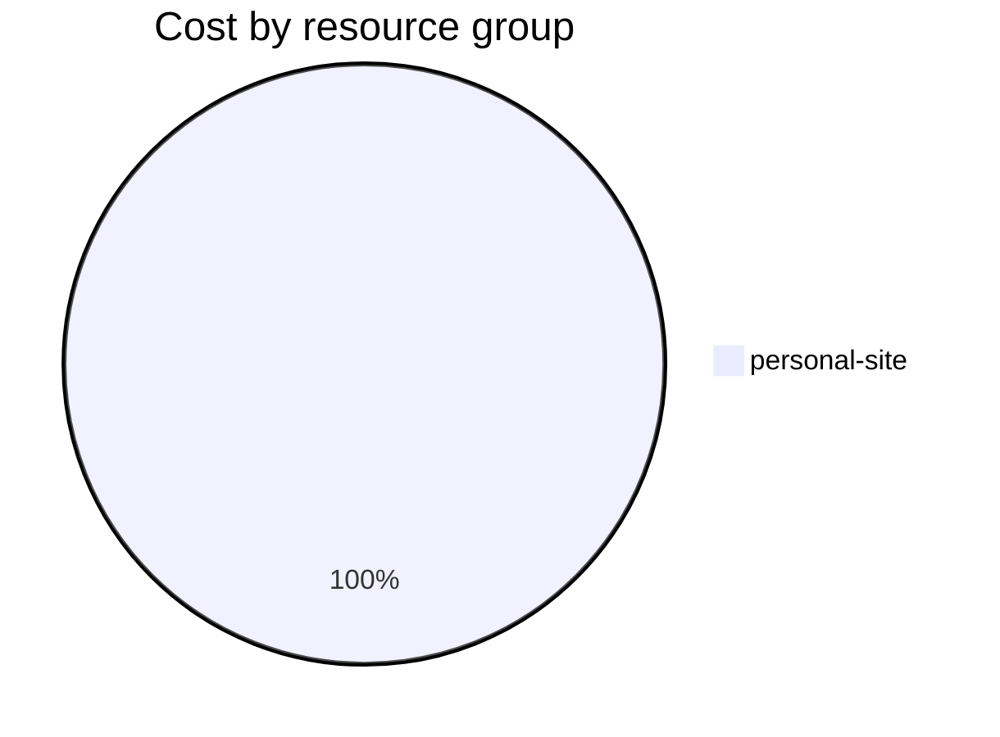

Fetching subscription details...
Fetching cost data...
Fetching forecasted cost data...
Fetching cost data by service name...
Fetching cost data by location...
Fetching cost data by resource group...
# Azure Cost Overview

> Accumulated cost for subscription id `JPF Pay-As-You-Go` from **06/01/2024** to **06/01/2024**

## Totals

|Period|Amount|
|---|---:|
|Today|0.00 USD|
|Yesterday|0.25 USD|
|Last 7 days|0.25 USD|
|Last 30 days|0.25 USD|

```mermaid
gantt
   title Accumulated cost
   dateFormat  X
   axisFormat %s
   section 01 Jun
   USD 0.25 :0, 25
   section 02 Jun
   USD 0.54 : done, 0, 54
   section 03 Jun
   USD 0.84 : done, 0, 84
   section 04 Jun
   USD 1.13 : done, 0, 113
   section 05 Jun
   USD 1.43 : done, 0, 143
   section 06 Jun
   USD 1.72 : done, 0, 172
   section 07 Jun
   USD 2.02 : done, 0, 202
   section 08 Jun
   USD 2.32 : done, 0, 232
   section 09 Jun
   USD 2.61 : done, 0, 261
   section 10 Jun
   USD 2.91 : done, 0, 291
   section 11 Jun
   USD 3.20 : done, 0, 320
   section 12 Jun
   USD 3.50 : done, 0, 350
   section 13 Jun
   USD 3.79 : done, 0, 379
   section 14 Jun
   USD 4.09 : done, 0, 409
   section 15 Jun
   USD 4.38 : done, 0, 438
   section 16 Jun
   USD 4.68 : done, 0, 468
   section 17 Jun
   USD 4.97 : done, 0, 497
   section 18 Jun
   USD 5.27 : done, 0, 527
   section 19 Jun
   USD 5.56 : done, 0, 556
   section 20 Jun
   USD 5.86 : done, 0, 586
   section 21 Jun
   USD 6.15 : done, 0, 615
   section 22 Jun
   USD 6.45 : done, 0, 645
   section 23 Jun
   USD 6.74 : done, 0, 674
   section 24 Jun
   USD 7.04 : done, 0, 704
   section 25 Jun
   USD 7.33 : done, 0, 733
   section 26 Jun
   USD 7.63 : done, 0, 763
   section 27 Jun
   USD 7.92 : done, 0, 792
   section 28 Jun
   USD 8.22 : done, 0, 822
   section 29 Jun
   USD 8.51 : done, 0, 851
   section 30 Jun
   USD 8.81 : done, 0, 881
```

## By Service Name

|Service|Amount|
|---|---:|
|Azure App Service|0.25 USD|

## By Location

|Location|Amount|
|---|---:|
|US Central|0.25 USD|
|EU West|0.00 USD|
|US East 2|0.00 USD|

## By Resource Group

|Resource Group|Amount|
|---|---:|
|personal-site|0.25 USD|

Generated at 2024-06-02 11:18:32 for subscription with id `4913be3f-a345-4652-9bba-767418dd25e3`
