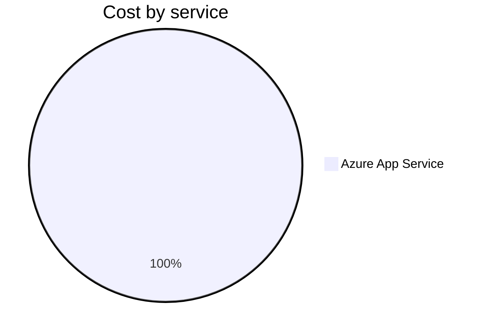
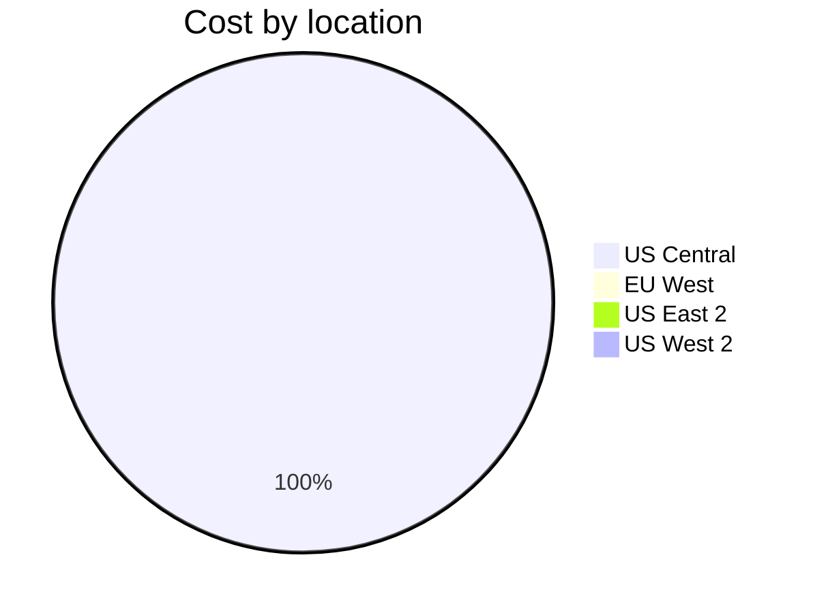
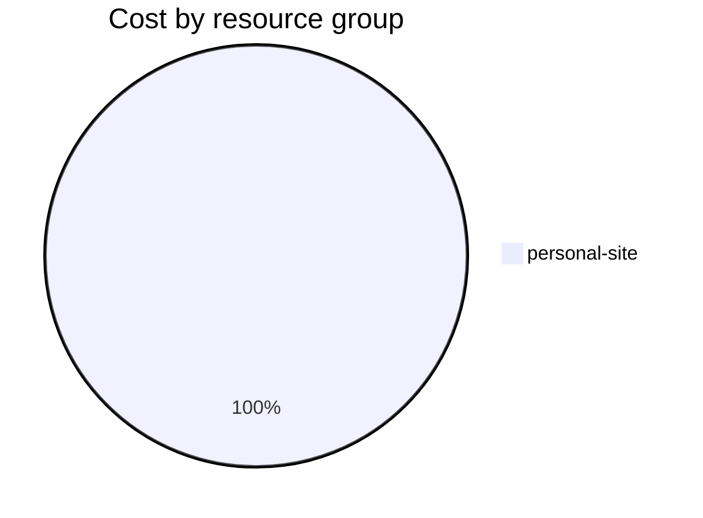

Fetching subscription details...
Fetching cost data...
Fetching forecasted cost data...
Fetching cost data by service name...
Fetching cost data by location...
Fetching cost data by resource group...
# Azure Cost Overview

> Accumulated cost for subscription id `JPF Pay-As-You-Go` from **08/01/2024** to **08/01/2024**

## Totals

|Period|Amount|
|---|---:|
|Today|0.00 USD|
|Yesterday|0.21 USD|
|Last 7 days|0.21 USD|
|Last 30 days|0.21 USD|

```mermaid
gantt
   title Accumulated cost
   dateFormat  X
   axisFormat %s
   section 01 Aug
   USD 0.21 :0, 21
   section 02 Aug
   USD 0.51 : done, 0, 51
   section 03 Aug
   USD 0.81 : done, 0, 81
   section 04 Aug
   USD 1.12 : done, 0, 112
   section 05 Aug
   USD 1.42 : done, 0, 142
   section 06 Aug
   USD 1.72 : done, 0, 172
   section 07 Aug
   USD 2.02 : done, 0, 202
   section 08 Aug
   USD 2.33 : done, 0, 233
   section 09 Aug
   USD 2.63 : done, 0, 263
   section 10 Aug
   USD 2.93 : done, 0, 293
   section 11 Aug
   USD 3.24 : done, 0, 324
   section 12 Aug
   USD 3.54 : done, 0, 354
   section 13 Aug
   USD 3.84 : done, 0, 384
   section 14 Aug
   USD 4.15 : done, 0, 415
   section 15 Aug
   USD 4.45 : done, 0, 445
   section 16 Aug
   USD 4.75 : done, 0, 475
   section 17 Aug
   USD 5.06 : done, 0, 506
   section 18 Aug
   USD 5.36 : done, 0, 536
   section 19 Aug
   USD 5.67 : done, 0, 567
   section 20 Aug
   USD 5.97 : done, 0, 597
   section 21 Aug
   USD 6.27 : done, 0, 627
   section 22 Aug
   USD 6.58 : done, 0, 658
   section 23 Aug
   USD 6.88 : done, 0, 688
   section 24 Aug
   USD 7.19 : done, 0, 719
   section 25 Aug
   USD 7.49 : done, 0, 749
   section 26 Aug
   USD 7.80 : done, 0, 780
   section 27 Aug
   USD 8.10 : done, 0, 810
   section 28 Aug
   USD 8.41 : done, 0, 841
   section 29 Aug
   USD 8.72 : done, 0, 872
   section 30 Aug
   USD 9.02 : done, 0, 902
   section 31 Aug
   USD 9.33 : done, 0, 933
```

## By Service Name

|Service|Amount|
|---|---:|
|Azure App Service|0.21 USD|

## By Location

|Location|Amount|
|---|---:|
|US Central|0.21 USD|
|EU West|0.00 USD|
|US East 2|0.00 USD|
|US West 2|0.00 USD|

## By Resource Group

|Resource Group|Amount|
|---|---:|
|personal-site|0.21 USD|

Generated at 2024-08-02 11:12:56 for subscription with id `4913be3f-a345-4652-9bba-767418dd25e3`
