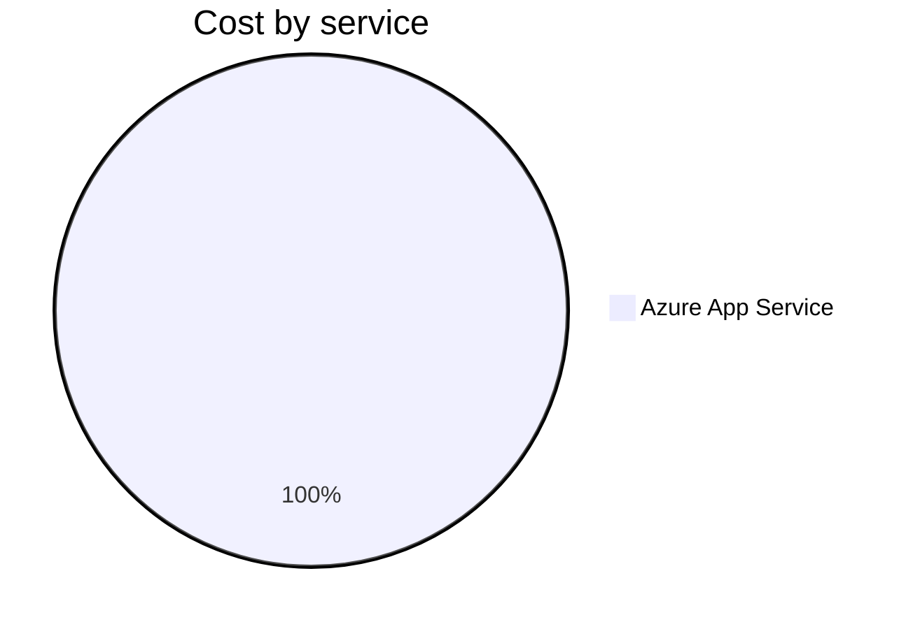
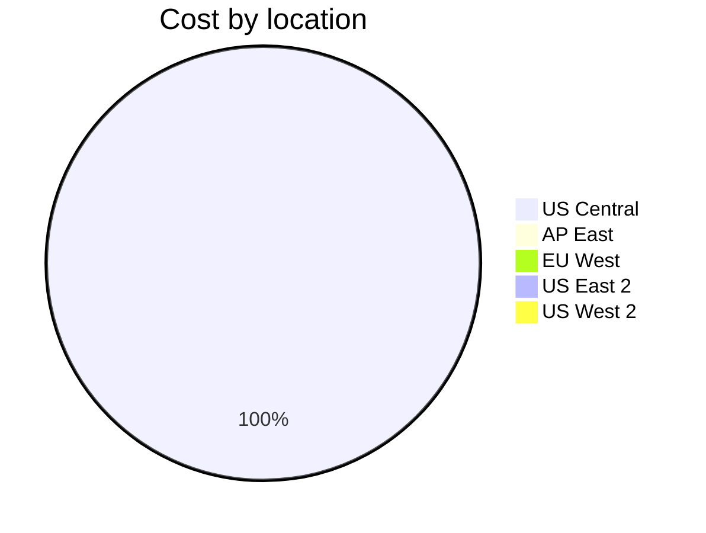
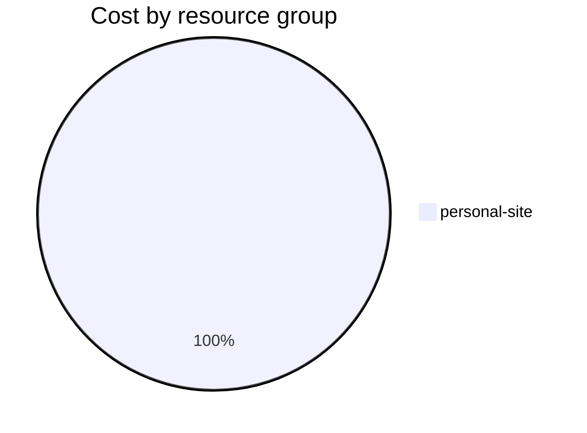

Fetching subscription details...
Fetching cost data...
Fetching forecasted cost data...
Fetching cost data by service name...
Fetching cost data by location...
Fetching cost data by resource group...
# Azure Cost Overview

> Accumulated cost for subscription id `JPF Pay-As-You-Go` from **10/01/2023** to **10/05/2023**

## Totals

|Period|Amount|
|---|---:|
|Today|0.00 USD|
|Yesterday|0.23 USD|
|Last 7 days|1.42 USD|
|Last 30 days|1.42 USD|

```mermaid
gantt
   title Accumulated cost
   dateFormat  X
   axisFormat %s
   section 01 Oct
   USD 0.30 :0, 30
   section 02 Oct
   USD 0.59 :0, 59
   section 03 Oct
   USD 0.89 :0, 89
   section 04 Oct
   USD 1.18 :0, 118
   section 05 Oct
   USD 1.42 :0, 142
   section 06 Oct
   USD 1.71 : done, 0, 171
   section 07 Oct
   USD 2.01 : done, 0, 201
   section 08 Oct
   USD 2.31 : done, 0, 231
   section 09 Oct
   USD 2.60 : done, 0, 260
   section 10 Oct
   USD 2.90 : done, 0, 290
   section 11 Oct
   USD 3.19 : done, 0, 319
   section 12 Oct
   USD 3.49 : done, 0, 349
   section 13 Oct
   USD 3.79 : done, 0, 379
   section 14 Oct
   USD 4.08 : done, 0, 408
   section 15 Oct
   USD 4.38 : done, 0, 438
   section 16 Oct
   USD 4.67 : done, 0, 467
   section 17 Oct
   USD 4.97 : done, 0, 497
   section 18 Oct
   USD 5.26 : done, 0, 526
   section 19 Oct
   USD 5.56 : done, 0, 556
   section 20 Oct
   USD 5.86 : done, 0, 586
   section 21 Oct
   USD 6.15 : done, 0, 615
   section 22 Oct
   USD 6.45 : done, 0, 645
   section 23 Oct
   USD 6.74 : done, 0, 674
   section 24 Oct
   USD 7.04 : done, 0, 704
   section 25 Oct
   USD 7.34 : done, 0, 734
   section 26 Oct
   USD 7.63 : done, 0, 763
   section 27 Oct
   USD 7.93 : done, 0, 793
   section 28 Oct
   USD 8.22 : done, 0, 822
   section 29 Oct
   USD 8.52 : done, 0, 852
   section 30 Oct
   USD 8.82 : done, 0, 882
   section 31 Oct
   USD 9.11 : done, 0, 911
```

## By Service Name

|Service|Amount|
|---|---:|
|Azure App Service|1.42 USD|

## By Location

|Location|Amount|
|---|---:|
|US Central|1.42 USD|
|AP East|0.00 USD|
|EU West|0.00 USD|
|US East 2|0.00 USD|
|US West 2|0.00 USD|

## By Resource Group

|Resource Group|Amount|
|---|---:|
|personal-site|1.42 USD|

Generated at 2023-10-06 11:16:03 for subscription with id `4913be3f-a345-4652-9bba-767418dd25e3`
