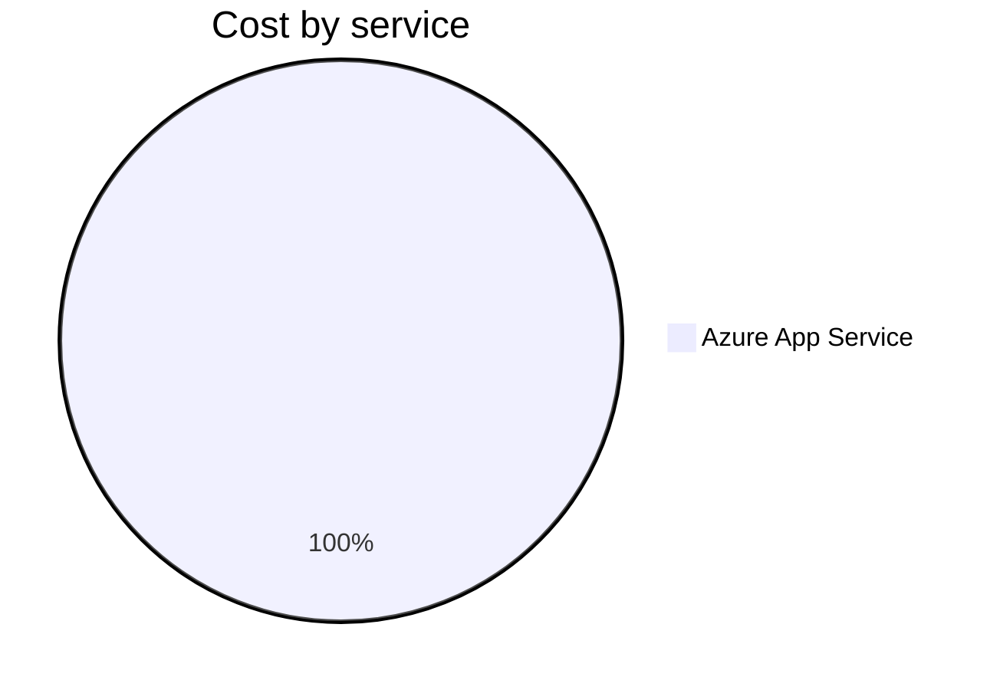
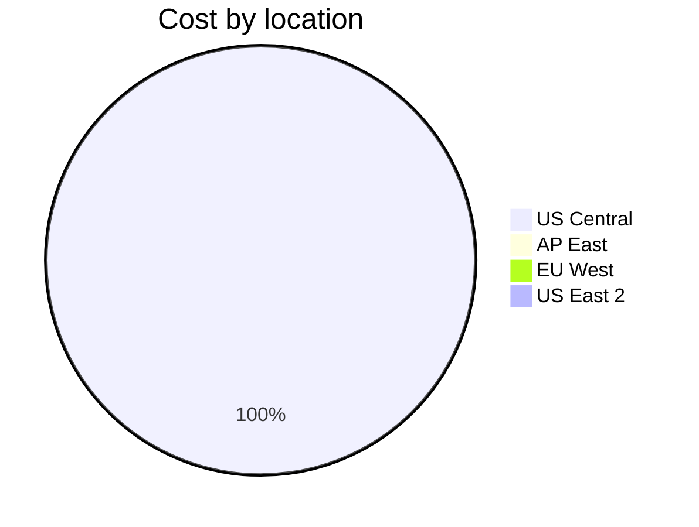
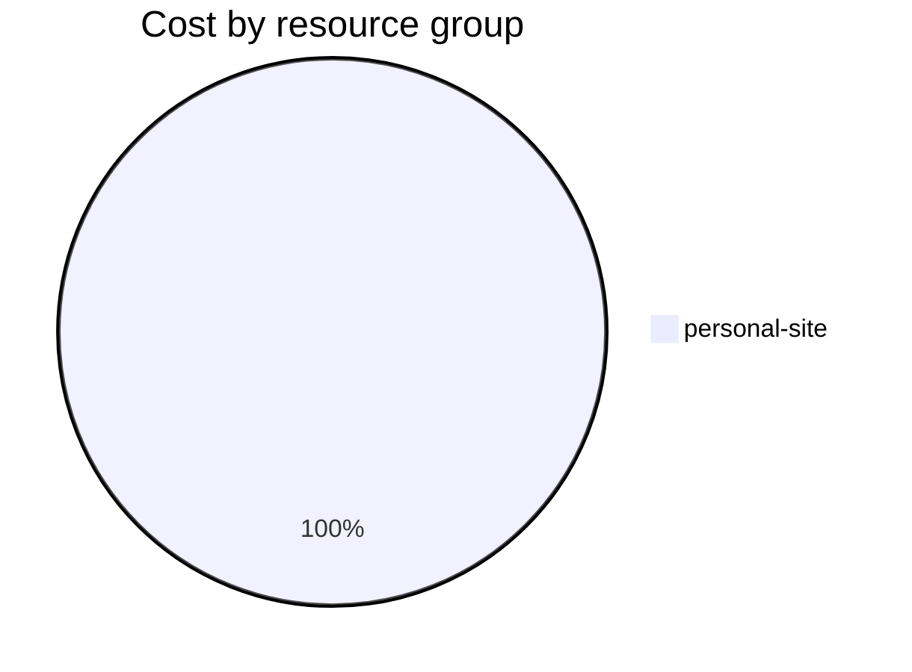

Fetching subscription details...
Fetching cost data...
Fetching forecasted cost data...
Fetching cost data by service name...
Fetching cost data by location...
Fetching cost data by resource group...
# Azure Cost Overview

> Accumulated cost for subscription id `JPF Pay-As-You-Go` from **06/01/2024** to **06/02/2024**

## Totals

|Period|Amount|
|---|---:|
|Today|0.00 USD|
|Yesterday|0.26 USD|
|Last 7 days|0.55 USD|
|Last 30 days|0.55 USD|

```mermaid
gantt
   title Accumulated cost
   dateFormat  X
   axisFormat %s
   section 01 Jun
   USD 0.30 :0, 30
   section 02 Jun
   USD 0.55 :0, 55
   section 03 Jun
   USD 0.85 : done, 0, 85
   section 04 Jun
   USD 1.15 : done, 0, 115
   section 05 Jun
   USD 1.44 : done, 0, 144
   section 06 Jun
   USD 1.74 : done, 0, 174
   section 07 Jun
   USD 2.03 : done, 0, 203
   section 08 Jun
   USD 2.33 : done, 0, 233
   section 09 Jun
   USD 2.62 : done, 0, 262
   section 10 Jun
   USD 2.92 : done, 0, 292
   section 11 Jun
   USD 3.21 : done, 0, 321
   section 12 Jun
   USD 3.51 : done, 0, 351
   section 13 Jun
   USD 3.80 : done, 0, 380
   section 14 Jun
   USD 4.10 : done, 0, 410
   section 15 Jun
   USD 4.39 : done, 0, 439
   section 16 Jun
   USD 4.69 : done, 0, 469
   section 17 Jun
   USD 4.98 : done, 0, 498
   section 18 Jun
   USD 5.28 : done, 0, 528
   section 19 Jun
   USD 5.57 : done, 0, 557
   section 20 Jun
   USD 5.87 : done, 0, 587
   section 21 Jun
   USD 6.16 : done, 0, 616
   section 22 Jun
   USD 6.46 : done, 0, 646
   section 23 Jun
   USD 6.75 : done, 0, 675
   section 24 Jun
   USD 7.05 : done, 0, 705
   section 25 Jun
   USD 7.34 : done, 0, 734
   section 26 Jun
   USD 7.64 : done, 0, 764
   section 27 Jun
   USD 7.93 : done, 0, 793
   section 28 Jun
   USD 8.22 : done, 0, 822
   section 29 Jun
   USD 8.52 : done, 0, 852
   section 30 Jun
   USD 8.81 : done, 0, 881
```

## By Service Name

|Service|Amount|
|---|---:|
|Azure App Service|0.55 USD|

## By Location

|Location|Amount|
|---|---:|
|US Central|0.55 USD|
|AP East|0.00 USD|
|EU West|0.00 USD|
|US East 2|0.00 USD|

## By Resource Group

|Resource Group|Amount|
|---|---:|
|personal-site|0.55 USD|

Generated at 2024-06-03 11:13:52 for subscription with id `4913be3f-a345-4652-9bba-767418dd25e3`
