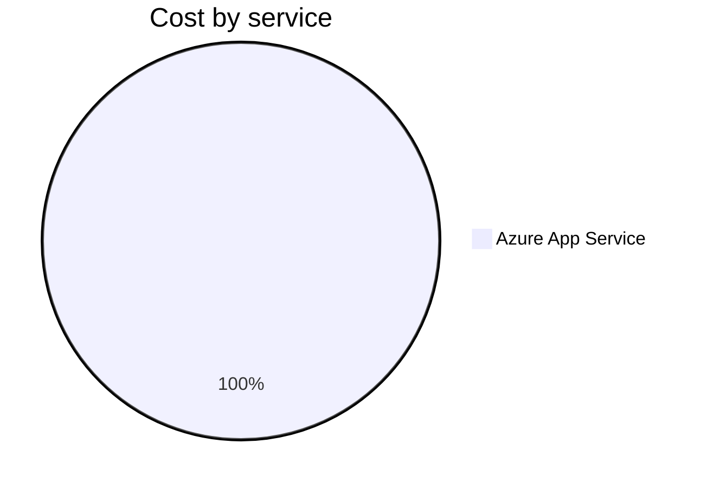
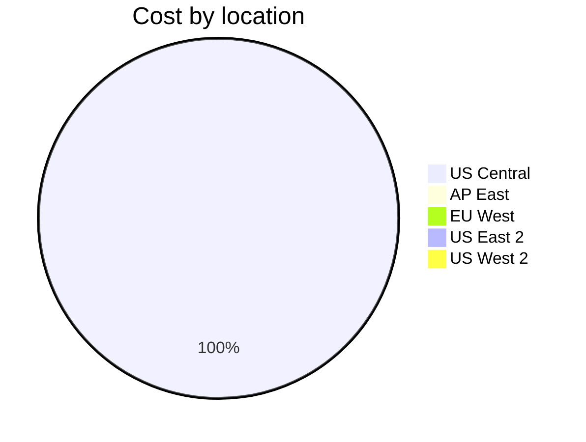
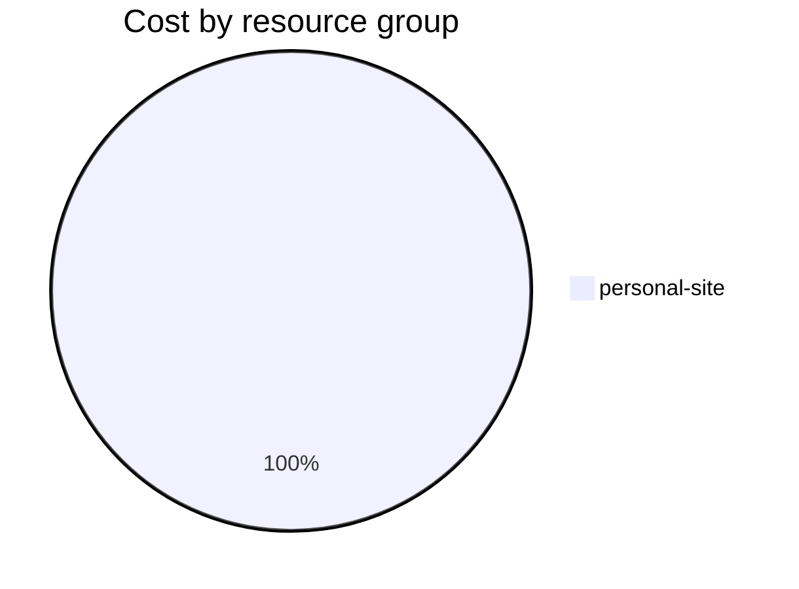

Fetching subscription details...
Fetching cost data...
Fetching forecasted cost data...
Fetching cost data by service name...
Fetching cost data by location...
Fetching cost data by resource group...
# Azure Cost Overview

> Accumulated cost for subscription id `JPF Pay-As-You-Go` from **06/01/2024** to **06/06/2024**

## Totals

|Period|Amount|
|---|---:|
|Today|0.00 USD|
|Yesterday|0.27 USD|
|Last 7 days|1.75 USD|
|Last 30 days|1.75 USD|

```mermaid
gantt
   title Accumulated cost
   dateFormat  X
   axisFormat %s
   section 01 Jun
   USD 0.30 :0, 30
   section 02 Jun
   USD 0.59 :0, 59
   section 03 Jun
   USD 0.89 :0, 89
   section 04 Jun
   USD 1.18 :0, 118
   section 05 Jun
   USD 1.48 :0, 148
   section 06 Jun
   USD 1.75 :0, 175
   section 07 Jun
   USD 2.05 : done, 0, 205
   section 08 Jun
   USD 2.34 : done, 0, 234
   section 09 Jun
   USD 2.64 : done, 0, 264
   section 10 Jun
   USD 2.93 : done, 0, 293
   section 11 Jun
   USD 3.23 : done, 0, 323
   section 12 Jun
   USD 3.52 : done, 0, 352
   section 13 Jun
   USD 3.81 : done, 0, 381
   section 14 Jun
   USD 4.11 : done, 0, 411
   section 15 Jun
   USD 4.40 : done, 0, 440
   section 16 Jun
   USD 4.70 : done, 0, 470
   section 17 Jun
   USD 4.99 : done, 0, 499
   section 18 Jun
   USD 5.29 : done, 0, 529
   section 19 Jun
   USD 5.58 : done, 0, 558
   section 20 Jun
   USD 5.87 : done, 0, 587
   section 21 Jun
   USD 6.17 : done, 0, 617
   section 22 Jun
   USD 6.46 : done, 0, 646
   section 23 Jun
   USD 6.76 : done, 0, 676
   section 24 Jun
   USD 7.05 : done, 0, 705
   section 25 Jun
   USD 7.34 : done, 0, 734
   section 26 Jun
   USD 7.64 : done, 0, 764
   section 27 Jun
   USD 7.93 : done, 0, 793
   section 28 Jun
   USD 8.22 : done, 0, 822
   section 29 Jun
   USD 8.52 : done, 0, 852
   section 30 Jun
   USD 8.81 : done, 0, 881
```

## By Service Name

|Service|Amount|
|---|---:|
|Azure App Service|1.75 USD|

## By Location

|Location|Amount|
|---|---:|
|US Central|1.75 USD|
|AP East|0.00 USD|
|EU West|0.00 USD|
|US East 2|0.00 USD|
|US West 2|0.00 USD|

## By Resource Group

|Resource Group|Amount|
|---|---:|
|personal-site|1.75 USD|

Generated at 2024-06-07 11:12:22 for subscription with id `4913be3f-a345-4652-9bba-767418dd25e3`
