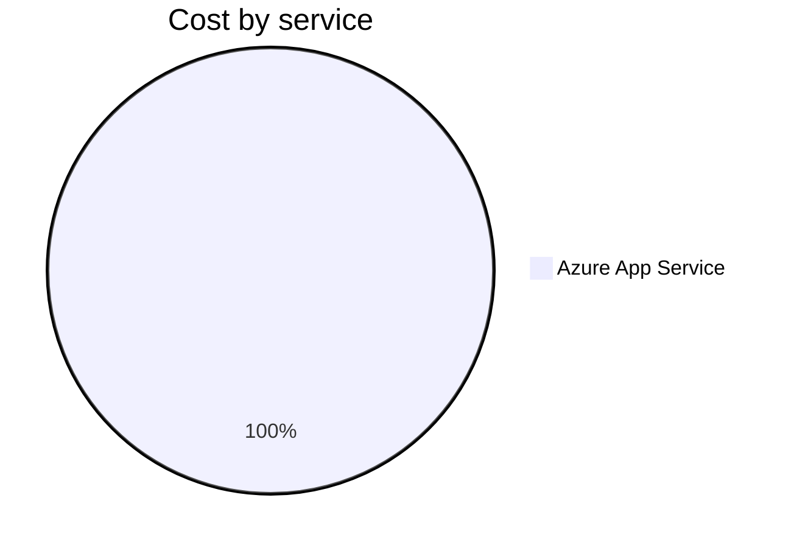
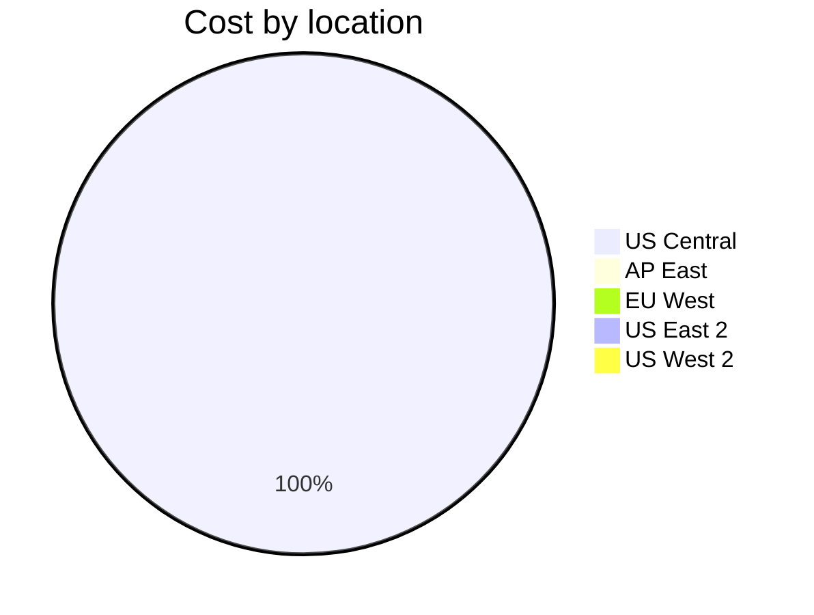
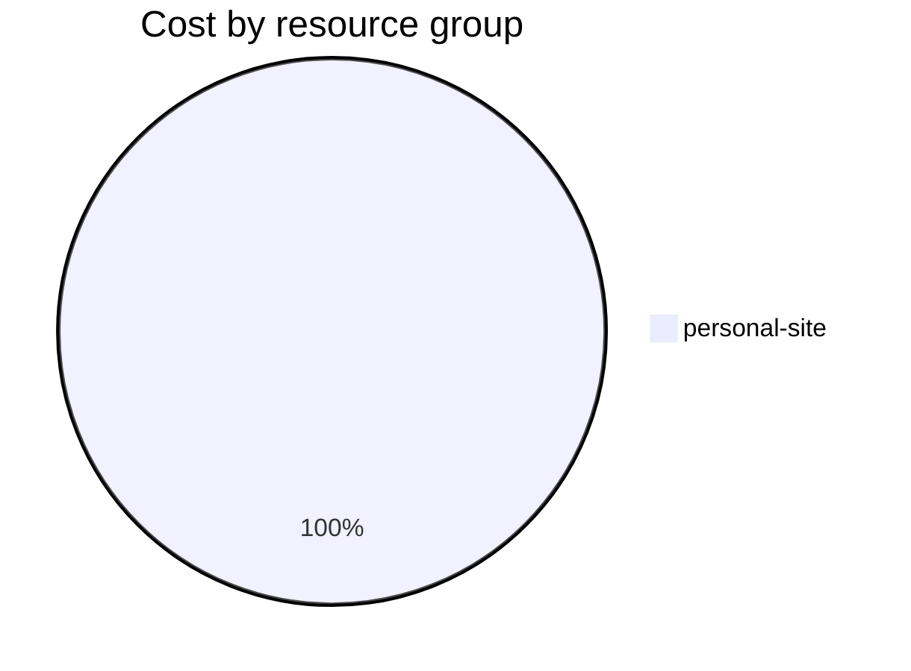

Fetching subscription details...
Fetching cost data...
Fetching forecasted cost data...
Fetching cost data by service name...
Fetching cost data by location...
Fetching cost data by resource group...
# Azure Cost Overview

> Accumulated cost for subscription id `JPF Pay-As-You-Go` from **08/01/2024** to **08/04/2024**

## Totals

|Period|Amount|
|---|---:|
|Today|0.00 USD|
|Yesterday|0.23 USD|
|Last 7 days|1.12 USD|
|Last 30 days|1.12 USD|

```mermaid
gantt
   title Accumulated cost
   dateFormat  X
   axisFormat %s
   section 01 Aug
   USD 0.30 :0, 30
   section 02 Aug
   USD 0.59 :0, 59
   section 03 Aug
   USD 0.89 :0, 89
   section 04 Aug
   USD 1.12 :0, 112
   section 05 Aug
   USD 1.42 : done, 0, 142
   section 06 Aug
   USD 1.72 : done, 0, 172
   section 07 Aug
   USD 2.02 : done, 0, 202
   section 08 Aug
   USD 2.32 : done, 0, 232
   section 09 Aug
   USD 2.61 : done, 0, 261
   section 10 Aug
   USD 2.91 : done, 0, 291
   section 11 Aug
   USD 3.21 : done, 0, 321
   section 12 Aug
   USD 3.51 : done, 0, 351
   section 13 Aug
   USD 3.81 : done, 0, 381
   section 14 Aug
   USD 4.10 : done, 0, 410
   section 15 Aug
   USD 4.40 : done, 0, 440
   section 16 Aug
   USD 4.70 : done, 0, 470
   section 17 Aug
   USD 5.00 : done, 0, 500
   section 18 Aug
   USD 5.29 : done, 0, 529
   section 19 Aug
   USD 5.59 : done, 0, 559
   section 20 Aug
   USD 5.89 : done, 0, 589
   section 21 Aug
   USD 6.18 : done, 0, 618
   section 22 Aug
   USD 6.48 : done, 0, 648
   section 23 Aug
   USD 6.78 : done, 0, 678
   section 24 Aug
   USD 7.07 : done, 0, 707
   section 25 Aug
   USD 7.37 : done, 0, 737
   section 26 Aug
   USD 7.67 : done, 0, 767
   section 27 Aug
   USD 7.96 : done, 0, 796
   section 28 Aug
   USD 8.26 : done, 0, 826
   section 29 Aug
   USD 8.56 : done, 0, 856
   section 30 Aug
   USD 8.85 : done, 0, 885
   section 31 Aug
   USD 9.15 : done, 0, 915
```

## By Service Name

|Service|Amount|
|---|---:|
|Azure App Service|1.12 USD|

## By Location

|Location|Amount|
|---|---:|
|US Central|1.12 USD|
|AP East|0.00 USD|
|EU West|0.00 USD|
|US East 2|0.00 USD|
|US West 2|0.00 USD|

## By Resource Group

|Resource Group|Amount|
|---|---:|
|personal-site|1.12 USD|

Generated at 2024-08-05 11:13:50 for subscription with id `4913be3f-a345-4652-9bba-767418dd25e3`
