Fetching subscription details...
Fetching cost data...
Fetching forecasted cost data...
Fetching cost data by service name...
Fetching cost data by location...
Fetching cost data by resource group...
# Azure Cost Overview

> Accumulated cost for subscription id `JPF Pay-As-You-Go` from **05/01/2024** to **05/06/2024**

## Totals

|Period|Amount|
|---|---:|
|Today|0.00 USD|
|Yesterday|0.26 USD|
|Last 7 days|1.74 USD|
|Last 30 days|1.74 USD|

```mermaid
gantt
   title Accumulated cost
   dateFormat  X
   axisFormat %s
   section 01 May
   USD 0.30 :0, 30
   section 02 May
   USD 0.59 :0, 59
   section 03 May
   USD 0.89 :0, 89
   section 04 May
   USD 1.18 :0, 118
   section 05 May
   USD 1.48 :0, 148
   section 06 May
   USD 1.74 :0, 174
   section 07 May
   USD 2.03 : done, 0, 203
   section 08 May
   USD 2.33 : done, 0, 233
   section 09 May
   USD 2.63 : done, 0, 263
   section 10 May
   USD 2.92 : done, 0, 292
   section 11 May
   USD 3.22 : done, 0, 322
   section 12 May
   USD 3.51 : done, 0, 351
   section 13 May
   USD 3.81 : done, 0, 381
   section 14 May
   USD 4.11 : done, 0, 411
   section 15 May
   USD 4.40 : done, 0, 440
   section 16 May
   USD 4.70 : done, 0, 470
   section 17 May
   USD 4.99 : done, 0, 499
   section 18 May
   USD 5.29 : done, 0, 529
   section 19 May
   USD 5.58 : done, 0, 558
   section 20 May
   USD 5.88 : done, 0, 588
   section 21 May
   USD 6.18 : done, 0, 618
   section 22 May
   USD 6.47 : done, 0, 647
   section 23 May
   USD 6.77 : done, 0, 677
   section 24 May
   USD 7.06 : done, 0, 706
   section 25 May
   USD 7.36 : done, 0, 736
   section 26 May
   USD 7.66 : done, 0, 766
   section 27 May
   USD 7.95 : done, 0, 795
   section 28 May
   USD 8.25 : done, 0, 825
   section 29 May
   USD 8.54 : done, 0, 854
   section 30 May
   USD 8.84 : done, 0, 884
   section 31 May
   USD 9.13 : done, 0, 913
```

## By Service Name

|Service|Amount|
|---|---:|
|Azure App Service|1.74 USD|

## By Location

|Location|Amount|
|---|---:|
|US Central|1.74 USD|
|AP East|0.00 USD|
|EU West|0.00 USD|
|US East 2|0.00 USD|
|US West 2|0.00 USD|

## By Resource Group

|Resource Group|Amount|
|---|---:|
|personal-site|1.74 USD|

Generated at 2024-05-07 11:11:57 for subscription with id `4913be3f-a345-4652-9bba-767418dd25e3`
