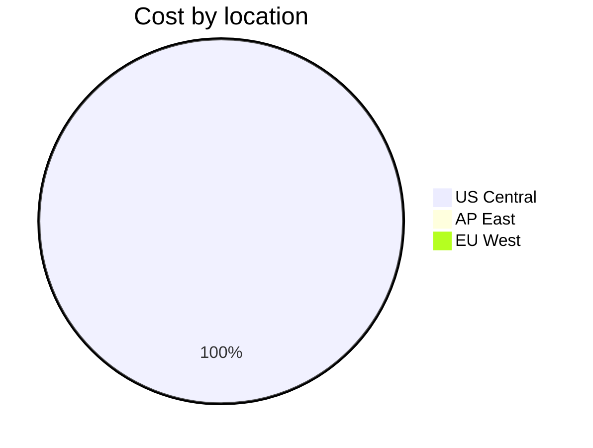

Fetching subscription details...
Fetching cost data...
Fetching forecasted cost data...
Fetching cost data by service name...
Fetching cost data by location...
Fetching cost data by resource group...
# Azure Cost Overview

> Accumulated cost for subscription id `JPF Pay-As-You-Go` from **09/01/2024** to **09/01/2024**

## Totals

|Period|Amount|
|---|---:|
|Today|0.00 USD|
|Yesterday|0.21 USD|
|Last 7 days|0.21 USD|
|Last 30 days|0.21 USD|

## By Service Name

|Service|Amount|
|---|---:|
|Azure App Service|0.21 USD|

## By Location

|Location|Amount|
|---|---:|
|US Central|0.21 USD|
|AP East|0.00 USD|
|EU West|0.00 USD|

## By Resource Group

|Resource Group|Amount|
|---|---:|
|personal-site|0.21 USD|

Generated at 2024-09-02 11:13:26 for subscription with id `4913be3f-a345-4652-9bba-767418dd25e3`
